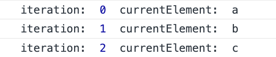
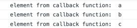

# Array methods / Методи масиву
Одразу хочу попередити, що ця тема буде стосуватися не тільки масивів, а і функцій, тому вона буде доволі важкою.

Також хочу зазначити, що ми будемо часто використовувати слово метод, тому розберемо спочатку цей момент.

**Метод** - це властивість об'єкта, де в якості значення використовується функція.

```js
const user = {
  id: 10,
  sayHello: function() {
    console.log('hello')
  }
}
```

Перш за все, ти можеш бачити звичайний об'єкт, який має 2 властивості: `id` та `sayHello`. У властивості `id` ми зберігаємо число 10, а у властивості `sayHello` ми зберігаємо функцію, як ми і говорили раніше, якщо значення властивості функція, то це вже називається не властивість, а метод, отже `id` - це властивість об'єкта, а `sayHello` це метод об'єкта. 

Другий момент це те, що раніше коли ми розбирали функції, ми придумували для них ім'я, а тут в нас ім'я не має, чому так? По перше, властивості використовують окремий тип функцій, він називається `function expression` _(раніше ми розглядали `function declaration`)_, більш дедатальну різницю між ними, ми розберемо пізніше, на разі, їхня різниця в тому, що `function expression` не має назви, як і можна бачити на прикладі метода `sayHello`.

Для того щоб нам викликати нашу функцію, нам просто потрібно звернутися до метода, і виконати його

```js
const user = {
  id: 10,
  sayHello: function() {
    console.log('hello')
  }
}

user.sayHello(); // "hello"
```

Ми звертаємося до нашого методу, таким самим чином як і до властивостей, для прикладу:

```js
const user = {
  id: 10,
  address: {
    street: 'hi street',
    sayStreet: function() {
      console.log('my street is hi street')
    }
  }
}

user.address.sayStreet(); // 'my street is hi street'
```

Для початку ми звертаємося до властивості `address`, а потім в викликаємо метод `sayStreet`, який знаходиться в цій властивості

Також скажу, що `function expression` так само можуть приймати аргументи функції, так само як і `function declaration`

```js
const user = {
  name: "John",
  sayHiTo: function(hiTo) {
    console.log('John say hi to ', hiTo)
  }
}

user.sayHiTo(); // 'John say hi to '
```

## Методи для зміни масиву
Тепер поясню, чому те що ми розібрали вище важливо. Як я писав в темі про [масиви](./arrays.md), масив - це спеціальний тип об'єкта, який має певні властивості та методи. Масиви мають багато різних методів, які дозволяють працювати з ними

### Метод push()
З допомогою метода `push()` ми можемо додавати елемент в кінець масиву новий елемент.

```js
const products = ['apple', 'orange', 'beer', 'potato'];

products.push('kiwi');

console.log(products); // ['apple', 'orange', 'beer', 'potato', 'kiwi']
```

Як ти можеш бачити метод `push` додав в кінець масиву новий елемент зі значенням `kiwi`.

### Метод pop()
За допомогою метода `pop()` ти можеш видалити останній елемент масиву.

```js
const products = ['apple', 'orange', 'beer', 'potato'];

products.pop();

console.log(products); // ['apple', 'orange', 'beer']
```

Нам нічого не потрібно передавати в цей метод, він тільки видалить останній елемент масиву. 

### Метод unshift()
За допомогою метода `unshift()` ти можеш додати якийсь елемент в початок масиву

```js
const products = ['apple', 'orange', 'beer', 'potato'];

products.unshift('tomato');

console.log(products); // ['tomato', 'apple', 'orange', 'beer', 'potato']
```

Як ти можеш бачити, тепер найперший елемент в масиві не `apple`, а `tomato`.

### Метод shift()
За допомогою метода `shift()` ти можеш видалити перший елемент масиву.

```js
const products = ['apple', 'orange', 'beer', 'potato'];

products.shift();

console.log(products); // ['orange', 'beer', 'potato'']
```

Нам нічого не потрібно передавати в цей метод, він тільки видалить перший елемент масиву

## Методи перебору масивів
В темі з масивами ми вже перебирали масиви за допомогою циклу `for`:

```js
const products = ['apple', 'orange', 'beer', 'potato'];

for(let index = 0; index < products.length; index = index + 1) {
  console.log(products[index])
}
```
В нас по черзі виводився кожен елемент масиву. Окрім такого способу, є ще простіший, це метод, вбудований в масиви. Метод називається `forEach`.

```js
const products = ['apple', 'orange', 'beer', 'potato'];

products.forEach(function(element) {
  console.log('current element: ', element);
})

// Як буде виглядати консоль
// 1. apple
// 2. orange 
// 3. beer
// 4. potato
```

Попереджу на перед, що воно може здаватися дуже важким. Що ж в нас відбувається:
1. На нашому масиві `products` ми викликаємо метод `forEach`
2. В метод `forEach` в якості першого аргументу, ми передаємо callback функцію ([тема про колбеки](./callback.md))
3. Ця функція `forEach` почне перебирати наш масив `products`, по тому самому принципу що і ми робили використовуючи цикл `for`, але на кожну ітерацію, він буде викликати функцію, яку ми передали, де в якості першого аргументу буде елемент масиву відносно поточної ітеарції

Якщо коротко, `forEach`, перебирає в циклі масив, і на кожній ітерації буде викликати функцію яку ми передали, і викликати її з поточним елементом масива.

Але щоб стало ще зрозуміліше, давай напишемо свій `forEach`.

Для початку, просто створимо функцію, яка буде приймати 2 аргумента, перший - масив, який потрібно перебрати, другий - колбек функцію, яку ми будемо викликати з кожним елементом масива.

```js
function myForEach(arr, callback) {}
```

Далі нам потрібно перебрати масив

```js
function myForEach(arr, callback) {
  for(let i = 0; i < arr.length; i += 1) {
    const currentElement = arr[i];
    
    console.log('iteration: ', i, ' currentElement: ', currentElement)
  }
}

myForEach(['a', 'b', 'c'])
```

На разі ми просто передаємо масив який потрбіно перебрати, в середині нашої функції, з допомогою циклу `for` ми перебираємо масив, який ми отримали з аргументів, і на кожну ітерацію виводимо поточний елемент масиву. Якщо запустити цей код в консолі, ми побачимо наступне\



Тепер нам потрібно на кожну ітерацію викликати функцію, яку нам передають другим аргументом, і в якості першого аргумента передавати поточний елемент масиву

```js
function myForEach(arr, callback) {
  for(let i = 0; i < arr.length; i += 1) {
    const currentElement = arr[i];
    
    callback(currentElement);
  }
}

myForEach(['a', 'b', 'c'], function(element) {
  console.log('element from callback function: ', element);
})
```

Якщо запустити цей код в середині консолі, то ти побачиш наступний результат.



Приблизно так, `forEach` працює в середині

### Фільтрація масиву
Окрім метода `forEach`, масиви ще мають метод `filter`, за допомогою якого ми можемо відфільтрувати масив. Одразу розберемо на прикладі

```js
const numbers = [1, 20, 0, -100, 78, 3, 17, 30, 90];

const filteredNumbers = numbers.filter(function(element){
  if (element > 25) {
    return true
  } else {
    return false
  }
})

console.log(filteredNumbers); // [78, 30, 90]
console.log(numbers); // [1, 20, 0, -100, 78, 3, 17, 30, 90]
```

Метод `filter` так само як і `forEach` в якості першого аргументу приймає колбек функцію, яку він буде викликати на кожній ітерації, де в якості першого елемента буде поточний елемент масиву, але є одна різниця.

По перше, метод `filter` не змінює оригінальний масив, тобто `numbers` як і був таким, яким ми його створили, таким він і залишився. Метод `filter` поверне новий масив, де будуть тільки ті елементи, при яких колбек функція, поверне `true` .

Як я і говорив, на кожному елементі масиву, буде викликатися колбек функція, яку ми передали в метод `filter`. Тобто:

1. на `0` елементі - це в нас число 1, колбек функція поверне `false`, томущо 1 менше 25, тобто в новому масиві цього елемента не буде
2. на `1` елементі - це в нас число 20, колбек функція поверне `false`, томущо 20 менше 25, тобто в новому масиві цього елемента не буде
3. на `2` елементі - це в нас число 0, колбек функція поверне `false`, томущо 0 менше 25, тобто в новому масиві цього елемента не буде
4. на `3` елементі - це в нас число -100, колбек функція поверне `false`, томущо -100 менше 25, тобто в новому масиві цього елемента не буде
5. на `4` елементі - це в нас число 78, колбек функція поверне `true`, томущо 78 більше 25, тобто в новому масиві буде цей елемент
6. на `5` елементі - це в нас число 3, колбек функція поверне `false`, томущо 3 менше 25, тобто в новому масиві цього елемента не буде
7. на `6` елементі - це в нас число 17, колбек функція поверне `false`, томущо 17 менше 25, тобто в новому масиві цього елемента не буде
8. на `7` елементі - це в нас число 30, колбек функція поверне `true`, томущо 30 більше 25, тобто в новому масиві буде цей елемент 
9. на `8` елементі - це в нас число 90, колбек функція поверне `true`, томущо 90 більше 25, тобто в новому масиві буде цей елемент

Після чого, масив який нам повернеться, ми записуємо в константу `filteredNumbers` і виводимо її в консоль.
