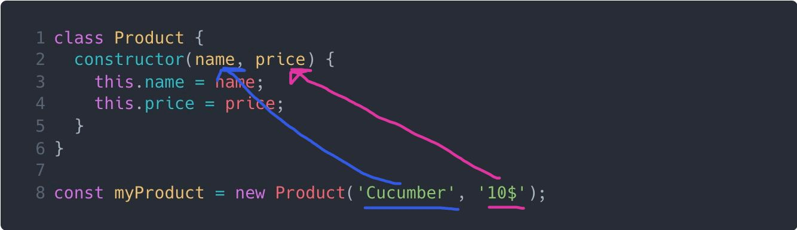

# Classes / Класи
В попередній темі, ми розглядали функції конструктори, продублюю приклад тут:
```js
function User(firstName, lastName, age) {
  this.firstName = firstName;
  this.lastName = lastName;
  this.age = age;
}

User.prototype.getFullName = function() {
  return this.firstName + ' ' + this.lastName
}

const user = new User('John', 'Carter', 20);
```
В цій темі ми будемо розглядати таку штуку як `class` (класи). `Class` - це просто спрощений синтаксис для функцій конструкторів, або як кажуть в нас, синтаксичний цукор, томущо він не приносить нічого нового в мову, а тільки солодить нам роботу.

Забігаючи вперед, якщо переписати приклад вище з `функції конструктора` на `Class`, то ми отримаємо наступний код:
```js
class User {
  constructor(firstName, lastName, age) {
    this.firstName = firstName;
    this.lastName = lastName;
    this.age = age;
  }

  getFullName() {
    return this.firstName + ' ' + this.lastName
  }
}

const user = new User('John', 'Carter', 20);
```

### Як створити `Class`
Щоб створити клас ми пишемо слово `class`, після його назву, в нас це `User`, та відкриваємо фігурні дужки. Шаблон виглядає наступним чином:
```js
class Назва {
  
}
```
Так само як і `функція конструктор`, назва класу повинна починатися з великої літери.

```js
class Animal {
}

class Fruit {
  
} 

class User {
  
}
```

### Конструктор
Як ти пам'ятаєш `функція конструктор` - це просто звичайна функція, тому коли ми викликали її ми передавали їй певні аргументи:
```js
function Product(name, price) {
  this.name = name;
  this.price = price;
}

const myProduct = new Product('Cucumber', '10$'); // { name: "Cucamber", price: "10$"}
``` 
В класах ми також можемо передавати додаткові аргументи, але так як `Class` це додатковий рівень абстракції над `функціями конструкторами`, це робиться трошки в інший спосіб, але працює абсолютно ідентично.
```js
class Product {
  constructor(name, price) {
    this.name = name;
    this.price = price;
  }
}

const myProduct = new Product('Cucumber', '10$'); // { name: "Cucamber", price: "10$"}
```
В класах ми маємо спеціальний метод `constructor`, по суті цей метод, і є наша `функція конструктор` з прикладу вище `function Product(...) { ... }`. 

Коли ми пишемо `new Product()` викликатися буде цей метод `constructor` і всі аргументи які ти передав у виклик `new Product(аргументи)` потраплять в метод `constructor`



Пригадаємо що таке метод. **Метод** - це властивість об'єкта, значенням якого є функція. Ти можеш пам'ятати з попередньої теми такий приклад:
```js
const user = {
  firstName: 'John',
  lastName: 'Carter',
  getFullName: function() {
    return 'John' + ' ' + 'Carter'
  }
}
```
Тут `getFullName` - це метод, але якщо ми хочемо таким чином створити метод в класі ми отримаємо помилку:
```js
class Product {
  // Помилка !!!
  constructor: function(name, price) {
    this.name = name;
    this.price = price;
  }
}
```
В класах, якщо ми хочемо створити метод, ми робимо це наступним чином, пишемо назву нашого метода, круглі дужки, і після відкриваємо тіло нашого методу за допомогою фігурних дужок
```js
class Назва {
  назваМетоду() {
    
  }
}
```

### Чому методи в класах ліпші від методів функції конструктор
Розширимо функціонал нашої `функції конструктора` `Product` і зробимо так, щоб ми мали можливість змінювати поле `price`. 

Одразу наведу реальний приклад, уяви що в тебе додаток онлайн аукціон, і тобі потрібно змінювати ціну цього товару, в залежності від того хто скільки запропонує.

Для цього нам потрібно мати метод, що дозволить змінювати ціну
```js
function Product(name, price) {
  this.name = name;
  this.price = price;
}

Product.prototype.changePrice = function(newestPrice) {
  this.price = newestPrice;
}

const myProduct = new Product('Cucumber', '10$');

console.log(myProduct); // { name: "Cucamber", price: "10$" }

myProduct.changePrice('20$')

console.log(myProduct); // { name: "Cucamber", price: "10$" }
```
Якщо пам'ятаєш, в попередній темі про `this`, ми говорили про те, що методи об'єктів потрібно виносити в прототипи, щоб не створювати копії цих методів для кожного нового об'єкта, а всі об'єкти використовували тільки один єдиний метод.

Тому в прикладі зверху, ми створили метод `changePrice` в прототипі `функції конструктора`. Якщо слідувати коду, то ми створюємо об'єкт з ціною `10$`, після чого викликаємо метод `changePrice` і змінюємо його ціну на `20$`.

Перед і після зміни я вивів в консоль що лежить в середині цього об'єкта, і як ти можеш бачити, поле `price` змінилося.

На мою думку, проблема коли ми виносимо щось в прототип, що візуально, ми ніби відділяємо його від `функції конструктора` `Product`, плюс потрібно писати ось це `Product.prototype...`. 

А тепер поглянемо, як би це виглядало використовуючи класи
```js
class Product {
  constructor(name, price) {
    this.name = name;
    this.price = price;
  }
  
  changePrice(newestPrice) {
    this.price = newestPrice;
  }
}

const myProduct = new Product('Cucumber', '10$'); 

console.log(myProduct); // { name: "Cucamber", price: "10$" }

myProduct.changePrice('20$')

console.log(myProduct); // { name: "Cucamber", price: "10$" }
```
Цей код на `class` працює ідентично до того що до `функція конструктор`, але візуально клас здається більш цілісним, і все що належати до класу, знаходиться в середині цього класу.

Окрім цього, всі методи класу, автоматично створюються в прототипі, тобто тобі досить написати просто метод в середині класу, а під капотом **Javascript** зробить `Product.prototype.назваМетоду = function(){}`

### Наслідування
На цьому моменті хочу дати більше роз'яснень, чому ця тема про об'єкти, `функції-конструктори`, `класи` така важлива. Причина в тому, що для нас як для людей неможливо оперувати машинним кодом, ми не можемо писати програми використовуючи 0 та 1, тому людство створили мови програмування, як певна абстракція над тим, що відбувається під капотом комп'ютера, але і в коді ми зустрічаємо велику кількість абстракцій. Все дійшло до того, що ми почали операувати об'єктами. Об'єкт це ж певна сущності, аля об'єкт кавоварка, об'єкт продукт, об'єкт автомобіль, де всі їхні властивості і методи, що дозволяють керуватися цими об'єктами знаходяться в середині цього конкуретного об'єкта.

Якщо в тебе є об'єкт кавоварка, значить кількість кави, молока, води, типи напоїв які вона може робити, як вона їх може робити, всякі кнопки і так далі, знаходиться в середині об'єкта кавоварки.

Зараз ми будемо розглядати тему наслідування - це коли один об'єкт, отримує всі властивості і методи іншого об'єкта. Уяви ситуацію, в тебе є об'єкт кавоварка і там є багато різних методів і властивостей, але, пройшов час, і в тебе з'являється багато інших типів кавоварок: професійна, домашня, середня, велика, швидка ... І виходить так, що всі вони, мають багато спільних методів та властивостей, для прикладу кількість кави, молока і води, та всі вони мають кнопку старт, яка починає варити каву, і якщо тобі потрібно щось змінити в методі, що варить каву, ти будеш змінювати це в кожному об'єкті кавоварки.

Для розв'язання проблем такого типу, ми використовуємо наслідування, надалі буду приводити приклади з класами. Ми можемо просто створити базовий клас кавоварки, який буде приймати всі необхідні властивості, після чого, створимо ще один клас, промислова кавоварка, яка буде наслідуватися від базової кавоварки, але буде приймати ще якісь певні додаткові властивості та мати якісь додаткові методи. І таких кавоварок, що будуть наслідуватися від базової може бути дуже і дуже багато.

Приклад наслідування одного класу від іншого:
```js
class Parent {
} 

class Child extends Parent {
  
}
```
В даному прикладі клас `Child` наслідує всі властивості та методи класу `Parent`.

```js
class Parent {
  cosntructor() {
    this.myNameIs = 'Hi I am Parent class'
  }
} 

class Child extends Parent {
  
}

const parent = new Parent();

console.log(parent.myNameIs); // 'Hi I am Parent class'
```
Для перевірки, на разі просто створимо екземпляр класу `Parent`, і виведемо в консоль його єдину властивість, як ти можеш бачити, все працює коректно.
```js
class Parent {
  cosntructor() {
    this.myNameIs = 'Hi I am Parent class'
  }
} 

class Child extends Parent {
  
}

const child = new Child();

console.log(child.myNameIs); // 'Hi I am Parent class'
```
> Хочу зауважити, що `constructor` - це спеціальний метод, він не наслідується.

Тут ми створили вже екземпляр класу `Child`, і як ти можеш бачити дитячий також має властивість `myNameIs`, яку він отримав з батьківського класу.

Але тепер перейдемо до більш реальних прикладів. Створимо клас `Product`, який буде доволі узагальненим, як кавоварка про яку ми говорили, а на основі цього класу, ми створимо декілька дитячих, або їх ще можна називати похідних.
```js
class Product {
  constructor(name, price) {
    this.name = name;
    this.price = price;
  }
  
  changePrice(newestPrice) {
    this.price = newestPrice;
  }
}

class Alcohol extends Product {
  constructor(minimalAgeToBuy) {
    this.minimalAgeToBuy = minimalAgeToBuy;
  }
}

const wiski = new Alcohol(21);
```
Тут в нас виникає маленька проблема, коли я буду писати `new Alchol()`, я можу передати тільки одну властивість, яка буде належати тільки цьому класу, але `name` та `price` знаходяться в батьківському класі.

Це все вирішується просто, якщо ти наслідуєшся від якогось класу, в твому дитячому з'являється спеціальний метод `super()`, при виклику якого, буде викликатися конструктор батьківського класу

```js
class Product {
  constructor(name, price) {
    this.name = name;
    this.price = price;
  }
  
  changePrice(newestPrice) {
    this.price = newestPrice;
  }
}

class Alcohol extends Product {
  constructor(minimalAgeToBuy, name, price) {
    super(name, price);
    
    this.minimalAgeToBuy = minimalAgeToBuy;
  }
}

const wiski = new Alcohol(21, 'wiski', 300);
const beer = new Alcohol(18, 'beer', 37);
```
Як ти можеш бачити, в середині конструктора класу `Alcohol` ми викликаємо конструктор батьківського класу `Product` за допомогою метода `super()` та передаємо туди потрібні для нього 2 аргументи, назву продукту, та його ціну.

Але тут є один дуже і дуже важливий нюанс, `super(...)` обов'язково повинен викликатися на початку конструктора, інакше ти отримаєш помилку, тобто от так буде не правильно:

```js
class Product {
  constructor(name, price) {
    this.name = name;
    this.price = price;
  }
  
  changePrice(newestPrice) {
    this.price = newestPrice;
  }
}

class Alcohol extends Product {
  constructor(minimalAgeToBuy, name, price) {
    this.minimalAgeToBuy = minimalAgeToBuy;
    // ПОМИЛКА !!! super повинен викликатися на початку конструктора
    super(name, price);
  }
}

const wiski = new Alcohol(21, 'wiski', 300);
const beer = new Alcohol(18, 'beer', 37);
```

Далі знову трошки розширимо наші приклади для демонстрації наслідування.

```js
class Product {
  constructor(name, price) {
    this.name = name;
    this.price = price;
  }
  
  changePrice(newestPrice) {
    this.price = newestPrice;
  }
}

class Alcohol extends Product {
  constructor(minimalAgeToBuy, name, price) {
    super(name, price);
    
    this.minimalAgeToBuy = minimalAgeToBuy;
  }
}

class Tomato extends Product { }

const wiski = new Alcohol(21, 'wiski', 300);
const beer = new Alcohol(18, 'beer', 37);
const tellowTomat = new Tomato('yellow tomat', 30);
const redTomat = new Tomato('red tomat', 60);
```

Тепер в нас є 2 похідних класи від класу `Product`, а саме `Alcohol` та `Tomato`, і зверни увагу на одну річ, клас `Tomato` не має в середині себе конструктора.

Якщо твій клас наслідується від іншого, і твій клас не має конструктора, тоді автоматично буде викликаний конструктор батьківського класу. В нашому випадку, коли ми пишемо `new Tomato()` викликається конструктор класу `Product`.

### Підсумки
Класи це доволі велика тема, і існує купа способів їх застосування в залежності від задачі, на даному моменті, ми просто розглянули базові принципи класів, вже по ходу навчання ми познайомимося ближче з реальними випадками застосування.
