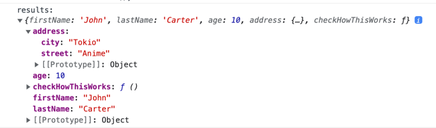
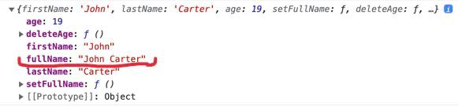
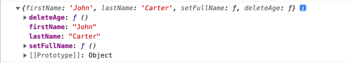
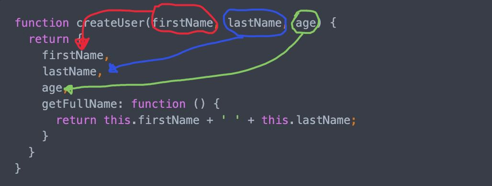
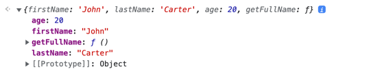
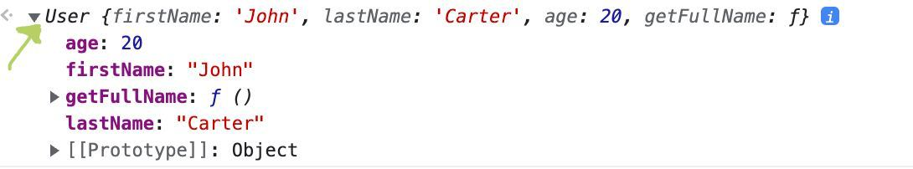
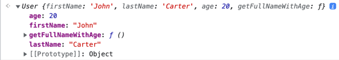
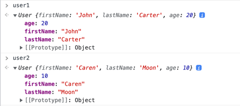
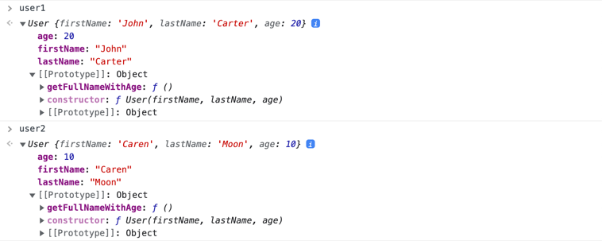

# This
```js
const user = {
  firstName: 'John',
  lastName: 'Carter',
}
```

В нас є об'єкт користувача з його іменем, але було б добре, як би ми мали змогу отримати його повне ім'я, додамо метод, що буде повертати нам повне ім'я користувача.

```js
const user = {
  firstName: 'John',
  lastName: 'Carter',
  getFullName: function() {
    return 'John' + ' ' + 'Carter'
  }
}

console.log(user.getFullName()); // "John Carter"
```

Як ми можемо бачити, виклик метода `getFullName` поверне нам повне ім'я користувача, але є проблема, що якщо `firstName` чи `lastName` буде змінюватися?

```js
const user = {
  firstName: 'John',
  lastName: 'Carter',
  getFullName: function() {
    return 'John' + ' ' + 'Carter'
  }
}

console.log(user.getFullName()); // "John Carter";  Тут ще все ок

user.firstName = 'Joseph';

// Ми змінили властивість firstName, але функція досі повертає старе значення
console.log(user.getFullName()); // "John Carter";
```

Як ти можеш бачити, якщо ми будемо змінювати властивості об'єкта, наша функція, що повертає повне ім'я буде працювати не так як ми цього хотіли б, тому в нас є дві опції як це можна виправити:

**Опція 1**
```js
const user = {
  firstName: 'John',
  lastName: 'Carter',
  getFullName: function() {
    return 'John' + ' ' + 'Carter'
  }
}

user.firstName = 'Joseph';

user.getFullName =  function() {
  return 'Joseph' + ' ' + 'Carter'
}

console.log(user.getFullName()); // "Joseph Carter";
```

Кожного разу, як в нас буде змінюватися `firstName` або `lastName` ми будемо змінювати код самої функції. Проблема лише в тому, що в нас функція маленька, але уяви, що вона займає рядків 20, ми стикнемося з великою кількістю проблем, тому цей варіант нам точно не підходить, і взагалі ніде таке краще не використовуй.

**Опція 2**
```js
const user = {
  firstName: 'John',
  lastName: 'Carter',
  getFullName: function() {
    return user.firstName + ' ' + user.lastName
  }
}

user.firstName = 'Joseph';

console.log(user.getFullName()); // "Joseph Carter";
```

Використовуючи цей підхід, при зміні `firstName` або `lastName` ми будемо отримувати значення які і очікуємо, томущо ми на пряму посилаємося на властивості об'єкта `user`.

Проблема в цьому підході лише одна, ми прив'язані до назви константи чи змінної, в середині якої лежить цей об'єкт. Для прикладу, якщо ми змінимо ім'я константи з `user` на `guestUser`, а такі речі трапляються доволі часто, тоді нам потрібно буде змінити і код в середині нашого метода, щоб він використовував вже не `user`, а `guestUser`, для прикладу:

```js
// Ми змінили тут з user на guestUser
const guestUser = {
  firstName: 'John',
  lastName: 'Carter',
  getFullName: function() {
    //     також тут змінили           і тут також змінили
    return guestUser.firstName + ' ' + guestUser.lastName
  }
}

guestUser.firstName = 'Joseph';

console.log(guestUser.getFullName()); // "Joseph Carter";
```

Як ти можеш бачити, що перший варіант, що другий має свої проблеми, і вони доволі критичні, але чесно кажучи, є ще одна опція, як ми можемо розв'язувати цю проблему - це використання `this`

## Використання `this`

Якщо простими словами, то `this` - це посилання на об'єкт, в якому викликається функція.

Для початку приклад

```js
const user = {
  firstName: 'John',
  lastName: 'Carter',
  age: 10,
  address: {
    city: 'Tokio',
    street: 'Anime'
  },
  checkHowThisWorks: function() {
    console.log('results: ', this)
  }
}

user.checkHowThisWorks();
```

Для початку просто подивимося, що таке `this`, якщо вивести його в консоль. Зверни увагу на цей об'єкт, в нас є метод `checkHowThisWorks`, все що він робить, це виводить в консоль `this`. Якщо викликати `user.checkHowThisWorks`, то в консолі ти побачиш наступне:



По суті в консолі, нам вивівся об'єкт `user`, якщо слідувати визначенню, `this` - посилається на об'єкт в якому виконується функція, а наша функція виконується в середині об'єкта `user`, тому і в консолі ми бачимо об'єкт `user`.

Грубо кажучи, приклад нижче аналогічний до верхнього:

```js
const user = {
  firstName: 'John',
  lastName: 'Carter',
  age: 10,
  address: {
    city: 'Tokio',
    street: 'Anime'
  },
  checkHowThisWorks: function() {
    console.log('results: ', user)
  }
}

user.checkHowThisWorks();
```

Але якщо в цьому прикладі ми зав'язані на назву константи чи змінної, в якій лежить об'єкт, то з використанням `this` ми можемо позбутися цієї залежності, і він сам використає потрібний об'єкт.

Якщо говорити про більше прикладів, уяви що в тебе є об'єкт, з даними про користувача, і тобі потрібно зробити метод, який буде повертати строку, зі всіма його даними:

```js
const user = {
  firstName: 'John',
  lastName: 'Carter',
  age: 10,
  address: {
    city: 'Tokio',
    street: 'Anime'
  },
  getFullInfo: function() {
    return 'User full name is: ' + this.firstName + ' ' + this.lastName + '. He lives in city: ' + this.address.city + ', on street: ' + this.address.street
  }
}

console.log(user.getFullInfo()); // "User full name is: John Carter. He lives in city: Tokio, on street: Anime"

user.age = 20;
user.address.city = 'Odessa';
user.address.city = 'River 23';

console.log(user.getFullInfo()); // "User full name is: John Carter. He lives in city: Odessa, on street: River 23"
```

Як ти можеш бачити, як би ми не змінювали значення в нашому об'єкті, метод `getFullInfo` буде завжди мати актуальну інформацію.

## Зміна 
Так як `this` посилається на об'єкт, це те ж саме що і працювати з об'єктом просто по назві константи чи змінної`, тобто ми можемо видаляти та додавати властивості або методи

```js
const user = {
  firstName: 'John',
  lastName: 'Carter',
  age: 19,
  setFullName: function() {
    this.fullName = this.firstName + ' ' + this.lastName;
  },
  deleteAge: function() {
    delete this.age;
  }
}
```

В нас є такий об'єкт, якщо викликати на ньому метод `setFullName`, то в нашому об'єкті з'явиться нова властивість

```js
const user = {
  firstName: 'John',
  lastName: 'Carter',
  age: 19,
  setFullName: function() {
    this.fullName = this.firstName + ' ' + this.lastName;
  },
  deleteAge: function() {
    delete this.age;
  }
}

user.setFullName();

console.log(user);
```

От що буде в консолі


Як можеш бачити, в нас з'явиться нова властивість, яку ми додали використовуючи `this`.

А от якщо ми викличемо `deleteAge`
```js
const user = {
  firstName: 'John',
  lastName: 'Carter',
  age: 19,
  setFullName: function() {
    this.fullName = this.firstName + ' ' + this.lastName;
  },
  deleteAge: function() {
    delete this.age;
  }
}

user.deleteAge();

console.log(user);
````

От що буде в консолі


Як ти можеш бачити, в нас зникла властивість `age`, яку ми видалили використовуючи `this`

## Проблема підтримки об'єктів
Якщо подивитися на попередній приклад коду, в нас виникає одна проблема, що якщо нам потрібно багато об'єктів користувача, які будуть мати `firstName`, `lastName`, `age` та метод `getFullName`?

```js
const user1 = {
  firstName: 'John',
  lastName: 'Carter',
  age: 20,
  getFullName: function() {
    return this.firstName + ' ' + this.lastName
  }
}

const user2 = {
  firstName: 'Jim',
  lastName: 'Owen',
  age: 12,
  getFullName: function() {
    return this.firstName + ' ' + this.lastName
  }
}

const user3 = {
  firstName: 'Ketie',
  lastName: 'Pumpa',
  age: 25,
  getFullName: function() {
    return this.firstName + ' ' + this.lastName
  }
}
```
Уяви ситуацію, що тепер `getFullName` потрібно змінити так, щоб ми повертали ще й вік користувача.

```js
const user1 = {
  firstName: 'John',
  lastName: 'Carter',
  age: 20,
  getFullNameWithAge: function() {
    return this.firstName + ' ' + this.lastName + ' age: ' + this.age
  }
}

const user2 = {
  firstName: 'Jim',
  lastName: 'Owen',
  age: 12,
  getFullNameWithAge: function() {
    return this.firstName + ' ' + this.lastName + ' age: ' + this.age
  }
}

const user3 = {
  firstName: 'Ketie',
  lastName: 'Pumpa',
  age: 25,
  getFullNameWithAge: function() {
    return this.firstName + ' ' + this.lastName + ' age: ' + this.age
  }
}
```
Нам довелося піти в кожен об'єкт, і руками змінити цей метод, в нашому випадку - це всього лиш 3 об'єкти, і це не критично, але якщо їх було десятки, і вони знаходилися в зовсім різних частинах коду.

По суті, ми можемо розв'язувати проблему наступним чином: створимо функцію, яка буде приймати необхідні нам аргументи, а саме вік, ім'я та фамілія, формувати об'єкт і просто повертати його

```js
function createUser(firstName, lastName, age) {
  return {
    firstName,
    lastName,
    age,
    getFullName: function () {
      return this.firstName + ' ' + this.lastName;
    }
  }
}

const user1 = createUser('John', 'Carter', 20);
console.log('user1: ', user1.getFullName()); "John Carter"

const user2 = createUser('Jim', 'Owen', 12);
console.log('user2: ', user2.getFullName()); "Jim Owen"

const user3 = createUser('Ketie', 'Pumpa', 25);
console.log('user3: ', user3.getFullName()); "Ketie Pumpa"
```

> **Пояснення до одного моменту**
> 
> Як ти можеш бачити з прикладу, коли ми повертаємо об'єкт, ми не пишемо `{ firstName: firstName }`, а просто `{ firstName }`. 
> 
> Розглянемо `{ firstName: firstName }`, зліва в нас ключ, а з права значення цього ключа, і в якості значення ми використовуємо те, що лежить в середині змінної `firstName`, і як ти можеш бачити, ключ має таке саме ім'я як змінна, в такому випадку ми можемо одразу використати змінну: `{ firstName }`, а ключ об'єкта автоматично назветься назвою змінної, тобто `firstName`
> 
> 

По суті ми розв'язали проблему, і тепер якщо об'єкти такого вигляду потрібно буде якось змінити, то ми просто внесемо зміни до функції `createUser`

## Функція конструктор
> Міні попередження, наступна інформація може здатися дуже важкою та абсолютно не зрозумілою, але це все ок, вона доволі велика тому за раз всі деталі й моменти не розібрати  

Окрім створення просто функції яка повертає об'єкти в Javascript існує ще таке поняття як функція конструктор, в нашому прикладі, наша функція просто приймає певні значення, і повертає простий об'єкт, але функції конструктори - це шаблони, які об'єкти певного типу.

Одразу наведу приклад що означає "об'єкт певного типу".

Ось що буде, якщо вивести в консоль простий об'єкт, для прикладу той який ми створювали функцією `createUser` вище:


Нічого не звичайного, простий об'єкт. А от, що виведеться в консоль якщо створити об'єкт використовуючи функцію конструктор:



Він виглядає так само як і звичайний об'єкт, але на відмінну від цього, перед його назвою, в консолі написано `User`. `User` - це його тип, тобто тепер це не просто `object`, це об'єкт типу `User`. 

По суті, назвати це якоюсь перевагою важко, але це просто перший момент різниці між звичайним об'єктом, і тим який ми отримуємо використовуючи функцію конструктор.

Функція конструктор по суті нічим не відрізняється від звичайної функції:
```js
function User(firstName, lastName, age) {
  this.firstName = firstName;
  this.lastName = lastName;
  this.age = age;
  
  this.getFullNameWithAge = function() {
    return this.firstName + ' ' + this.lastName + ' age: ' + this.age
  }
}

const user = new User('John', 'Carter', 20);
```
В скріні нище показано що буде якщо вивести в консоль цю константу `user`


Розглянемо цей код. Перше що потрібно сказати, що всі функції конструктори повинні мати 2 речі:
1. Назва має бути з великої літери, в нашому випадку це `User`
2. Викликати цю функцію потрібно використовуючи слово `new`, в нашому випадку `new User(...)`

Також потрібно сказати, що об'єкти які створені функціями конструкторами називаються `instance` інстансами, тобто екземплярами. В коді вище, в константі `user` знаходиться екземпляр шаблону `User`.

[//]: # (Що стосується коду самої функції `User`, коли ми викликаємо її з використанням слова `new`, вони автоматично будуть повертати `this`,)

В функції `User` - є дві дивини, по перше, чому ми тут нічого не повертаємо, але коли ми виводили в консоль константу `user`, в нас виводився об'єкт? по друге, чому ми тут використовуємо `this`, ми ж говорили про те, що `this` - це ключове слово, яке вказує на об'єкт, в якому виконується функція, але наша функція не виконується ні в якому об'єкті

І на перед я скажу, по перше, функція `User` повертає об'єкт, а по друге, вона ще й виконується в середині об'єкта, просто під капотом, тому ми і маємо доступ до `this`

Давай крок за кроком, розберемо що тут відбувається:
- Коли ти пишеш `new User(...)` Javascript під капотом створює пустий об'єкт
- Потім він силою вказує, що `this` для цієї функції - це буде той щойно створений об'єкт, тому коли ми пишемо `this` він буде посилатися на цей щойно створений об'єкт, і коли ми пишемо `this.firstName = '...'` ми створимо властивість `firstName` в середині цього щойно створеного об'єкта
- Після чого, хоч ми і не писали ніякий `return`, але функція викликані використовуючи `new` автоматично повертає `this`, тобто посилання на об'єкт, який створив сам Javascript під капотом, і в який ми записували властивості, такі як `firstName`, `lastName` ...
- І далі в нашому коді, ми присвоюємо посилання на цей об'єкт для константи `user`. І тепер константа `user` посилається на об'єкт який був щойно створений

В посиланні ниже невелика презентація, яка описує всі ці кроки з картинками
https://docs.google.com/presentation/d/1_K93mw69b9iJBk5oBZFXGtWfABOz8liRIpa7u3oW6wU/edit?usp=sharing

## Прототипи
Для того, щоб не гортати постійно вверх я продублюю нашу функцію конструктор `User`.
```js
function User(firstName, lastName, age) {
  this.firstName = firstName;
  this.lastName = lastName;
  this.age = age;
  
  this.getFullNameWithAge = function() {
    return this.firstName + ' ' + this.lastName + ' age: ' + this.age
  }
}

const user1 = new User('John', 'Carter', 20);
const user2 = new User('Caren', 'Moon', 10);

console.log(user1.getFullNameWithAge()); // "John Carter age: 20"
console.log(user2.getFullNameWithAge()); // "Caren Moon age: 10"
```

Є одна проблема, що в прикладі з функцією конструктором `User`, що і з просто функцією `createUser` яка повертає простий об'єкт, надалі ми будемо говорити тільки про функцію конструктор `User`

Кожен наш об'єкт, який ми створюємо використовуючи `User`, тобто `user1` та `user2` будуть мати метод `getFullNameWithAge`, і на це буде витрачатися додаткова кількість пам'яті, але питання, чи дійсно нам треба мати в кожному об'єкті цей метод, якщо вони роблять одну й ту саму роботу?

Як ти можеш бачити метод `getFullNameWithAge` повертає тільки ті данні, які належать до свого об'єкта, тобто `this` в `user1` посилається на `user1`, а `this` в `user2` посилається на `user2`.

Було б круто, щоб в нас існував тільки один екземпляр цього метода, який би використовував `this` того об'єкта, на якому цей метод викликається, тим самим ми б економили пам'ять, і не дублювали метод в кожному об'єкті, томущо зараз в нас тільки один метод, а може бути таке, що наш юзер має з десяток різних методів, з купою коду і рахуй ми на пустому місці будемо використовувати більше пам'яті чим потрібно.

Якраз для розв'язання проблем такого типу, були придумані прототипи. Прототип - це по суті коробка, яка зберігає методи і властивості, які є спільні для всіх екземплярів функції конструктора. Якщо говорити про наш приклад зверху, то `user1` та `user2` будуть мати спільний прототип. 

Тепер будемо зберігати нашу функцію `getFullNameWithAge` в середині прототипа 

```js
function User(firstName, lastName, age) {
  this.firstName = firstName;
  this.lastName = lastName;
  this.age = age;
}

User.prototype.getFullNameWithAge = function() {
  return this.firstName + ' ' + this.lastName + ' age: ' + this.age
}

const user1 = new User('John', 'Carter', 20);
const user2 = new User('Caren', 'Moon', 10);

console.log(user1.getFullNameWithAge()); // "John Carter age: 20"
console.log(user2.getFullNameWithAge()); // "Caren Moon age: 10"
```

Якщо запустити код, то ти побачиш, що наш код виконується без проблем, і повертає те ж саме, що і раніше.

Прототип - це по суті об'єкт, тому щоб додати туди нову властивість чи метод, ми робимо це таким самим чином як і зі звичайними об'єктами. Ми пишемо `User`, в кожної функції є об'єкт `prototype`, доступаємося до нього `User.prototype` і далі додаємо нову властивість чи метод, як при роботі з звичайними об'єктами. `User.prototype.getFullNameWithAge = function() {...}`.

Тепер дивись дивину, якщо вивести в консоль `user1` та `user2` ти можеш побачити, що в них не має метода `getFullNameWithAge`


А ще ти можеш побачити властивість `[[Prototype]]`

Як ти можеш бачити, в середині прототипа в нас є цей метод `getFullNameWithAge`, який ми самі туди ж і додали.

Тепер питання, якщо в нас в об'єкті не має метода `getFullNameWithAge`, то як тоді ми можемо його викликати `user1.getFullNameWithAge()`? Відповідь насправді дуже проста, коли ти звертаєшся до властивості чи метода, Javascript спочатку буде шукати його в середині об'єкта, і якщо його не знайде, тоді почне шукати в середині прототипа. Так відбувається і в нас, в наших об'єктів не має метода `getFullNameWithAge`, тому Javascript почне ритися в прототипі, знайде його і викличе його з потрібним значення `this`. 

Ще раз хочу наголосити, що хоч і прототип в нас спільний, `this` в середині функцій які ми викликаємо буде залежати від того, на якому об'єкті ми викликаємо функцію

```js
console.log(user1.getFullNameWithAge()); // "John Carter age: 20"
console.log(user2.getFullNameWithAge()); // "Caren Moon age: 10"
```

Як можеш бачити, повертаються ті данні, які відносяться до об'єкта на якому викликається метод.

## Закріплення прототипів
```js
function User(name, age) {
  this.name = name;
  this.age = age;
}

User.prototype.sayHello = function() {
  return 'Hello ' + this.name;
}

User.prototype.canBuyAlcho = function() {
  if (this.age < 18) {
    return false;
  } else {
    return true
  }
}

const user1 = new User('John', 10);

console.log(user1.sayHello()); // "Hello John"
console.log(user1.canBuyAlcho()); // false
```
Просто ще один приклад, просто з декількома методами

## Підсумки
Тема важка і не зрозуміла, але це напевно найважча частина Javascript яку ми розбираємо в скоупі `stage 0`
