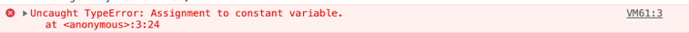

# Variables / Змінні

**Визначення**

**Змінна** - це коробка, яка здатна зберігати значення.

## Створення змінної

Щоб створити змінну використовується слово `let`, кожна змінна повинна мати ім'я. Для прикладу створимо змінну, та назвемо її `age`.

```js
let age;
```

В прикладі зверзу, ми створили змінну, але змінні не мали б сенсу, якщо в них нічого не можна було зберігати. Для того, щоб записати щось в змінну, в нас існує оператор присвоєння `=`.

```js
let age;

age = 21;
```

В цьому прикладі, ми спочатку створили змінну `age`, після чого присвоїли їй число `21`.

Ми також можемо створити змінну вже з якимось значенням, робиться це наступним чином:

```js
let age = 21;
```

Ми так само використовуємо оператор присвоєння. 

Щоб перевірити, що лежить в середині змінної, ми можемо використовувати таку штуку як `console.log(твоя_змінна)`, після чого значення змінної буде виведене в консоль.

```js
let age = 21;

console.log(age); // 21
```

Змінні від слова змінюватися, тому ми можемо змінювати значення змінної стільки разів, скільки ми хочемо.

```js
let age = 21;

console.log(age); // 21

age = 30;

console.log(age); // 30

age = 10;

console.log(age); // 10

age = 89;

console.log(age); // 89
```

Ми також маємо можливості присвоювати значення однієї змінної для іншої. Присвоєння відбувається з права на ліво.

```js
let a = 10;
let b = 20;

a = b;

console.log(a); // 20
console.log(b); // 20
```

В цьому прикладі ти можеш бачити правило з права на ліво, з ліва в нас змінна `a`, а з права змінна `b`, тому значення змінної `b` буде присвоєне для змінної `a`.

Також потрібно розуміти, що після присвоєння, значення змінної `b` нікуди не зникає, просто під час присвоєння воно копіюється, і передається для змінної `a`.  

## Константи
Окрім змінних, в Javascript ще існують константи, константи відрізняються від змінних лише тим, що вони створюються за допомогою слова `const` і їм не можна присвоювати нові значення.

```js
const minimumAgeToBuyAlcohol = 20;

console.log(minimumAgeToBuyAlcohol); // 20
```

Якщо ми будемо намагатися присвоїти нове значення для констати, то отримаємо помилку в консолі:
```js
const minimumAgeToBuyAlcohol = 20;

minimumAgeToBuyAlcohol = 30;
```
Ось приклад помилки, яку ти отримаєш:


## Типи данних
В Javascript є 7 типів данних, але тут буде тільки 5. Один з них ми не використовуємо взагалі, а інший ми розберемо пізніше детальніше:

`Number` - число, ми використовували його в попередньому прикладі
```js
let age = 10;
```

`String` - строка, дозволяє зберігати текст. Строка має бути огорнута в одинарні, або подвійні лапки.
```js
let myName = 'Yevhen';

let yourName = "Victor";
```

`Boolean` - булеан, тип який описує вірність, де **true** - це вірно, а **false** - невірно.
```js
let myNameIsYevhen = true;

let iAm14YearsOld = false;
```

`Undefined` - якщо ти створюєш змінну, і при створенні ти не присвоюєш їй ніякого значення, тоді ця змінна буде мати undefined, те ж саме і стосується констант, але який тоді сенс створювати константу без значення. Взагалом, ми не використовуємо це значення явно, тобто випадки, коли ми перемо змінну, в якій щось є і присвоюємо їй `undefined` не існують, а якщо і існують, то це просто костиль без якого щось не буде працювати.
```js

let age;

console.log(age); // undefined

// або можна вказати явно

let name = undefined;

console.log(name); // undefined

```
`Null` - описує пустоту, на початках його можна спутати з `undefined`, але `undefined` - не бажано використовувати явно. Якщо тобі треба описати пустоту, наприклад, що користувач не вказав свій вік, то використовувати потрібно саме `null`.
```js
let userAnswer = null;

console.log(userResponse); // null
```
