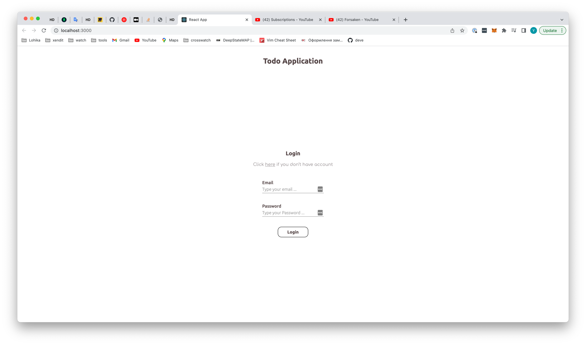
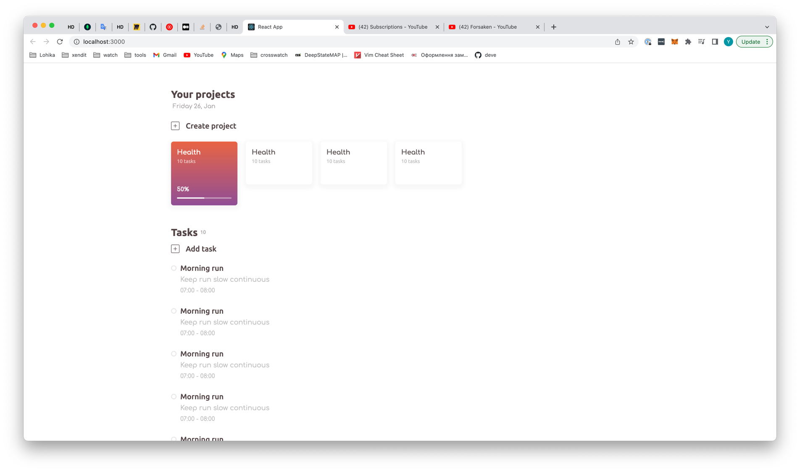

### Що собою представляє stage 1?
На цьому етапі ми познайомимося з основами React, розберемо що таке Node.js та npm, як результат цього етапу ми отримаємо наступне:

Тільки `UI` частина, без функціонала, для того, щоб розібратися як взагалі писати компоненти, стилізувати їх та використовувати.

Основне - це розібратися в загальному в екосистемі розробки фронт енд додатків.

### Теми
- [Вступ](./intro.md)
