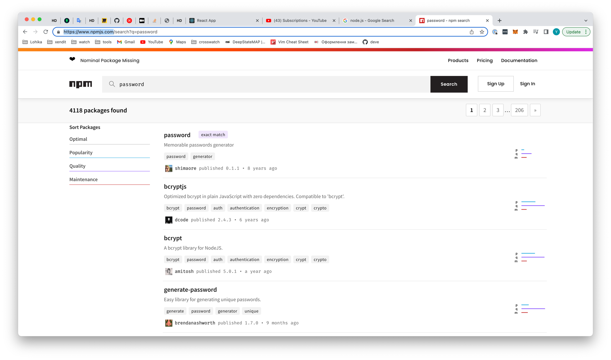
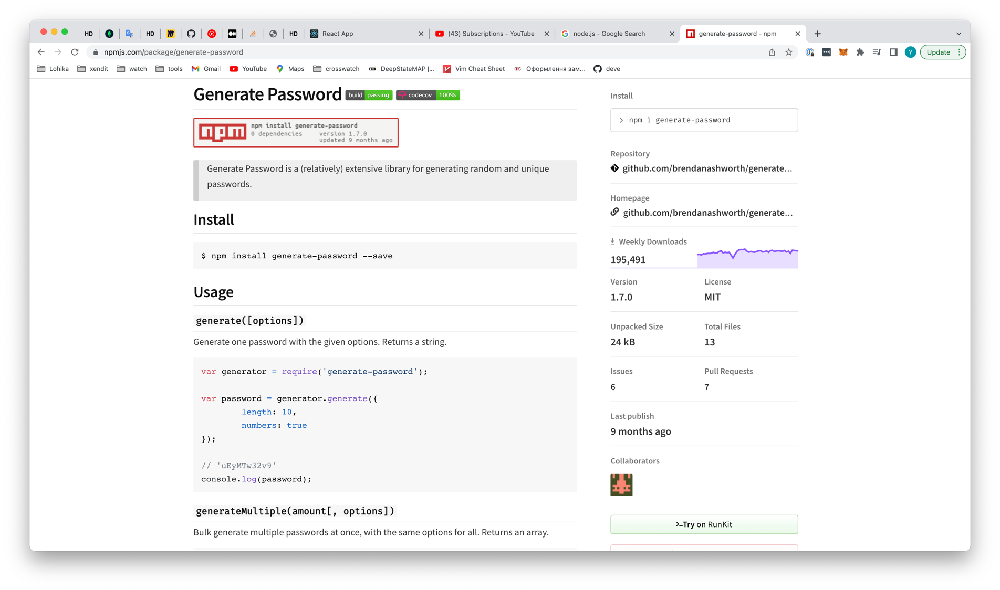

### Вступ

### Які проблеми виникали раніше

Раніше `frontend` був доволі простим, ми просто робили сайти з HTML та CSS та іноді трохи **Javascript**, але з часом, в галузь почало надходити все більше і більше інвестицій, і окрім простих сайтів, довелося розробляти важкі та комплексні додатки, які повинні були мати багато інтерактивних елементів. Але проблема в тому, що робити це використовуючи чистий `Javascript` було дуже важко. Для прикладу, `Telegram Web`, де в залежності від твоєї дії щось змінюється, зникає, або навпаки з'являється.

Окрім цього гостро стояла проблема підтримка функціоналу, що вже існує, та паралельно додавання нового. У великих проєктах, число рядків коду досягає десятків тисяч, і якщо в тебе є лише один єдиний `Javascript` файл, орієнтування в ньому було б не можливим, а окрім того, на таких проєктах точно працює більше чим одна людина, і чисто випадково ви могли видаляти код один одного.

Як рішення, можна розділити проєкт на багато `Javascript` файлів і просто підключати їх в `html`, але це також погане рішення, томущо яким правилом керуватися під час розділення такого коду на файли, окрім цього ти не можеш просто взяти та розбити його на велику кількість файлів, томущо браузер не здатний одночасно завантажувати велику кількість файлів.

### Node.js

У 2009 році, Ryan Dahl випустив `Node.js`, розумними словами - це runtime environment for Javascript, або якщо української - середовище виконання для Javascript. Якщо пояснити це простими словами, то ми отримали змогу запускати Javascript не тільки в браузері, а і на комп'ютері, що дало нам можливість за допомогою Javascript, для прикладу, створювати та читати файли, директорії та багато-багато іншого.

> Тут я хочу наголосити, браузер - це також середовище викання Javascript, але з безпекових причин, Javascript на сайтах не має доступу, наприклад до файлової системи комп'ютера, було би дивно як би ти заходиш на сайт, а він видаляє тобі все :). 
> 
> Node.js це вже інше діло, томущо спочатку тобі потрібно встановити на комп'ютер, і запускати своїми руками, тобто якась випадкова людина того робити не буде. 

Але на разі нас цікавить те, що в `Node.js` з'явилася система модулів, ми не будемо заглиблюватися в цю тему, лише скажу наступне, люди які писали на `Javascript` на `Node.js` отримали можливість розбивати свій проєкт на файли, де кожен файл міг отримати доступ до якоїсь функції чи змінної іншого файлу, тим самим вирішивши проблему організації проєкту, яку ми розглядали в темі вище.

Але браузери залишалися такими, як вони є, й навіть зараз браузери не підтримують модульність, але ти можеш зауважити, як тоді існують такі величезні додатки як `facebook`, `rozetka`, `Web Telegram`? 

### Bundler

Так як:
1. Не було фізичної можливості додати в браузери модульну систему файлів
2. Навіть як би браузери мали б модульну систему файлів, надмірна кількість файлів змусила б тебе чекати вічність доки завантажитися більш менш великий сайт.

Розробниками довелося шукати обхідні шляхи. Цей обхідний шлях виглядав наступним чином - ми будемо писати код ніби як на `Node.js`, але використовувати з нього, **ТІЛЬКИ** його модульну систему. Для реалізації цього плану потрібно було створити спеціальний тип програми - `bundler` (бандлер), найвідомішим її представником зараз є `Webpack`. 

Суть бандлера дуже і дуже проста, взяти весь той модульний код, це можуть бути тисячі файлів і зліпити з них один єдиний файл, з яким браузер міг би працювати.

> Чому я написав **ТІЛЬКИ** модульну систему? Як би ми використовували й інші можливості `Node.js`, наприклад створювати файли, то ми просто отримали б помилку, томущо браузер такої можливості не має.

Такий підхід хоч і додав додаткової складності для розробки проєктів, але його переваги повністю нівелюють його мінуси. По-перше, була вирішена проблема організації коду, по-друге, браузеру потрібно завантажувати тільки один єдиний `javascript` файл, тим самим зменшилася швидкість завантаження вебсторінок.

Окрім цього, бандлери стали доволі гнучкими, і окрім збиранням коду в один єдиний файл, що є основною задачею бандлера, ти міг написати спеціальний плагін, використовуючи `Javascript` для модифікації цього ж коду. Забігаючи на перед, робота зі стилями в `React` зав'язана на спеціальному плагіні бандлера.


### NPM

Трохи пізніше, після виходу `Node.js` з'явився інструмент під назвою `NPM`. `NPM` розшифровується як `Node.js Package Manager` (менеджер пакетів node.js). 

**Пакет** - це спеціальний кусок коду, який кожен може додати до свого проєкту.

Якщо коротко, то `NPM` складається з двох частин:
- **Перша** - це спеціальна веб платформа, грубо кажучи сайт, на якому ти можеш знайти сотні тисяч пакетів, які були написані різними розробниками, і будь-який з цих пакетів ти з легкістю можеш встановити в свій проєкт.
- **Друга** - це спеціальна програма, яка встановлюється разом з `Node.js`, яка так і називається `npm` тільки з маленької букви, яку ти можеш використовувати тільки з термінала. Якраз завдяки цій програмі ти можеш контролювати, які пакети використовує твій проєкт.

По суті `NPM` надав можливості величезному ком'юніті, яке пише на `Javascript` з легкістю ділитися своїми напрацюваннями, і використовувати чужі.

Для демонстрації, уявимо що в нашому додатку потрібно згенерувати пароль, ми б могли самотужки зробити це, але замість того щоб писати непротестований реальними умовами велосипед, ми можемо зайти на сайт `npm` за посиланням https://www.npmjs.com, в пошуку написати `password` і ми побачимо всі пакети, які працюють тим чи іншим чином з паролями



Так як нам потрібно генерувати пароль, по назві нам найбільше підходить останній пакет



Відкривши його, ми побачимо всю інформацію про нього загальне число завантажень за тиждень, останнє оновлення, інструкція по встановленні та використанню, та навіть його розмір, якщо це є важливим для нас.

### Package.json

Щоб використовувати `npm` твій проєкт повинен мати спеціальний файл, його назва `package.json`. 

> Хочу зазначити, використання `npm` не є обов'язковим, наприклад банківські додатки, не мають права використовувати сторонній код в цілях безпеки, але якщо ми не розробляємо системи з нахилом на безпеку, відмовлятися від такого солодкого пирога у вигляді `npm` було б дурістю.

Нижче приведений приклад `package.json` файлу з реального проекту, там де ти бачиш `...` означає що інформація не є важливою для навчання, або не може бути розповсюджена.

````json
{
    "name": "...",
    "version": "1.0.0",
    "dependencies": {
        "axios": "^0.26.1",
        "body-parser": "^1.19.0",
        "compression": "^1.7.4",
        "escape-html": "^1.0.3",
        "express": "^4.17.1",
        "express-http-context": "^1.2.4",
        "generate-password": "^1.7.0",
        "googleapis": "^100.0.0",
        "googleapis-common": "^5.1.0",
        "helmet": "^4.6.0",
        "http-graceful-shutdown": "^3.1.3",
        "kafkajs": "^1.16.0",
        "launchdarkly-node-server-sdk": "^6.1.0",
        "lodash": "^4.17.21",
        "module-alias": "^2.2.2",
        "reflect-metadata": "^0.1.13",
        "source-map-support": "^0.5.19",
        "swagger-parser": "^10.0.2"
    },
    "scripts": {
      "start": "node ./dist/src/server.js",
      "start:dev": "tsc-watch --onSuccess \"node -r dotenv/config ./dist/src/server.js\"",
      "build": "rm -rf dist && tsc",
      "test": "cross-env NODE_ENV=test jest --setupFiles=dotenv/config --verbose --runInBand --collectCoverage=true ./tests/unit ./src",
      "test-integration": "cross-env NODE_ENV=test jest --verbose --runInBand --collectCoverage=true ./tests/integration"
    },
    "license": "UNLICENSED",
    "private": true
}

````

**Одразу скажу, що не потрібно лякатися, воно тільки виглядає страшно, тому розберемо його.**

Перш за все зверни увагу на пункт `dependencies` - тут розписані всі пакети, які використовуються на цьому проєкті, але чому нам взагалі потрібно вказувати, які пакети використовуються?

Тут є один нюанс, який потрібно розуміти. Пакети - це не щось, що прив'язане до проєкту напряму, для прикладу, якщо тобі потрібно надіслати комусь свій проєкт, або ти зберігаєш його в хмарі, наприклад на гугл диску, ти не відправляєш, чи не зберігаєш свій проєкт разом з пакетами, ти використовуєш тільки й тільки код, який ти пишеш своїми руками.

Чому так зроблено? Причин на справді доволі багато, але розглядати ми зараз їх не будемо. Саме тому, кожен розробник, якому ти кинеш свій додаток, запустить в себе спеціальну команду, яка називається:

```shell
npm install
```

Наступне на що потрібно звернути увагу в файлі `package.json` - це пункт `scripts`

```json
{
  "scripts": {
    "start:dev": "tsc-watch --onSuccess \"node -r dotenv/config ./dist/src/server.js\""
  }
}
```

**Навіщо нам взагалі потрібна ця штука?** 

В прикладі вище я навів тільки один скрипт `start:dev`. Думай про скрипти наступним чином, в тебе є автомобіль, щоб він завівся, йому потрібно зробити багато дій, подати електрику на стартер, запустити його, розігнати мотор і так далі, але для водія, існує лише одна єдина кнопка `start`. Скрипти відіграють ту ж саму роль, за допомогою них, ти можеш сховати щось під одну єдину кноку.

В нашому прикладі, скрипт `start:dev` використовується, щоб запустити проєкт локально, це і є твоя кнопка, щоб запустити цей скрипт тобі просто потрібно написати в консолі:

```shell
npm run start:dev
```

І в тебе запуститься проєкт. Тобто тобі як людині розробнику не завжди потрібно знати що там відбувається, тобі просто надають якийсь інтерфейс і ти його використовуєш.

### Підсумую
Ця тема - це вступ, вона доволі об'ємна, тут доволі багато незрозумілих слів і визначень, все це буде розбиратися детальніше і надалі. Мені також важко спрогнозувати питання, які можуть бути задані, тому після або під час прочитання, пінгай мене в лічку.
