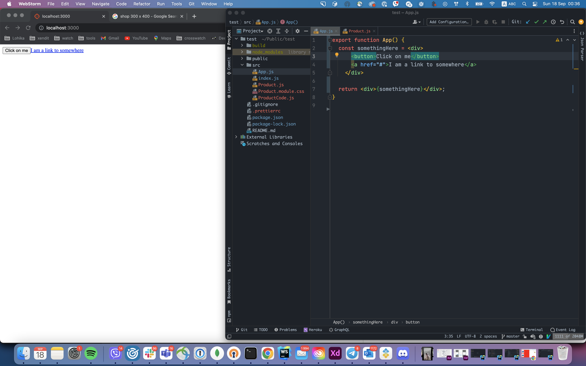
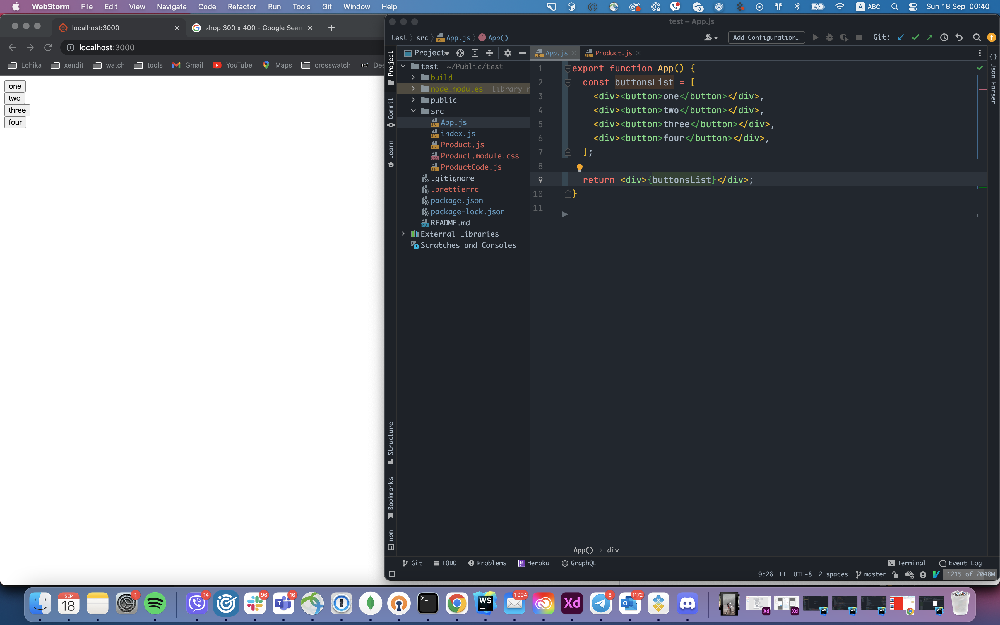
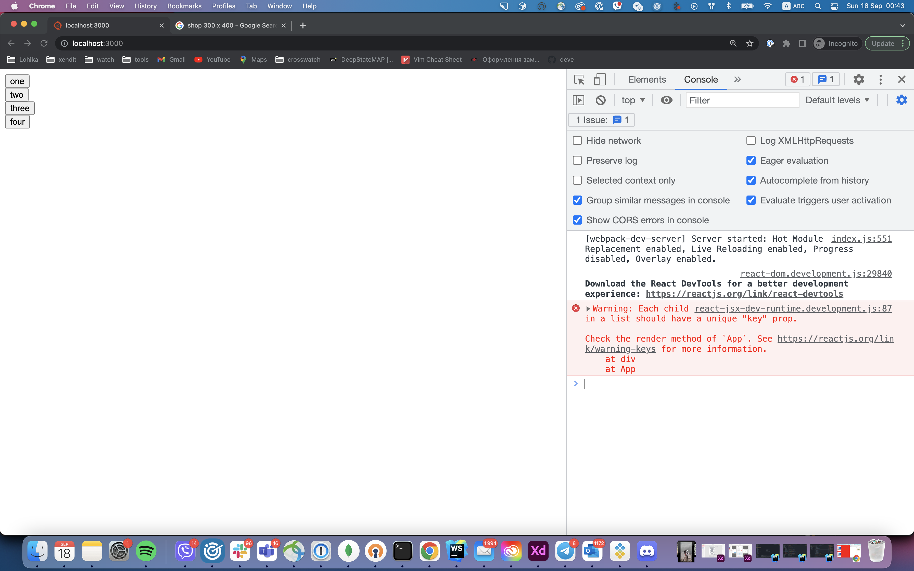
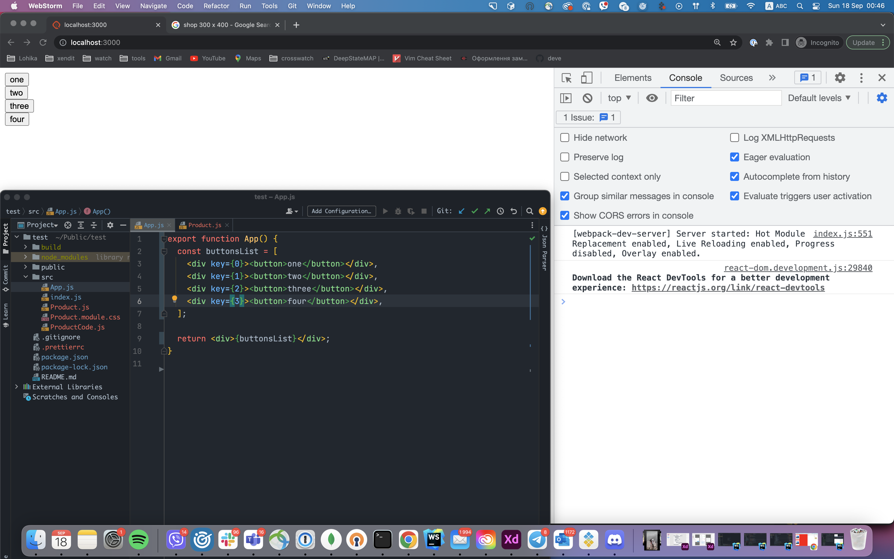
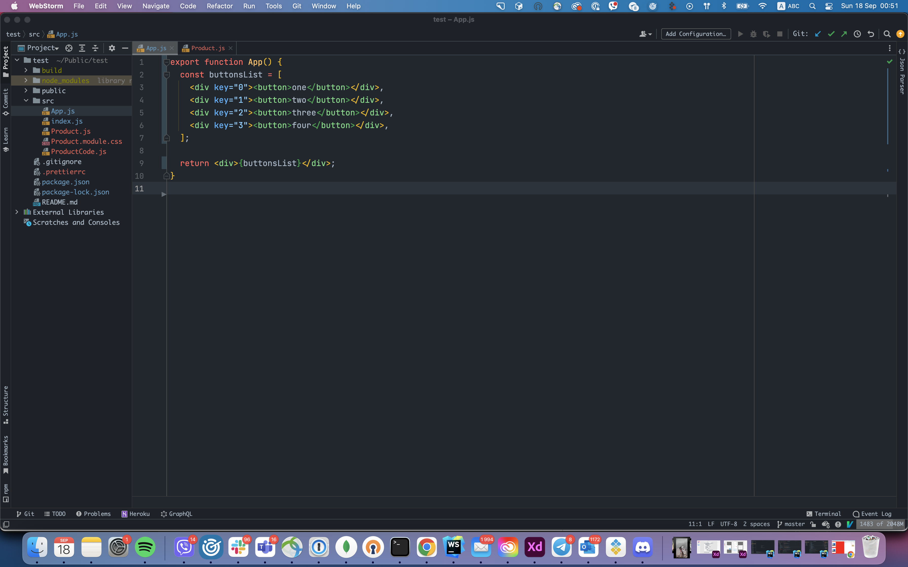
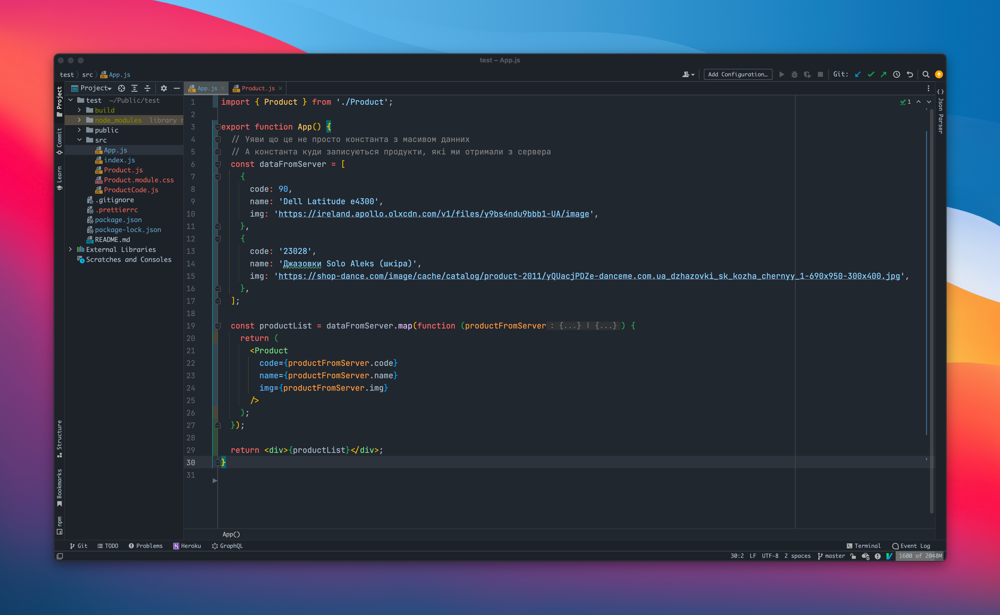
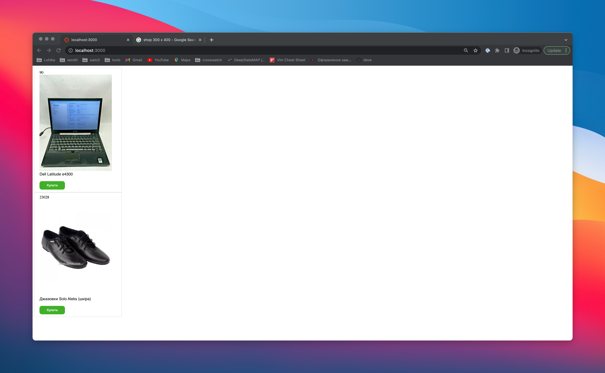

# Виведення масивів

Для початку розберемося з наступним - у всіх прикладах ми завжди виводили `html` руками, тобто ми його писали після `return`, але ми можемо записати частину `html` в змінну чи константу і вивести її, і на екрані ми побачимо `html` що знаходиться в тій змінній чи константі



Зверни увагу, в константу ми записали `html`, і потім виводимо значення змінної, і зауваж, що ми знову використовуємо фігурні дужки, томущо ми працюємо з `javascript`.

Окрім цього ми можемо виводити масиви з `html` елементу, для прикладу:



Зауваж, що після кожного елементу масиву, ми як зазвичай ставимо кому. Це не якась магія Javascript, це просто спеціальна можливість яка вбудована в `React`, що ти можеш виводити масиви

Але тут є один цікавий нюанс, якщо ми зазирнемо в консоль ми побачимо помилку



Вона говорить нам про те, що кожен елемент списку повинен містити в собі `key`. Тут потрібно запам'ятати, якщо ми хочемо виводити масив `html` елементів, тоді для кожного елемента цього масиву, нам потрібно надати атрибут `key`. Значення цього атрибуту повинне бути унікальне поміж елементів цього масиву.



Тепер, коли кожен елемент має унікальний ключ поміж своїх сусдів, помилки в нас більше не має. 

> Зверни увагу, у всіх прикладах раніше, коли ми передавали якийсь атрибут чи пропсу ми завжди працювали з типом `string`, але якщо ти хочеш використовувати інші типи, ти повинен огортати їх в `{}`.
> 
> **Чому `string` не потрібно огортати?** На справді `string` також можна огортати, але в тому не має великого сенсу, томущо в `html`, все що не огорнуто в `{}` буде рахувати як `string` за замовченням.
> 
> Два наступних приклади будуть ідентичними:
> 
> 

### Використання `map()` в React

А тепер поговоримо от про що, в прикладі коли ми показували компоненту `Product`, ми завжди виводили сталу кількість компонент:

`App.js`
```jsx
import { Product } from './Product';

export function App() {
  return (
    <div>
      <Product
        code="90"
        name="Dell Latitude e4300"
        img="https://ireland.apollo.olxcdn.com/v1/files/y9bs4ndu9bbb1-UA/image"
      />
      <Product
        code="23028"
        name="Джазовки Solo Aleks (шкіра)"
        img="https://shop-dance.com/image/cache/catalog/product-2011/yQUacjPDZe-danceme.com.ua_dzhazovki_sk_kozha_chernyy_1-690x950-300x400.jpg"
      />
    </div>
  );
}
```

Але в реальності, `frontend` ніколи не знає, скільки продуктів є на сторінці, томущо ці всі данні зберігаються десь на сервері, і якщо говорити про наш приклад, ми з сервера просто отримаємо масив продуктів, для прикладу:

```js
[
  {
    code: 90,
    name: 'Dell Latitude e4300',
    img: 'https://ireland.apollo.olxcdn.com/v1/files/y9bs4ndu9bbb1-UA/image'
  },
  {
    code: '23028',
    name: 'Джазовки Solo Aleks (шкіра)',
    img: 'https://shop-dance.com/image/cache/catalog/product-2011/yQUacjPDZe-danceme.com.ua_dzhazovki_sk_kozha_chernyy_1-690x950-300x400.jpg'
  }
]
```

І нам на основі цього масиву потрібно створити потрібні нам компоненти та вивести їх. Зазвичай ми робимо це таким чином:



Якщо відкрити браузер, то ми побачимо, що як і раніше в нас виводяться 2 продукти



Для зручності продублюю код:

```jsx
import { Product } from './Product';

export function App() {
  // Уяви що це не просто константа з масивом данних
  // А константа куди записуються продукти, які ми отримали з сервера
  const dataFromServer = [
    {
      code: 90,
      name: 'Dell Latitude e4300',
      img: 'https://ireland.apollo.olxcdn.com/v1/files/y9bs4ndu9bbb1-UA/image',
    },
    {
      code: '23028',
      name: 'Джазовки Solo Aleks (шкіра)',
      img: 'https://shop-dance.com/image/cache/catalog/product-2011/yQUacjPDZe-danceme.com.ua_dzhazovki_sk_kozha_chernyy_1-690x950-300x400.jpg',
    },
  ];

  const productList = dataFromServer.map(function (productFromServer) {
    return (
      <Product
        code={productFromServer.code}
        name={productFromServer.name}
        img={productFromServer.img}
      />
    );
  });

  return <div>{productList}</div>;
}
```

Давай тепер крок за кроком розберемо, як воно взагалі працює.

Перш за все, в константі `dataFromServer` ми просто зберігаємо масив об'єктів, далі використовуючи метод `map()` ми отримуємо масив компонентів `<Product />`, який потім виводимо.

Але розберемо момент з `map()`. Перш за все `map` - це метод масиву, який на основі одного масиву, формує новий. Метод `map()` приймає в якості аргумента функцію, яка викликається на кожному елементі цього масиву, де в якості першого аргументу поточний елемент масиву, і те що ця функція повертає стає елементом нового масиву.

Для прикладу:

```js
const originalArr = [1, 2, 3];

const newArr = originalArr.map(function(value) {
  return value * 2;
})
```

Функція, яку ми передали в метод `map()`, буде викликатися на кожному елементі масиву:
```js
function(value) {
  return value * 2;
}
```
Де в якості першого аргумента цієї функції буде поточний елемент масиву, ось ця змінна `value`, тобто якщо ми виведемо в консоль цю змінну, ми побачимо наступне:

```js
const originalArr = [1, 2, 3];

const newArr = originalArr.map(function(value) {
  console.log('value is: ', value);
  
  return value * 2;
})

/*
Уяви що це консоль

value is: 1
value is: 2
value is: 3
 */
```
Тепер наступне, те що буде повертати ця функція, буде елементом нового масиву. Наша функція множить кожне число на два, тобто:

Якщо в оригінального масиву `0` елемент дорівнював `1`, то в нового масиву, `0` елемент вже буде `2`

Якщо вивести в консоль константу `newArr`, то ти побачиш наступне:

```js
[2, 4, 6];
```

Тобто, головна суть метода `map()` взяти один масив, і на його основі створити зовсім інший, так і в нашому випадку, в нас є масив об'єктів:

```js
 const dataFromServer = [
    {
      code: 90,
      name: 'Dell Latitude e4300',
      img: 'https://ireland.apollo.olxcdn.com/v1/files/y9bs4ndu9bbb1-UA/image',
    },
    {
      code: '23028',
      name: 'Джазовки Solo Aleks (шкіра)',
      img: 'https://shop-dance.com/image/cache/catalog/product-2011/yQUacjPDZe-danceme.com.ua_dzhazovki_sk_kozha_chernyy_1-690x950-300x400.jpg',
    },
  ];
```

Ми пропускаємо його через `map()`

```jsx
const productList = dataFromServer.map(function (productFromServer) {
    return (
      <Product
        code={productFromServer.code}
        name={productFromServer.name}
        img={productFromServer.img}
      />
    );
  });
```

І в кінці в нашій константі `produtctList` знаходиться масив компонентів, це приблизно виглядає так:

```jsx
const productList = [
  <Product
    code="90"
    name="Dell Latitude e4300"
    img="https://ireland.apollo.olxcdn.com/v1/files/y9bs4ndu9bbb1-UA/image"
  />
  <Product
    code="23028"
    name="Джазовки Solo Aleks (шкіра)"
    img="https://shop-dance.com/image/cache/catalog/product-2011/yQUacjPDZe-danceme.com.ua_dzhazovki_sk_kozha_chernyy_1-690x950-300x400.jpg"
  />
]
```

Як я і казав, на основі одного масиву, ми створюємо зосім інший. Такий підхід надає нам гнучкості, томущо якщо з сервера буде приходити вже не 2 продукти, а сотня, воно саме перебере масив, на його основі створить компоненти і виведе, і нам не прийдеться писати руками 100 компонент `<Product />`. 

### Підсумки

По суті ми дійшли до закінчення цього етапу в плані теорії, по переду чекають також важкі теми, але з кожним кроком все буде ставити все простішим і простішим.
