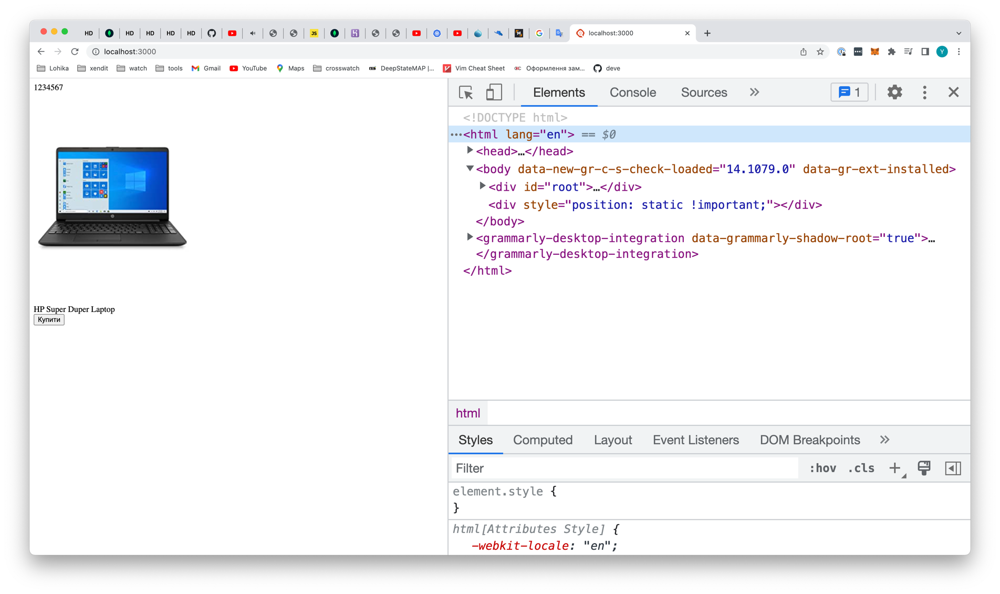

# Практикуємося з React компонентами

### Вступ
В даній темі, ми нарешті будемо щось кодити, а не тільки дивитися, але перед цим потрібно зробити декілька маленьких речей. 

По перше, потрібно зайти в `index.js` і повернути його в належний вигляд:


Окрім того, прийнято, що компонента `App` рахується вхідною для додатка, тобто по суті, в цьому файлі `index.js` ми тільки виводимо компоненту `<App />`.

І останнє з підготовлення, для того щоб запустит проект, ми використовуємо скрипт `start`, який ти можеш знайти в `package.json` в розділі `scripts`, тобто:

```bash
npm run start
```

Ця команда, це по суті огортка над командою `npm run build`, тільки якщо `build` - це процес який триває відносно довго, томущо він максимально стискає твій код, то `npm run start` дуже швидкий, і нічого не стискає, ідеально для розробки.

Окрім цього він робить ще одну магію, по перше, в тебе піднімається локальний сервер на якому вже крутиться твій реакт додаток, завдяки чому, ти максимально наближений до реальних умов, та коли ти щось будеш міняти в коді, він автоматично буде перебілджувати твій проєкт і оновлювати твою сторінку навіть без перезавантаження.

Так як цей веб сервер піднімається на твому комп'ютері, ми це називаємо локальним веб сервером, а щоб відкрити свій додаток, ти в браузері пишеш:

`http://localhost:3000`

Або

`http://127.0.0.1:3000`

І в тебе відкриється твій додаток. Ще раз зауважу, що ця команда використовується тільки для розробки.

Якщо відкрити `http://localhost:3000` в браузері, ти маєш побачити наступну картину


Якщо пам'ятаєш, в `index.js` файлі ми відображаємо компоненту `<App />`, в свою чергу компонента `<App />` повертає `HTML` де є 2 `div`. На скрінах нижче можеш це також побачити

`index.js`


`App.js`


І також якщо відкрити інструмент розробника, ти можеш побачити наступне:


По перше, ці 2 дівки, про які ми говорили, і які повертає компонента `<App />`

По друге, ти можеш побачити, що все це відображається в середині `div` з `id` `root`. 

### Компоненти та композиція компонентів
По перше, я скажу, що на разі ми не будемо працювати зі стилями, це буде окрема тема, на разі тільки експерименти з компонентами. В вступі в `React`, я показував такий приклад:


Давай спробуємо повторити це, використовуючи `React` компоненти, на разі просто використаємо `HTML` без `CSS`, і створимо декілька компонентів:

```
|- Компонета Товар
  |- Компонета КодТовару
  |- Картинка товару (не як окрема компонента)
  |- Назва товару (не як окрема компонента)
  |- Компонета Статистика
  |- Компонета Ціна
  |- Кнопка купити (не як окрема компонента)
```

Перш за все, стовримо нашу компоненту `Товар`, назвемо її `Product`, і створимо для нех файл `Product.js`.


Тепер нам потрібно цю компоненту вивести на екран, це ми будемо робити в компоненті `<App />`, ні в якому разі не роби це в `index.js`, томущо так не прийнято, це можна, але не прийнято.


Якщо відкрити сторінку в браузері, то ми побачимо наступне:


Виглядає так наче все працює як потрібно, тепер давай розширимо нашу компоненту `Product`, щоб вона виводила щось про продукт, а не просто `I am a product`.

Ось що в мене вийшло


І якщо відкрити браузер, ми отримаємо наступне


В нас відобразиться наш товар.

Наступним корок створимо компоненту КодТовару, так само, створюємо для неї окремий файл, і в кінці в нас має вийти наступне.


І застусуємо цю компоненту в нашій компоненті `<Product />`


Якщо зараз відкрити наш додаток в браузері, то це буде мати наступний вигляд:



Тепер в нас в самому верху відображається код товару. І тепер саме головне, використаємо нашу компоненту `<Product />` декілька разів


І в браузері ми побачимо наступне


Я спеціально зменшив розмір сторінки, щоб все вмістилося. Як ти можеш бачити, ми написали одну єдину компоненту, яка повертає певний `html`, по суті як я і казав, компонента - це шаблон, і якщо ми якось змінимо цю компоненту, цей шаблон, то і у всіх місцях де ми цю компоненту використовували, зміниться її вигляд.

### Кінець

Це таке невелике інтро в світ компонентів, по суті так і створюються компоненти, більше тут додати нічого. Далі ми розберемося як працювати:
- зі стилями, щоб це все виглядало гарно
- як передавати якісь данні в компоненту, щоб зробити її динамічною, томущо від неї не має толку, якщо вона показує одне і те ж саме

Ця і попередні теми - це фундамент, на який ми будемо опиратися, для знайомства з наступними темами, тому якщо щось було не зрозумілим, ми ще до того будемо повертатися, ну і звичайно пінгуй мене, щоб я міг зкоординувати тебе.


