# Компоненти в React

В цій темі ми будемо говорити тільки про теорію, яку вже зможемо застосувати в наступній темі.

### Імпортування та експортування загальна теорія

Розпочнемо наше вивчення з файлу `index.js`.

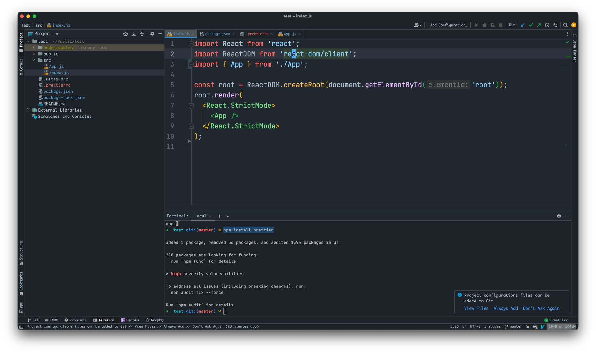

Зверни увагу на рядки `1 - 3`, за допомогою слова `import` ми можемо використати код, що знаходиться в іншому файлі, тобто те що ми обговорювали в темі **[вступ](./intro.md)**.

> Але потрібно зауважити:
> - імпортувати ми можемо тільки `змінні`, `константи` та `функції`; 
> - імпортувати ми можемо тільки те, що позначено словом `export`, тобто ми не можемо отримати доступ до будь-чого в середині того чи іншого файлу;
> - є декілька способів імпортувати щось з файлу, зверни увагу що рядки 1 та 2, відрізняються від рядка 3

Слово `import` ми використовуємо не тільки для імпортування власного коду, але і для імпортування коду з встановлених нами пакетів, для прикладу рядки 1 та 2 імпортують щось з пакетів, а рядок 3 імпортує щось з твого коду.

**Питання 1. Чим відрізняється імпортування пакетів, та імпортування власного коду?**

Якщо ми хочемо імпортувати щось з власного коду, строка яка йде строка після слова `from` повинна розпочинатися з `./` (приклад `from './App'`), тобто повинна розпочинатися шляхом.

Якщо ми хочемо імпортувати щось з пакету, в строці яка йде після слова `from` повинна розпочинатися з назви пакету. На строці `1` - це `react`, на строці `2` - це `react-dom/client`, якщо відкрити файл `package.json`, де розписані всі пакети що ми використовуємо, ти можеш впевнитися, що дійсно назви збігаються:

`package.json`
```json
{
  ...,
  "dependencies": {
    ...,
    "react": "^18.2.0",
    "react-dom": "^18.2.0",
    ...
  },
  ...
}
```

**Питання 2. Що буде в випадку якщо ми вкажемо не правильний шлях, або пакет якого не існує?**

Ми отримаємо помилку, додаток навіть не запуститься. В темі **[вступ](./intro.md#bundler)**, в підпункті **bundler** ми говорили про те, що всі файли збираються до купи та в кінці виходить один єдиний файл зі всім кодом. Якщо ти вкажеш невірний шлях, чи неіснуючий пакет, **bundler** просто не зможеш зібрати твій проєкт до купи, тому і додаток навіть не запуститься, а ти побачиш помилку.

**Питання 3. Якщо існує декілька способів імпортування, як мені знати, який з них правильний?**

Якщо це стосується твого коду, то тут все залежить від того, який вид імпортування тобі найбільше підходить, ми це будемо розбирати в наступному етапі, або від типу експорту, томущо їх також є декілька, і це також тема наступного етапу.

Якщо це стосується пакетів, то часто це розписано прямо в документації до пакету і скорше за все навіть з прикладами, якщо цього не має, то скоріш за все краще такий пакет не використовувати.

### Імпортування та експортування власного коду

На разі ми розберемо тільки один вид імпорту та експорту, він своєю чергою є найпростішим і найбільш зрозумілим, розпочнемо з експортування.

В нашому випадку, у файлі `index.js` ти можеш знайти приклад цього імпорту/експорту на рядку 3

```js
import { App } from './App';
```

Якщо відкрити файл `App.js` ти побачиш наступну функцію:

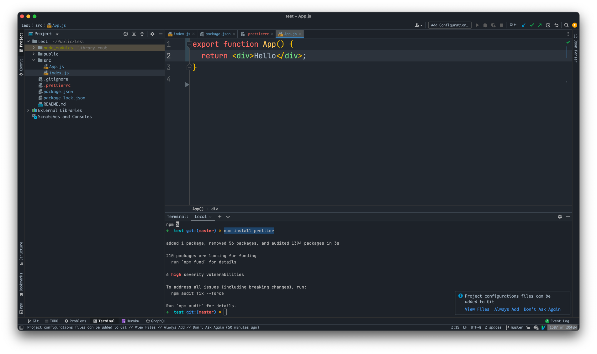

```js
export function App () {
  ...
}
```

**Важливе правило** - якщо ти хочеш щось експортувати, тоді перед змінною, константою чи функцією, ти повинен написати слово `export`. В такому разі, твій імпорт буде виглядати наступним чином:

```js
import { те_що_ти_хочеш_імпортвати } from 'шлях_до_файлу_чи_пакет';
```

Уявимо ситуацію, що наш файл `App.js` експортує більше чим просто одна функція `App()`:

```js
export const age = 10;

export function getFullName(firstName, lastName) {
  ...
}

export function App () {
  ...
}
```

І нам потрібні ці дві функції та константа, тоді `import` буде виглядати наступним чином:

```js
import { age, getFullName, App } from './App';
```

> Хочу звернути увагу, що:
> - Якщо твій файл експортує для прикладу 100 функцій, а тобі потрібна тільки одна з них, ти можеш імпортувати тільки одну, тобі не потрібно імпортувати все;
> - Ліміту на експортування не має, експортуй хоч тисячу функцій чи змінних з одного файлу;

### Компоненти 

В `React` - компонента це функція, назва якої розпочинається ВЕЛИКОЇ літери, та вони повинна повертати `html`, який потрібно показати.

> Зауваж!!! Без дотримання цих вимог, воно просто напросто не буде працювати. 

> Як гарний тон, прийнято, що кожна компонента лежить в окремому файлі, який називається таким самим іменем як і функція, тобто, якщо твоя компонента називається `function Todo() {...}`, то файл буде називатися `Todo.js`; _Це просто правило гарного тону, не більше_ 

На даному етапі нашого додатка, в нас є лише одна компонента, а саме `App.js`.


Як ти можеш бачити, вона виконуємо всі умови компоненти, це функція, назва починається з великої літери, та вона повертає HTML.

Одразу хочу загострити увагу на моменті, який провтикують початківці - компонента повинна повертати тільки один елемент! 

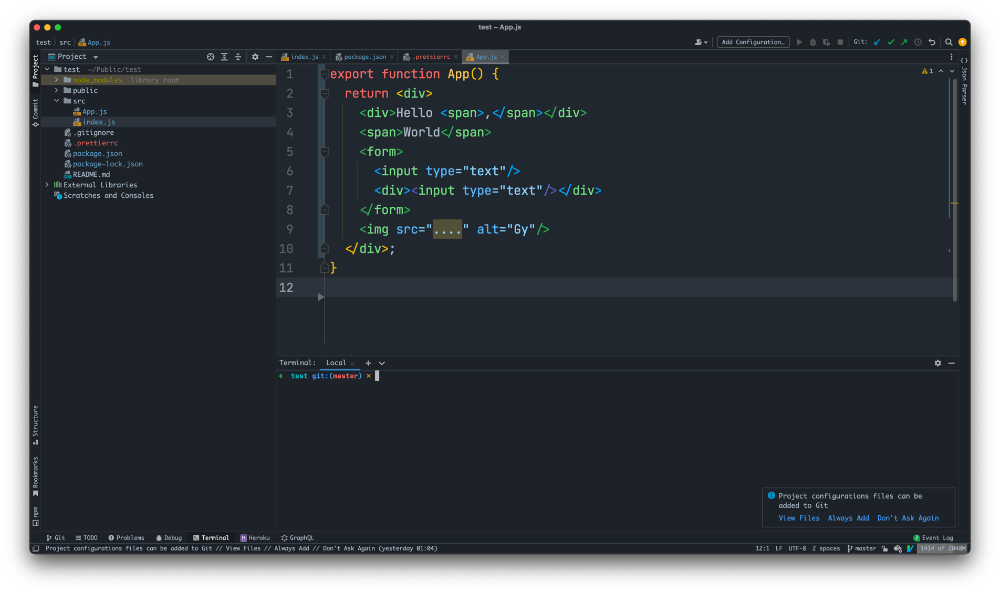

В прикладі вище, ми повертаємо тільки один елемент, в нашому випадку - це `div`, який в середині має безліч інших елементів, але повернути одразу 2 елементи ми вже не можемо:

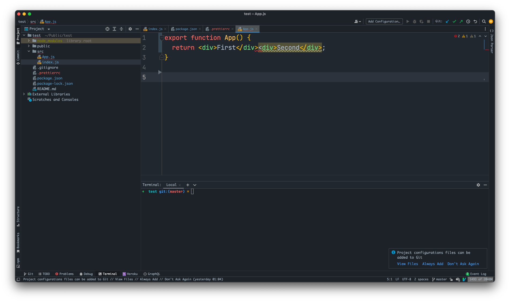

Як ти можеш бачити, навіть webstorm підсвічує що є помилка в коді. Якщо тобі вкрай необхідно одночасно повернути 2 елементи, тоді огорни їх в таку штуку як `<></>`:

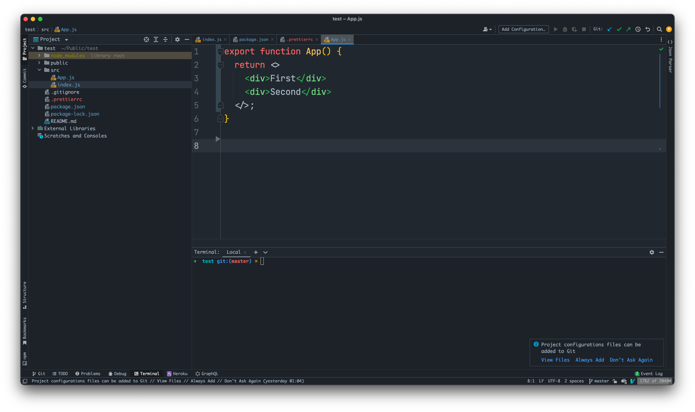

Таке робиться доволі рідко, і вважається за поганий тон, але випадки бувають різні.

### Використання компонент

> Хочу звернути увагу, компоненти це просто шаблон, який ми можемо використовувати стільки разів, скільки нам потрібно.

Для початку потрібно сказати, що будь-яка програма має один єдиний вхідний файл, з якого стартує проєкт, в випадку з `react` таким файлом є `index.js`.

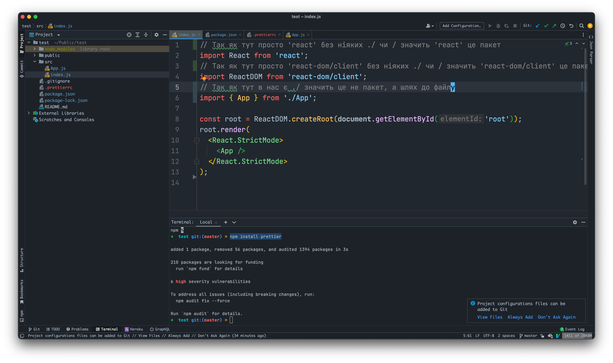

Розберемо що відбувається в середині цього файлу, нам не потрібно заглиблюватися, просто опишемо все загальними термінами.

Зверни увагу на рядок `8`, тут ми використовуємо `ReactDOM`, який ми імпортували з бібліотеки `react-dom/client`, і викликаємо метод `createRoot`. Думає про це наступним чином, тут ти створюєш `React` додаток і записуєш його в константу `root`.

На рядку `9` ми викликаємо метод `render`. Цей метод приймає в себе `HTML` який потрібно показати на екрані.

На данний момент ми показуємо наступне:

```jsx
root.render(
  <React.StrictMode>
    <App />
  </React.StrictMode>
);
```

Зараз нас не цікавить, що таке `<React.StrictMode></React.StrictMode>`, зверни увагу тільки на `<App />`.

`<App />` це наша компонента, яку ми імпортували з файлу `App.js` на 5 рядку.

Компоненти ми використовуємо схожим чином і `HTML` теги. Пам'ятаєш, в `HTML` були парні теги як `div`, та непарні такі як `img`. Компоненти в `React` використовуються як не парні теги:

```jsx
<App />
```

Зверни увагу, що в `HTML` в непарних тегах, нам не потрібно було ставити цей символ в кінці `/`, але в `React`, ти зобов'язаний це робити не тільки для компонентів, а і до будь-яких непарних тегів.

Якщо в `HTML` тег `img` ти писав як:

```html

```

То в `React` це буде виглядати наступним чином:

```jsx

```

В кінець додається `/`.

І як я казав, компоненту ми можемо використовувати скільки завгодно разів:

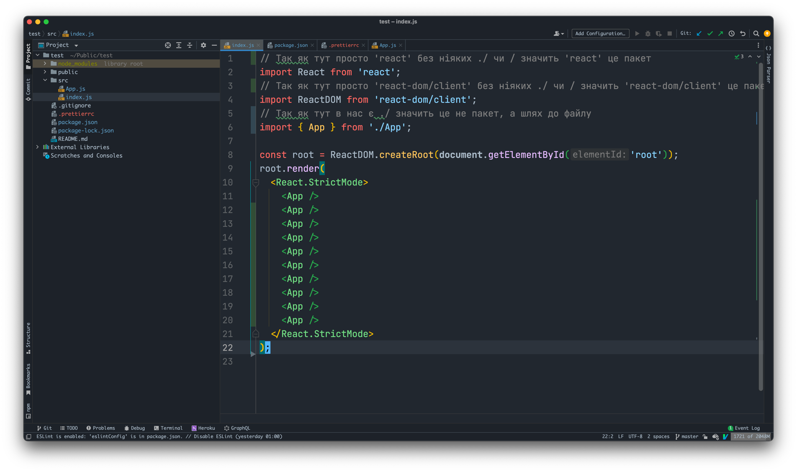

### Public та старт React
Тепер давай детальніше розберемо за що відповідає 8 рядок та директорія `public` 😅. Розпочнемо з директорії `Public` :) 

Раніше, до `React`, для кожної сторінки в браузері, був окремо заготовленний `html` файл. Якщо в тебе було 3 сторінки на сайті, то в тебе і було 3 `html` файли. 

Для прикладу:

```shell
https://my-site.com - index.html
https://my-site.com/about - about.html
https://my-site.com/contact-us - contact-us.html
```

Але `React` - це single page application, тобто односторінковий додаток, він має лише один єдиний `html` файл.

```shell
https://my-site.com - index.html
https://my-site.com/about - index.html
https://my-site.com/contact-us - index.html
```

Тоді ти можеш поставити питання, а як ми тоді будемо показувати контент в залежності від сторінки в `React`. Для цього ми створюємо компоненти, які репрезентують кожну сторінку, і в залежності від поточного url, ми будемо показувати той чи інший компонент.

```shell
https://my-site.com - index.html - показувати компонени Home.js
https://my-site.com/about - index.html - показувати компонени About.js
https://my-site.com/contact-us - index.html - показувати компонени ContactUs.js
```

**Чому ми розглядаємо це зараз?**

В директорії `public` в нас є тільки один єдиний файл, який називається `index.html` - це той самий один єдиний `index.html` файл з прикладу вище, в ньому якраз і буде крутитися твій `React` додаток.

Я видалив з нього все непотрібне, і от що отримав:

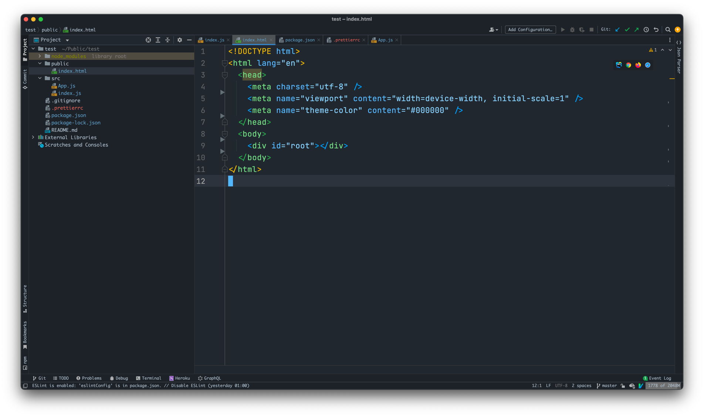

Зверни увагу на 9 строку, там в нас є `div` з `id="root"`, саме в цьому тезі, буде створений наш `React` додаток, що я маю на увазі, повернись назад в `index.js`.


І зверни увагу на 8 строку: 

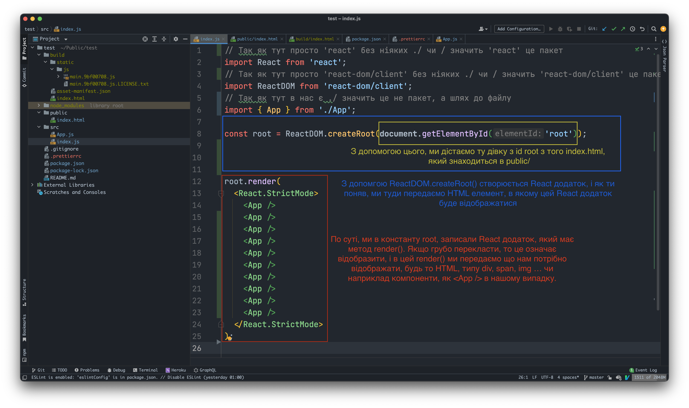

- На цій 8 строці ми створюємо React додаток, і записуємо його в константу `root`;
- Для того, щоб створити React додаток, ми використовуємо об'єкт `ReactDOM` який ми імпортуємо з `react-dom/client` на 4 строці, а точніше використовуємо його метод `createRoot`.
- Метод `createRoot` приймає `HTML` елемент, в якому потрібно створити `React` додаток
- І в кінці-кінців, на 12 строці в метод `render` ми передаємо `html`, який потрібно те що потрібно вивести на екран

### Білд та збираємо все до купи

І так, на даному моменті, ми розібрали всю базу реакту, в плані того як воно працює, і що за що відповідає, тепер ми зберемо все до купи, і зрозуміємо що з того всього виходить в кінці.

Перше, що я хочу обговорити, я не раз говорив, про те, що `import` є тільки в `Node.js`, і браузер не вміє то читати, тому ми збираємо то до купи, щоб браузер міг то прочитати, тоді питання як це все зібрати до купи?

Заходимо в `package.json`, і знаходимо такий пункт як `scripts`

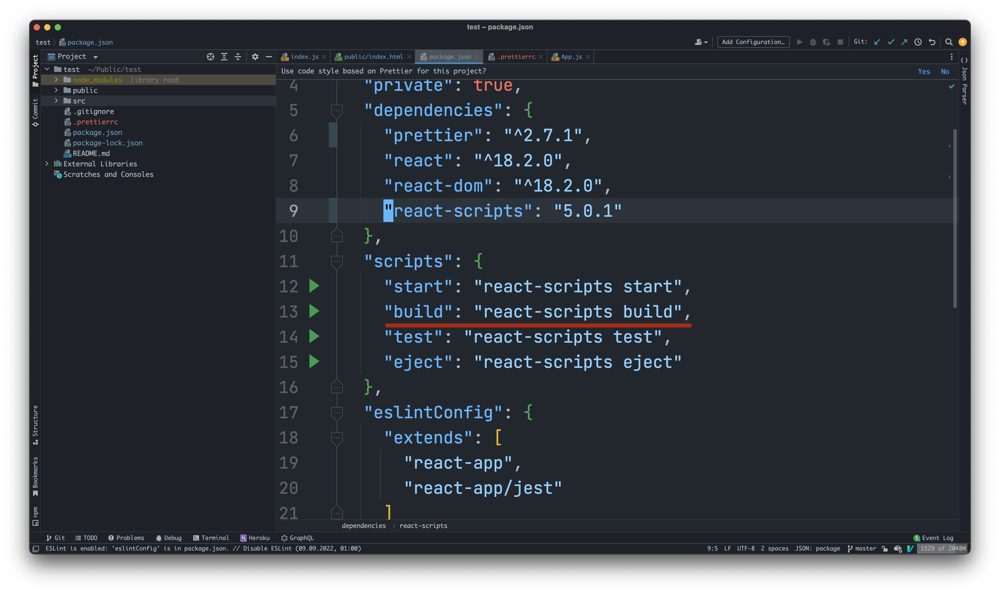

Як я говорив в [Вступ](./intro.md#packagejson), в цьому місці в нас зберігаються наші `npm` скріпти. На разі нас цікавить скрипт `build`, якщо запустити його, то наш проект збере все до купи, і ми отримаємо код, який може їсти браузер:

Для того щоб запустити `npm` скрипт, ми пишемо `npm run назва_скрипта`, тобто щоб запустити скрипт `build`, нам потрібно написати наступне:

```bash
npm run build
```

Цей процес може зайняти якийсь час, але не дуже багато, після чого в тебе згенерується папка, під назвою `build`, от що в ній має бути:

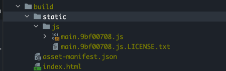

В тебе згенерується наступна структура. В ній є `index.html` файл, без нього ніяк, і також в тебе є тільки один єдиний, `js` файл. Тепер з такою штукою, браузер зможе працювати. Окрім того, весь код, максимально мініфікований, якщо ти відкриєш `js` файл, ти побачиш наступне


Як можеш бачити, тут повна, нечитабельна для наших очей каша, це зроблено навмисно, щоб максимально зменшити розмір файлу. Але на цьому дива не закінчуються, якщо подивитися на наш `index.html` файл в директорії `public`, ти побачиш, що ми не підключали ніякого `javascript` файлу, і типу, яким чином наш додаток має працювати без javascript'а?

Ось цей `index.html` з директорії `public`:


Взагалі нічого про javascript. А от тут і є "магія". Діло в тому, що коли ми білдаємо наш проєкт, цей `index.html` файл в директорії `public` береться як шаблон, як основа. Далі, після того, як javascript буде згенерований, цей білд, сам, автоматично, додасть тег `<script></script/>` в `index.html`.

Ось дивись, відкриваю `index.html` файл з папки `build`

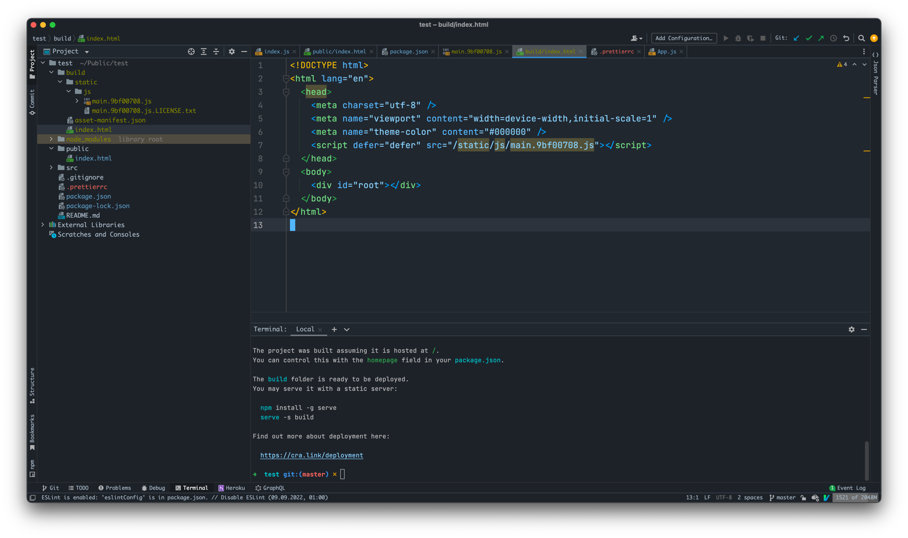

Зверни увагу на 7 рядок, ми це не писали, білд сам його додав. І це тільки маленька частина можливостей, які ми можемо використовувати.

Підсумую що робить `build`

1. Генерує один єдиний `js` файл _(до речі, от ті цифри, завжди будуть мінятися, це для того, щоб кешування не працювало)_. Він бере `index.js` файл з `src` і крок за кроком, збирає всі `js` файли які використовуються в один єдиний і вставляє його в папку `build`.
2. Копіює твій `index.html` файл з папки `public` додає туди тег `script` який підключає прямо перед цим згенерований `js` файл і вставляє в папку `build`.

Але, тут є один останній нюанс, `build` ми використовуємо тільки для фінального варіанту коду, який буде зберігатися на сервері, для розробки ми використовуємо команду `start`, це вже ми розберемо в наступній частині. Ця команда `start` робить все теж саме, що і `build`, просто вона не оптимізовує код, тому дуже швидко білдить проект при кожній його зміні.
