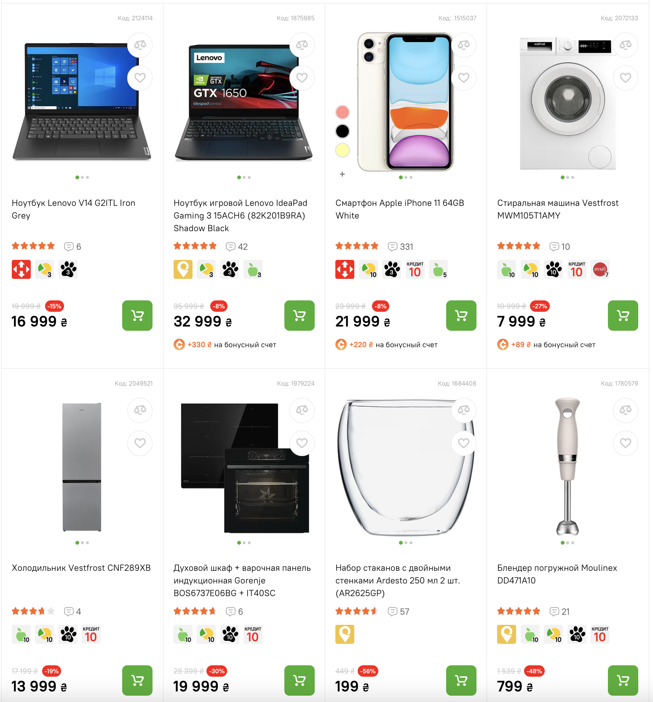
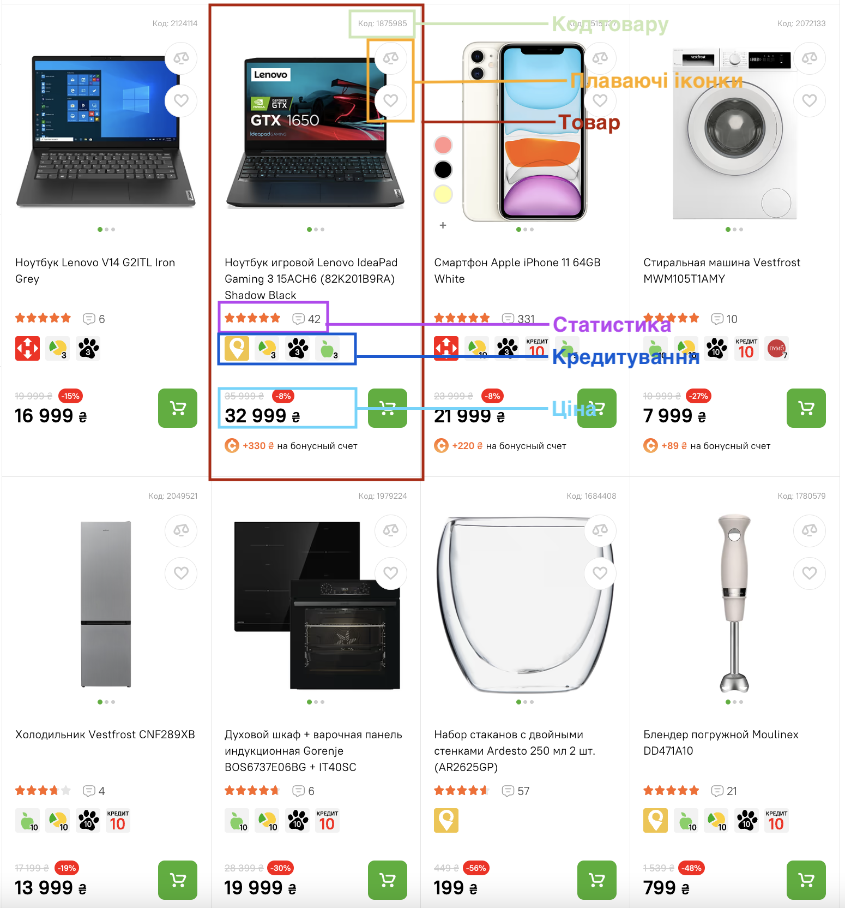
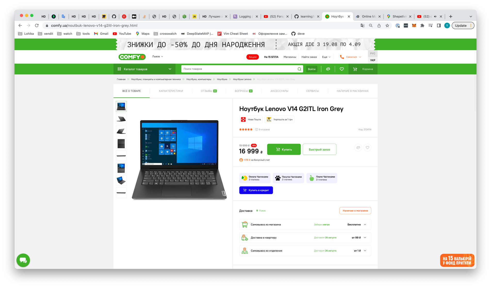

# Вступ до React

В цій темі ми розберемо взагалі що таке `React`, які проблеми він вирішує, що таке компоненто-орієнтований підхід, і як до цього дійшли розробники.

### Мініісторія розвитку фронтенду

По перше потрібно згадати, як виглядав інтернет навіть якихось 10 років назад, по більшій мірі - це були звичайні `HTML` сторінки зі стилями, і мінімальною кількістю Javascript`а.

З розвитком індустрії вимоги користувачів до сайтів все збільшувалися та збільшувалися, вони хотіли більше інтерактивності, менший час очікування і так далі. Своєю чергою реалізовувати всі ці вимоги, використовуючи лише чистий Javascript було дуже важко, а про якусь підтримку такого коду я взагалі мовчу, до того ж кожен розробник робив так, як він вважав це за потрібним.

### Компонентно орієнтований підхід

Виходячи зі всіх вимог, був створений так званий компонентий підхід.

Головним елементом цього підходу є компонента. `компонента` - це якась сутність, якій ти вказуєш, який `html` потрібно показувати, своєю чергою цей `html` може бути динамічним, тобто використовувати якісь данні, які будуть змінюватися, а при зміні цих данних, на екран автоматично буде виводитися вже новий `html`, з новими даними.

Для прикладу в `React` - це функція, яка повертає `html`, а про динамічні дані ми будемо говорити в наступному етапі.

Переваги такого підходу доволі очевидні, ти можеш розділити свій проєкт на компоненти, і використовувати їх стільки разів, скільки потрібно, на тих сторінках, на яких тобі потрібно. У випадку, якщо тобі треба буде щось змінити, чи додати новий функціонал, ти додаси його тільки в компоненту, а не як раніше, коли тобі доводилося робити зміни по всьому проєкті

Для прикладу сайт `comfy`:



Візуально, навіть не думаючи про `React`, ми можемо його поділити на якісь частинки:



На основі цього, ми могли б створити наступні компоненти:

```bash
|- Компонета Товар
  |- Компонета КодТовару
  |- Картинка товару (не як окрема компонента)
  |- Назва товару (не як окрема компонента)
  |- Компонета Статистика
  |- Компонета Ціна
  |- Кнопка купити (не як окрема компонента)
```

Окрім цього, ми з легкістю можемо перевикористати наші компоненти на будь-якій сторінці сайту:



На даному знімку екрана зображена сторінка окремого продукту, і тут ми можемо перевикористати наступні компоненти: `Ціна`, `Статистика`, `КодТовару`.

Тобто комонентний підхід, дає нам гнучкість, нам не потрібно дублювати код, ми просто створюємо компоненти, як шаблон, і просто використовуємо їх в необхідних для нас місцях. 
