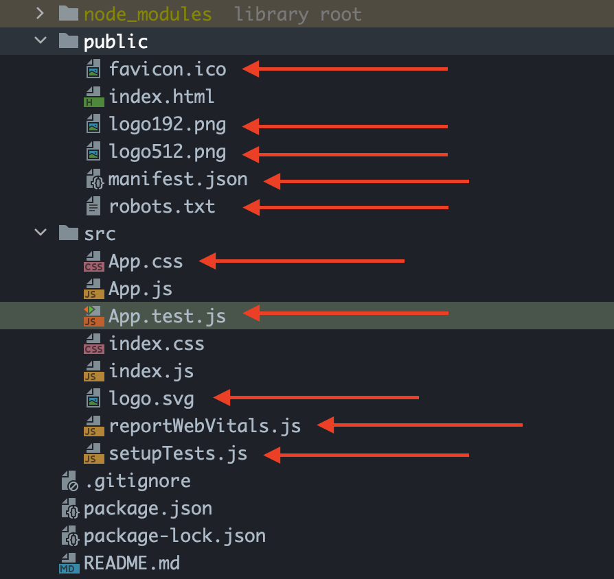
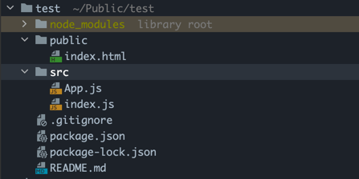
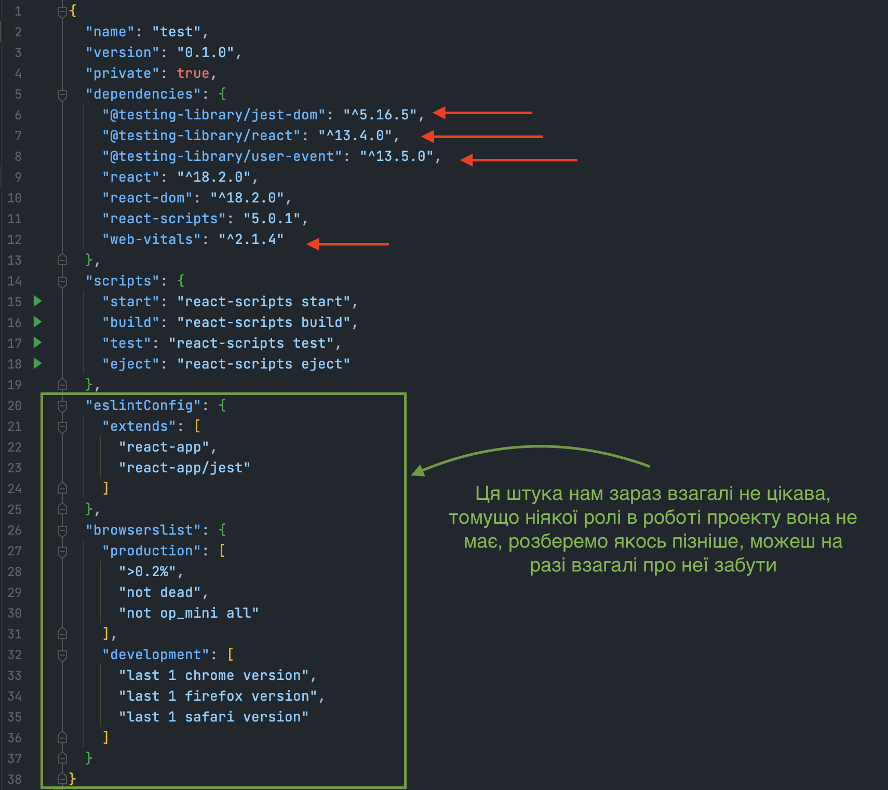
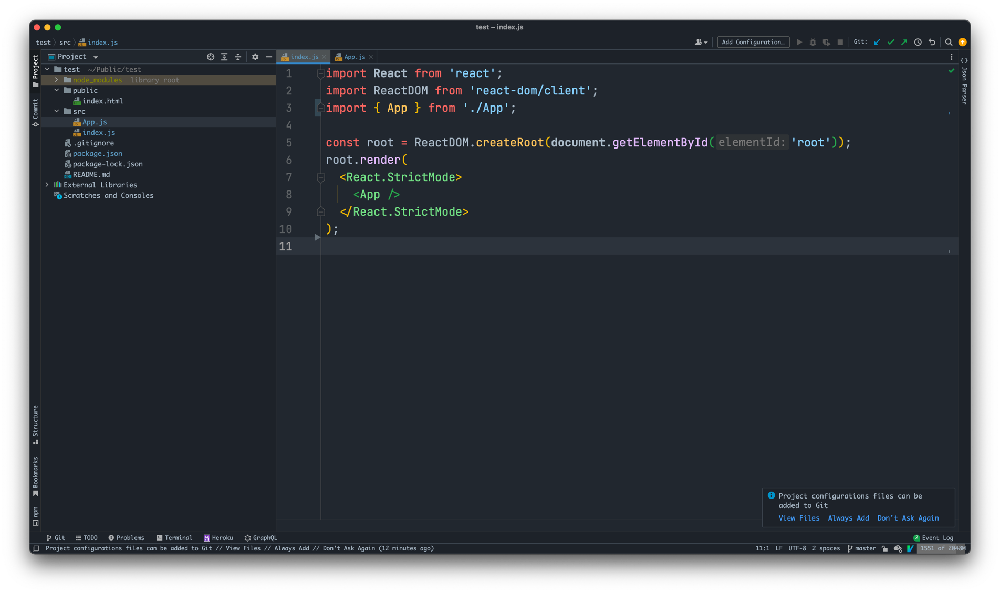
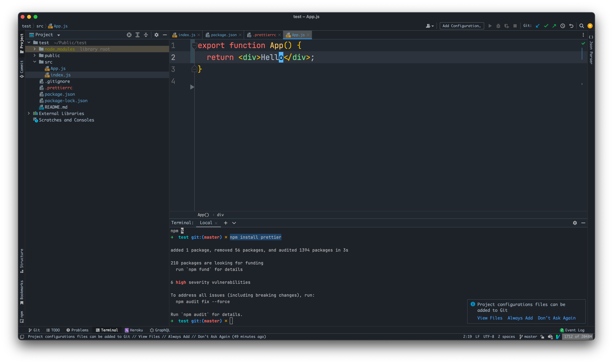
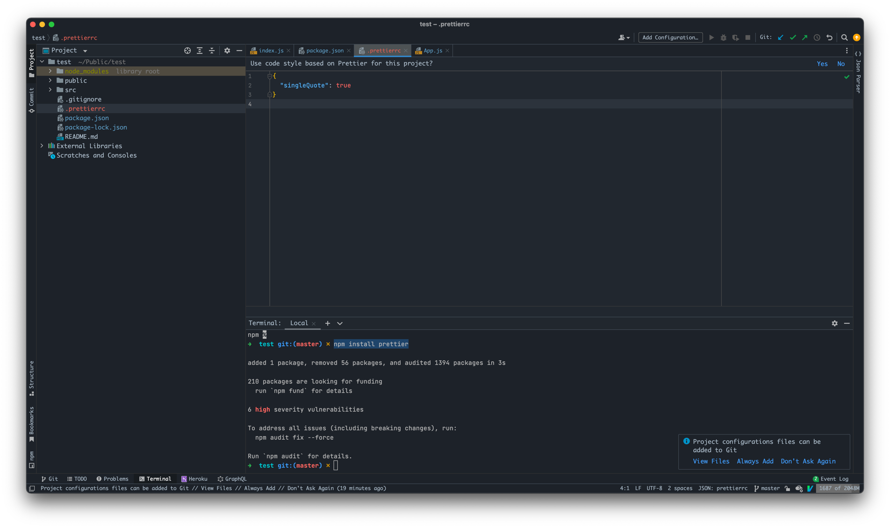

# Налаштування React проєкта

Одразу вимушений сказати, що ми не використовуємо чистий реакт, а викристовуємо спеціальний пакет який називається `create-react-app` який надає нам багато плюшок, які спрощують наше життя в роботі з проектом, всі ці плюшки ми будемо розбирати надалі. Перше що нам дає ця штука - це можливість розробляти реакт додаток використовуючи штуки які ми розбирали тут [Вступ](./intro.md), для прикладу можлвість розбивати проект на багато файлів, і використовувати [NPM](./intro.md#npm), окрім цього він одразу згенерує для нас зручну структуру проекту.

Для того щоб створити проєкт використовуючи `create-react-app` потрібно відкрити термінал і написати в нього:

```bash
npx create-react-app workspace 
```

Останнє слово `workspace` - це назва папки яку згенерує `create-react-app`

Як тільки ми створимо перший `React` проект, там буде доволі багато коду, який нам не потрібен для навчання, томущо ми поступово до всього будемо доходити.

Перше що нам потрібно зробити це видалити не потрібні для нас файли:



Після очищення в тебе має бути наступна структура:



Після чого тобі потрібно зайти в файл `package.json` і видали там наступні штуки:



Після чого тобі потрібно зайти в файл `index.js` і привести його до такого вигляду:



Також зайти в `App.js` і привести його до такого вигляду:



Так як ти вже знайомий з `prettier` пояснювати навіщо не буду, лише інструкція як додати до проекту:

Виконай в консолі команду:

`npm install prettier`

Таким чином ти встановиш в проект паке `prettier`

Далі нам потрібно створити файл конфігурації для `prettier` його назва `.prettierrc`, створити його потрібно в корені проекту і написати туди наступне:



Після чого в тебе повинен запрацювати `prettier` і робити твій код гарним.

### Підсумки
Це все потрібно щоб ми почали працювати з `React` на максимально чистому рівні і отримувати тільки ту інформацію яка нам потрібно в поточний момент.
