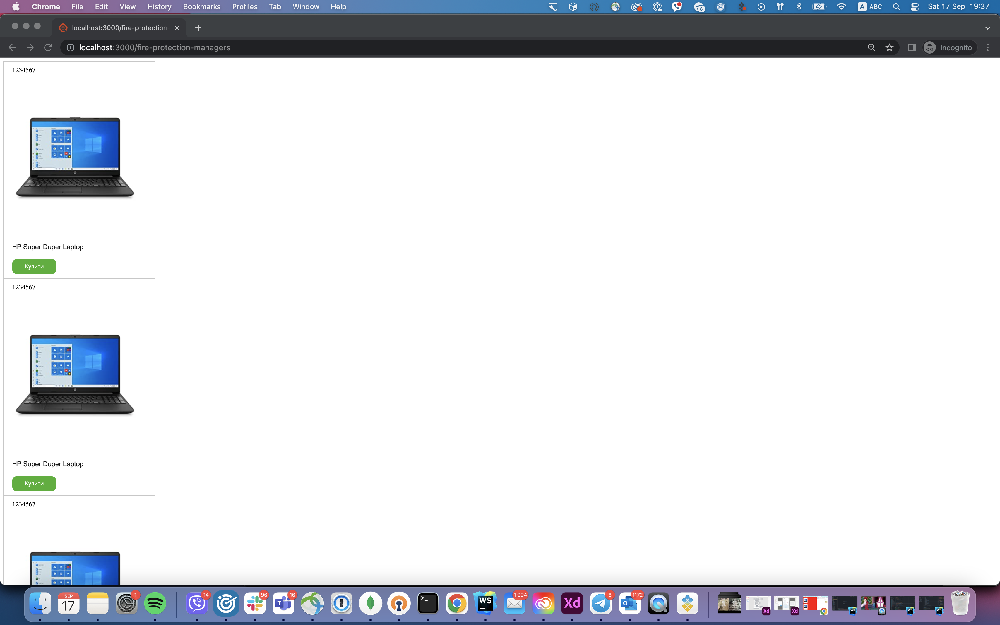
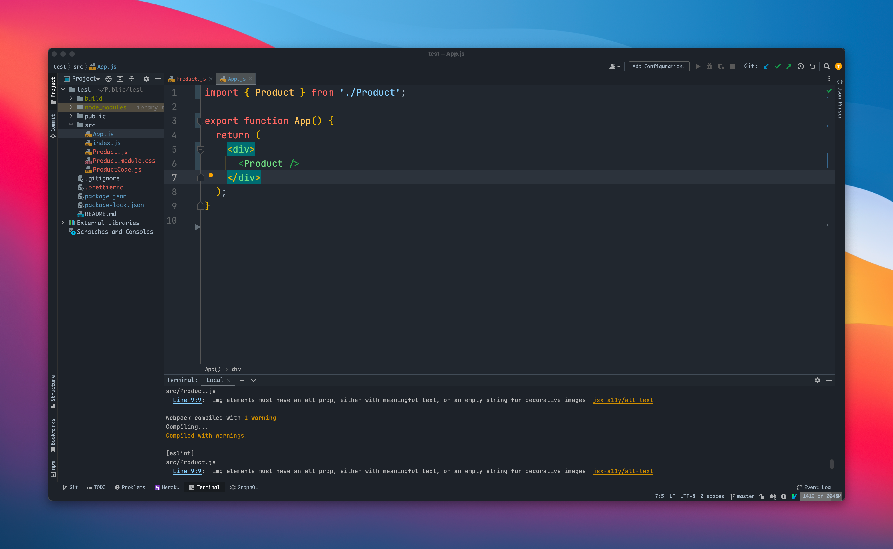
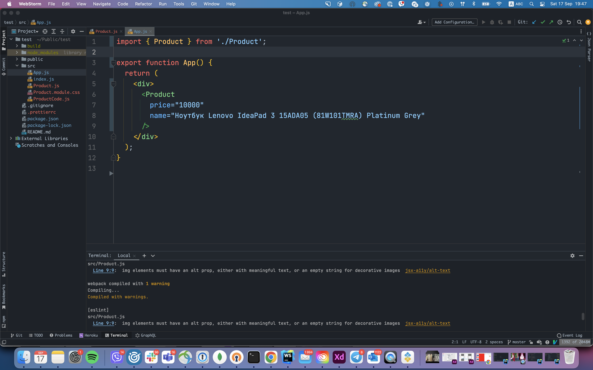
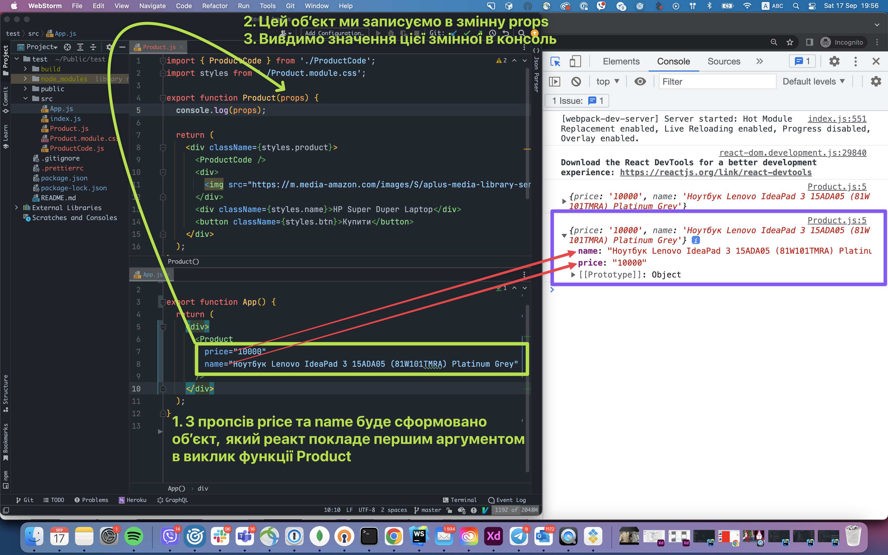
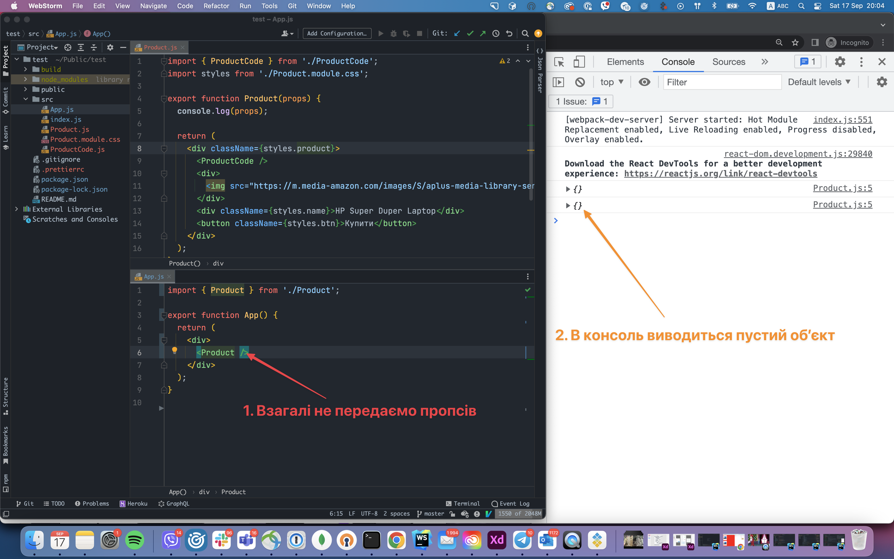
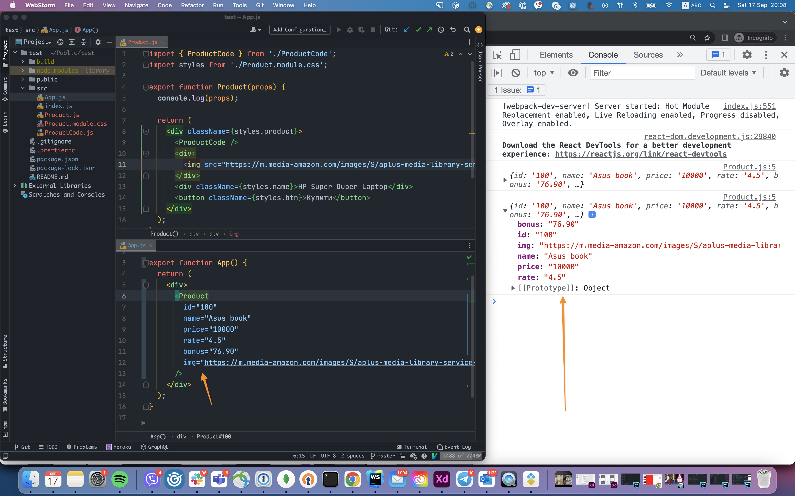
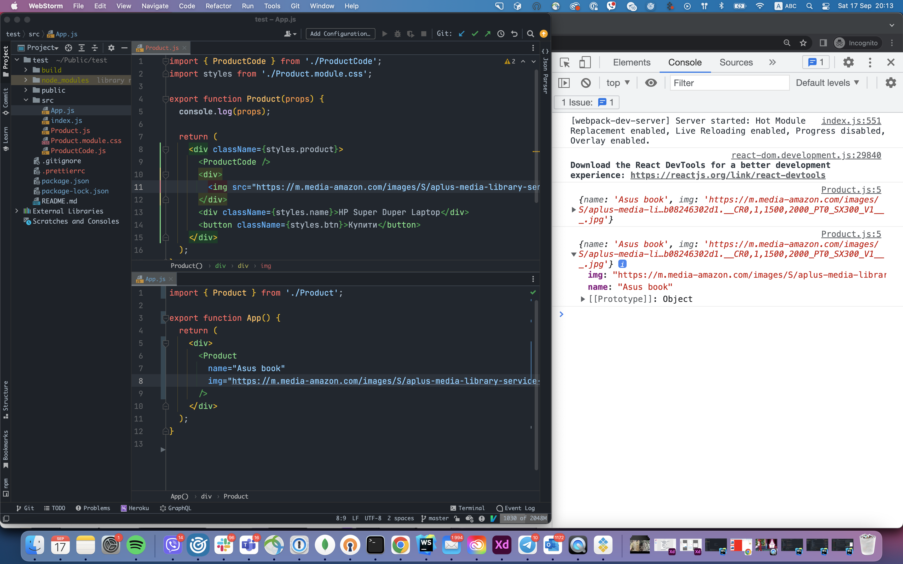
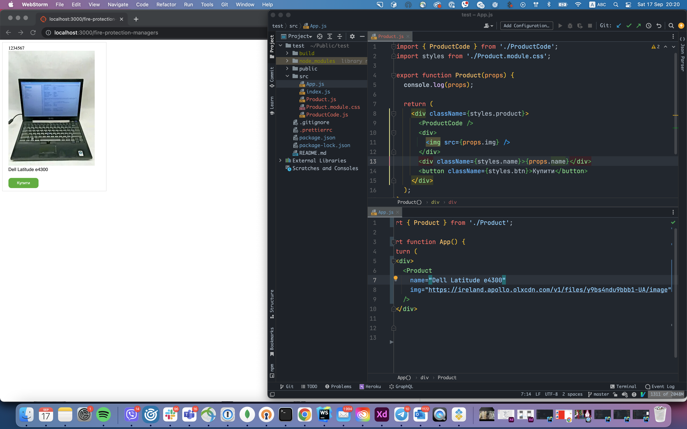
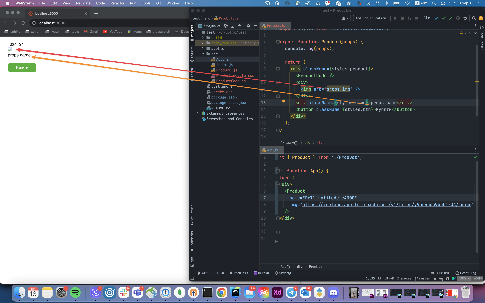
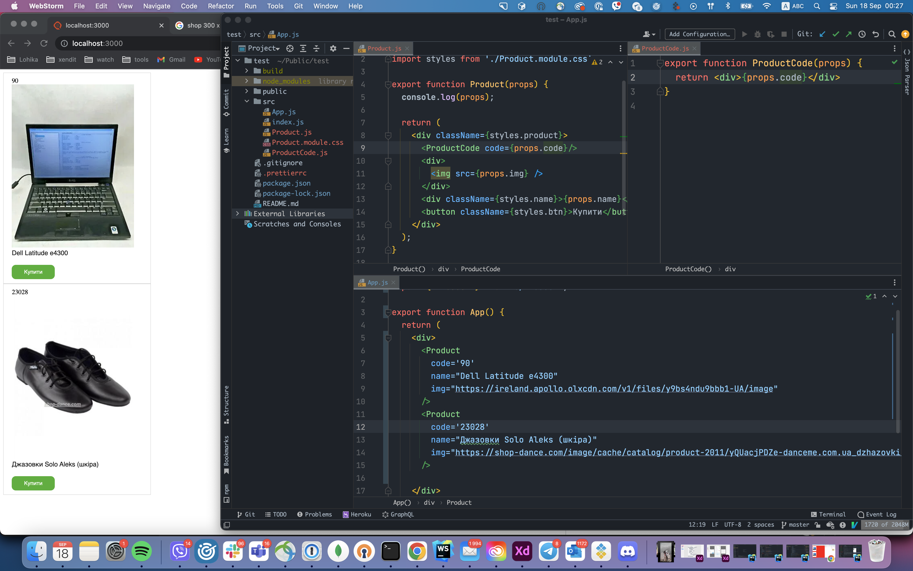

# React Props

І так, ми підходимо до фінальної частини цього етапу 😊.



На разі в нас є ось така `UI` частина, і наша головна проблема в тому, що кожна компонента має одні і ті ж самі значення, що повністю позбавляє їх хоча би якогось права на існування.

Для того щоб зробити наші компоненти більш перевикористовуючими в `React` є таке поняття як `Props`. Грубо кажучи завдяки `Props` - ми можемо передати в компоненту якісь данні.

**Розберімось як використовувати `Props`.**

Для початку, в нашій компоненті `App` видалимо всі `<Product />` окрім одного (це потрібно просто для зручності пояснення).



`Props` чимось схожі до атрибутів в `html` тегах. Для прикладу, давай в компоненту `<Product />` будемо передавати назву продукта.


Як я і казав, `Props` схожі на атрибути і передаються в наступному форматі:

```
назва=значення
```

Щоб зробити приклад ще більш розгорнутим, давай ще будемо передавати ціну товару



Як ти можеш бачити, все справді схоже на атрибути

Тепер головне питання, яким чином, ми ці пропси можемо отримати в середині нашої компоненти `<Product />`.

Перше за все пригадаймо що таке компонента. `Компонента` - це функція, яка повертає `html`, який ми хочемо показати на екрані, тобто, спочатку реакту потрібно цю функцію викликати, десь записати цей `html` і вже після того його відобразити, цей процес схований в середині реакту, і ми на нього не впливаємо. 

Але, `React` не просто викликає функцію, він викликає її з одним єдиним аргументом. Цей аргумент - це об'єкт, в якому знаходяться всі пропси, які були передані, якщо ж ніяких просів не було передано, об'єкт буде пустим.



Для прикладу, видалимо всі пропси, і подивимося що виведеться в консоль



Як ти можеш бачити, в консоль взагалі нічого не виводиться. І ще для прикладу, давай передамо багато всяких різних пропсів



Як ти можеш бачити, `React` і справді формує всі `Props` які ми передали в звичайний об'єкт.

Зверни увагу на функції `Product`, перший аргумент ми назвали `props`, ти можеш назвати як ти хочеш, як і зі звичайними функціями (томущо це і є функція), просто прийнятно називати його `props`.

Ми розібралися як передавати проси, так як їх прймати, а як їх використовувати? 

Давай на разі, будемо передавати в нашу компоненту 2 пропси: `name` та `img`. 



І давай будемо в src картинки, виводити те посилання, яке ми передаємо в проси, та будемо виводити назву продукта те, яке нам приходить з пропсів. Робиться це таким самим чином як зі стилями. Нагадємо:

Якщо нам потрібно використати якийсь `Javascript` в середині нашого `html`, ми повинні огорнути його в фігурні дужки - `{}`

Тобто:



Якщо ти не будеш огортати його в фігурні дужки, воно буде сприйматися просто як текст:



Окрім цього наша компонента `Product` в середині використовує компоненту `ProductCode` яка на разі виводить одне єдине значення.

Давай для компоненти `Product` будемо передавати додаткову пропсу `code`, яку ми будемо передавати в `ProductCode` і виводити її там.


Тут зверни увагу на те, що наша компонента приймає пропсу, і передає її іншій компоненті, це нормальний підхід.

Тепер наша компонента стала більш перевикористовуємою, так як може приймати багато різних параметрів, але що якщо ми забудемо передати ту чи іншу пропсу? Все залежить від того, що ми робимо з тою чи іншою пропсою, якщо ми її просто виводимо, то нам або нічого не покажеться, або покажетсья якийсь undefined, а якщо ми використовуємо її ще для якихось цілей, то можемо отримати помилку. Тут порада одна, не забувай передавати всі необхідні пропси, на жаль, в Javascript не має нормального способу вказати що потрібно передавати, тому це або дивитися на інші куски коду, де та чи інша компонента використовується і просто робити по прикладу, або дивитися на код компоненти і шукати які пропси потрібно передавати

Ну і приклад де виводиться більше чим просто одна компонента `<Product />`



### Підсумки

По суті ми розібрали майже все про пропси, єдине хочу додати, в наших прикладах, в якості пропсів, ми передавали тільки строку, але ми можемо передавати будь який тип данних, масив, об'єкт, булеан, число, робиться це тим самим чином, але потрібно використовувати `{}`, це ми розберемо в наступних темах, на разі цього достатньо.
