# Стилі в React

В цій темі, ми розберемо як потрібно працювати з CSS в `React` додатках.

### Public

Найпростіший, і знайомий для тебе спосіб працювати зі стилями - це підключити їх в `html` сторінку, використовуючи тег `<link />`.

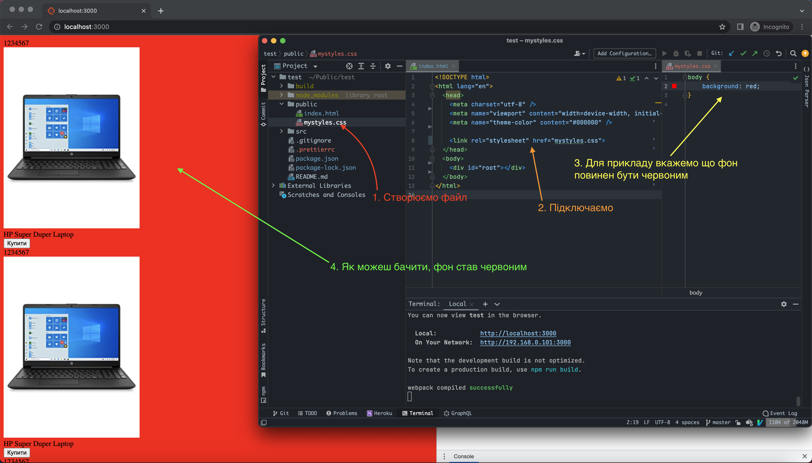

1. В папці `/public` створюємо наш `css` файл;
2. В папці `/public` у файлі `index.html` підключаємо;
3. Вказуємо що тег `<body></body>` повинен мати червоний фон;
4. На екрані можемо бачити що фон і справді змінився;

Це найпростіший спосіб, але в ньому є дуже і дуже і дуже багато проблем, тому ми його не використовуємо.


### Import CSS

Спосіб який я зараз покажу, може здатися максимально незрозумілим, але ми його розберемо крок за кроком. Для початку нам потрібно зробити наступне:

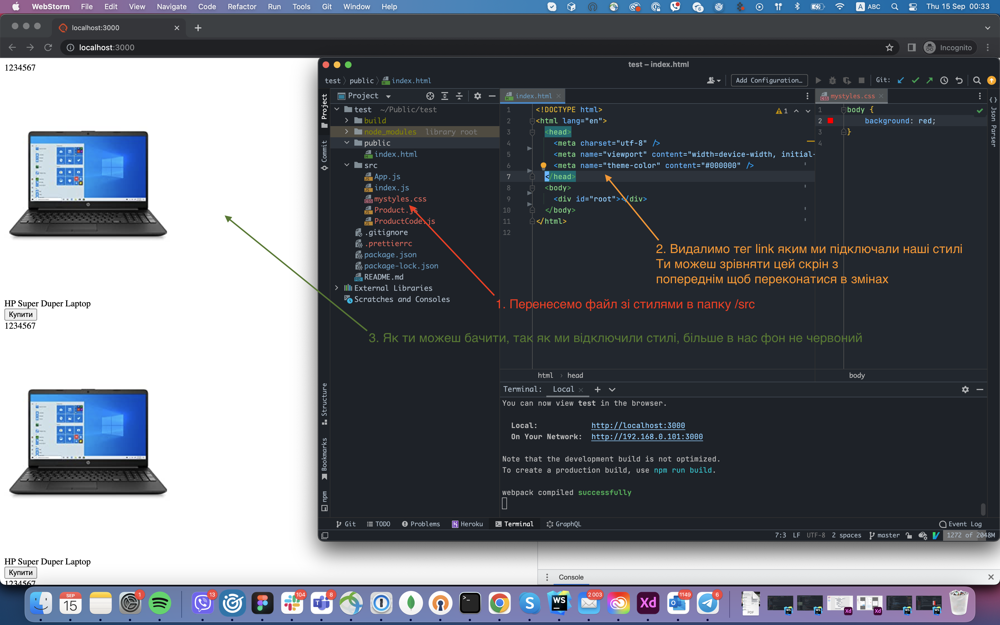

1. Перенести файл зі стилями з папки `/public` в папку `/src`;
2. Видалити з `index.html` тег `<link />` який ми використовували для підключення;
3. І подивитися на результат, як бачиш, після того як ми відключили стилі, очікувано фон перестав бути червоним;

Надалі нам потрібно зайти в файл `App.js` і створити наступний імпорт.

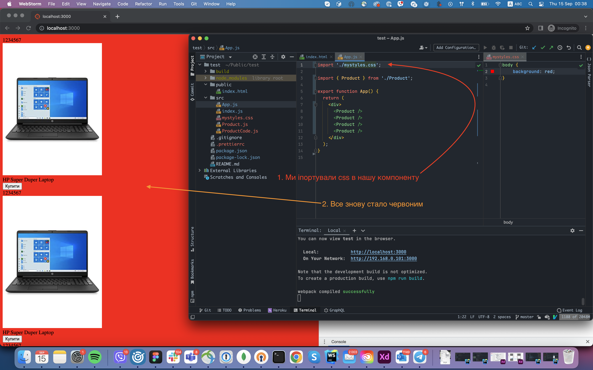

1. В файлі `App.js` на першому рядку ми імпортували наш файл зі стилями `mystyles.css`
2. Фон сторінки знову став червоним

Тепер давай розберемося як ця магія працює.

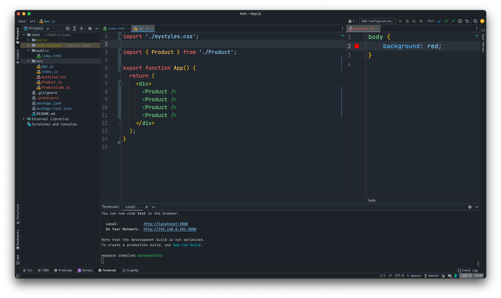

На скріні зверху ти можеш бачити файл `App.js`. Тепер повернемося до пояснень.

По перше, в тебе може виникнути абсолютно логічне питання, а як так то, як ми в Javascript файл імпортуємо CSS, яке взагалі відношення CSS файл має до Javascript`а? Я одразу тобі дам відповідь, насправді, ніякого імпорту CSS в Javascript не відбувається.

Пам'ятаєш як ми в темах [Вступі](./intro.md) та в [Компоненти в React](./react-components.md) розглядали тему імпортування файлів. Ми говорили про те, що весь javascript який ми пишемо потім збирається в один єдиний файл, щоб його міг читати браузер, і окрім цього розбирали команду: `npm run build`, яка генерувала нам папку `build` де якраз знаходився той один єдиний javascript файл.

Якщо ти зараз спробуєш запустити команду `npm run build`, то ти там знайдеш наступне:

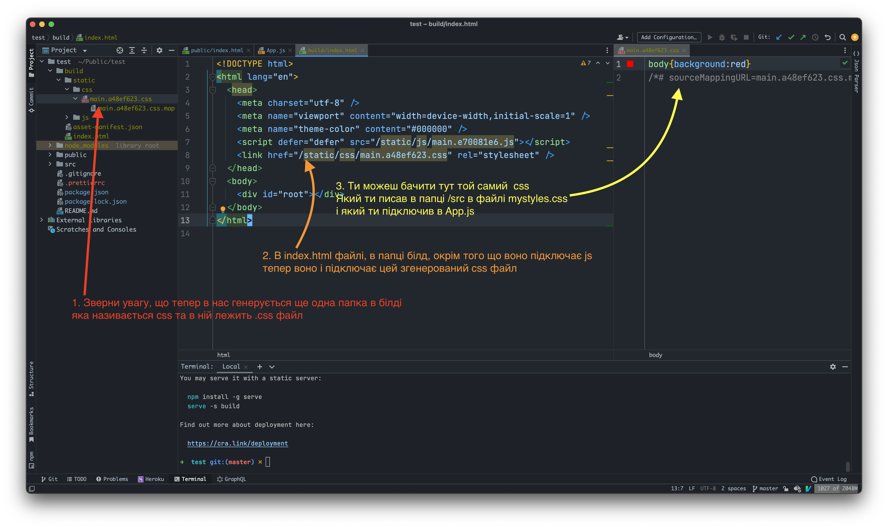

Як ти можеш бачити, в нашому білді в нас згенерувався `css` файл, який автоматично підключився до `index.html` і він містить саме той `css` який ми підключали в верху нашої `App` компоненти на першому рядку за допомогою `import './mystyles.css';`

Штука яка білдає проект, називається `webpack` - він крутий тим, що його можна розширяти, додавши туди якийсь плагін, плагін - це по суті якийсь кусок коду який щось робить. Ну і розробники реакту такі подумали, і бляха, нам треба зробити роботу з `CSS` простішою, давайте щось думати.

І придумали вони наступне, якщо під час білда твого проекту, той `webpack` наткнеться на подібну строку

```
import 'шлях_до_файлу/файл.css'
```

В нашому випадку це:
```
import './mystyles.css';
```

Потрібно дістати весь той `CSS`, відложити його, ось цю строку імпорту видалити. Вот він взяв цей `CSS`, відложив його, і коли білд `javascript'а` закінчиться, створить один єдиний `CSS` файл, і запихне туди всі ті стилі які він відложив, і підключить його в `index.html`.

І щоб закріпити цей момент, ми створимо ще один `css` файл, підключимо його, і подивимося що з того вийде:

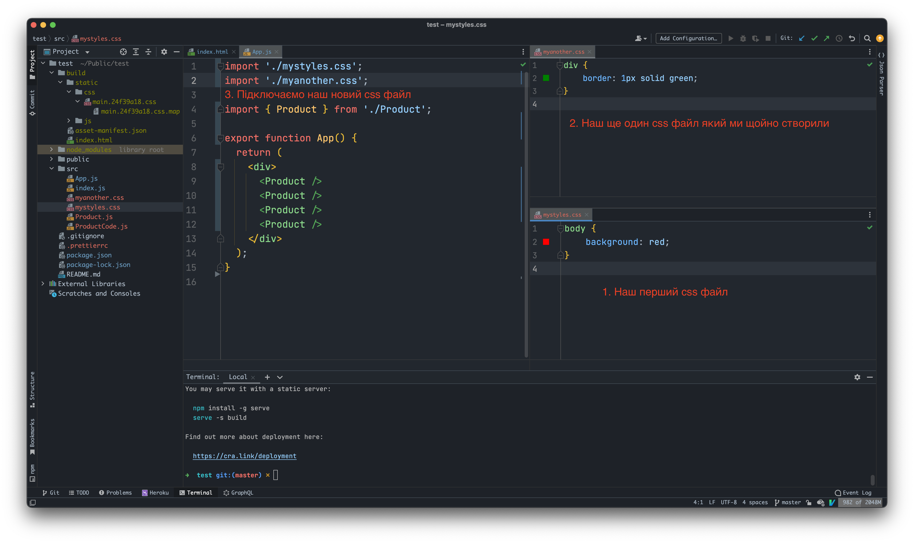

Все що ми зробили тут, це створили ще один `css` файл і імпортували його після нашого першого. І тепер подивимося як виглядає `build`

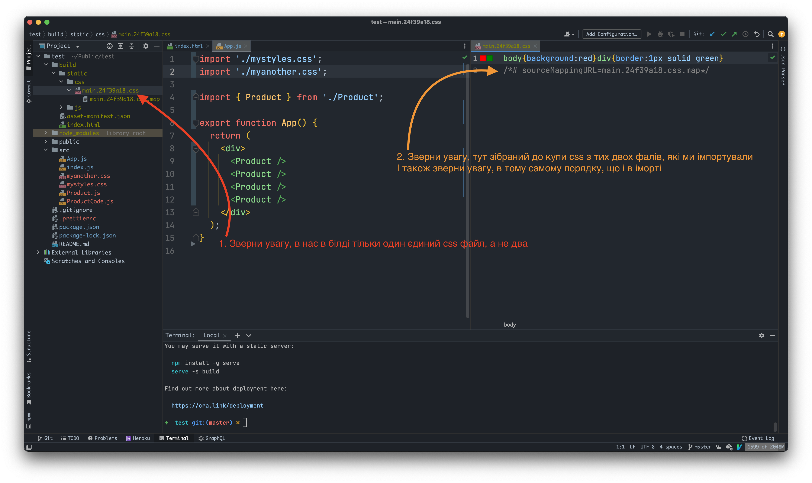

Як ти можеш бачити:
1. Хоч ми і підключали через `import` 2 `css` файли, в білді в нас є лише один єдиний `css` файл з всим `css` який ти імпортував.
2. Зверни увагу, що порядок `import` має значення, томущо грубо кажучи `css` вставляється в порядку білда.

Тут ми детальніше познайомилися, що таке взагалі білд, і те, що це зовсім не магія, а просто якісь люди написали код, який робить конкретні речі, нам ж потрібно тільки слідувати правилам.

Підхід який ми щойно розібрали, в практиці використовується як замінна першому, де ми руками вставляли в `index.html` тег `link` і руками підключали `css`. Тобто, якщо тобі треба підключити якісь глобальні стилі, то бажано використовувати цей підхід з `import` аніж вручну щось вставляти в `index.html`.

Після того як ми розібрали базові поняття як підключається `css` в `React` я хочу затронути проблематику роботи з `css` в великих проектах.

### Проблеми CSS в великих проектах

Перше за все, уяви, що в тебе проект по типу онлайн магазину `rozetka`, ну або соціальна мережа типу `facebook`, `css` таких проектів може мати тисячі строк коду, а то і десятки тисяч, окрім цього, над одним проектом одночасно може працювати багато розробників.

Якщо тобі потрібно буде щось змінити в `css`, ти або потратиш вічність щоб знайти потрібний рядок, по друге є великий шанс що хтось інший випадково зачіпить твій `css`, по третє, великий шанс того, що щось зламається, томущо ти не можеш знати, де саме використовується той чи інший `css`. Окрім того, ти випадково можеш створити `css` клас, який вже існує, і таким чином, ти перепишеш вже існуючі стилі для такого css класу.

Але, ми ж працюмо з реактом, а реакт це штука яка будеє проект з компонентів, так чому би нам, не ізолювати наші стилі в середині компонент, грубо кажучи, кожен компонент, буде мати свої власні та унікальні стилі, і якщо в компоненті `A` ти використовуєш клас `.hello`, і в компоненті `B` ти також маєш клас `.hello`, змінивши клас `.hello` в компоненті `B` вона зміниться тільки і тільки в цій компоненті.

Тобто по суті кожна компонента має свій власний `css`, і цей `css` ізольовний в цій же компоненті.

Така штука називається інкапсуляція стилів, це як синонім до слова ізоляція, а в реакті інкпсуляція стилів реалізована за допомогою `CSS Modules`, або якщо нашою `CSS Модулі`.

### CSS Modules

По перше, я видалю імпорти css які ми робили в компоненті `<App />`, так як вони нам вже не потрібні, а для демонстрації цієї теми, я тимчасово видалю вивід продуктів, та створю дві компоненти `A` та `B`.

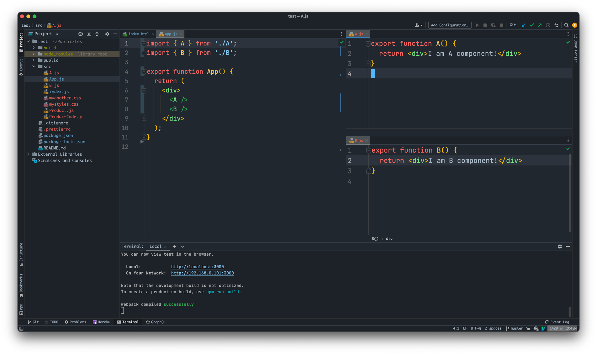

Після чого сторінка буде виглядати наступним чином

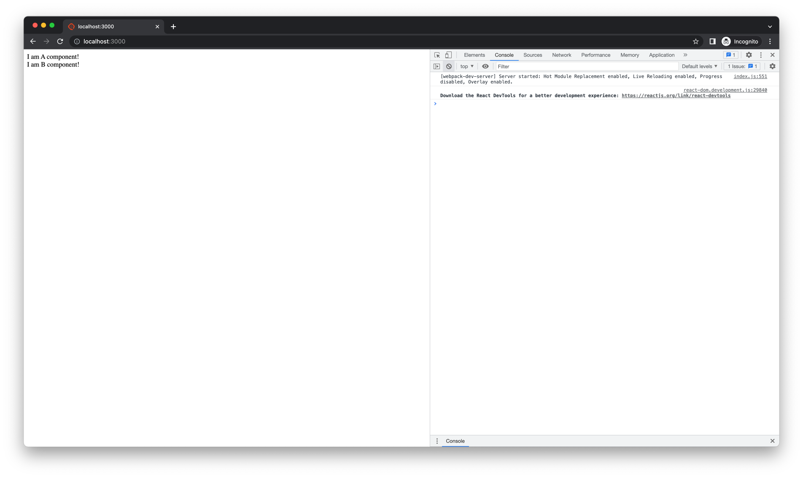

Тепер створимо для кожного нашого компонента CSS Файл, але тут уважно, для того щоб CSS Modules працювали, CSS файл повинен в кінці мати `.module.css`, наприклад `mystyles.module.css`. Для зручності, щоб ми могли легко відділяти який css до якої компоненти належить, я буду називати наш css файл базуючись на імені компоненти.

Отже я все зробив, і так виглядає зараз мій проект:

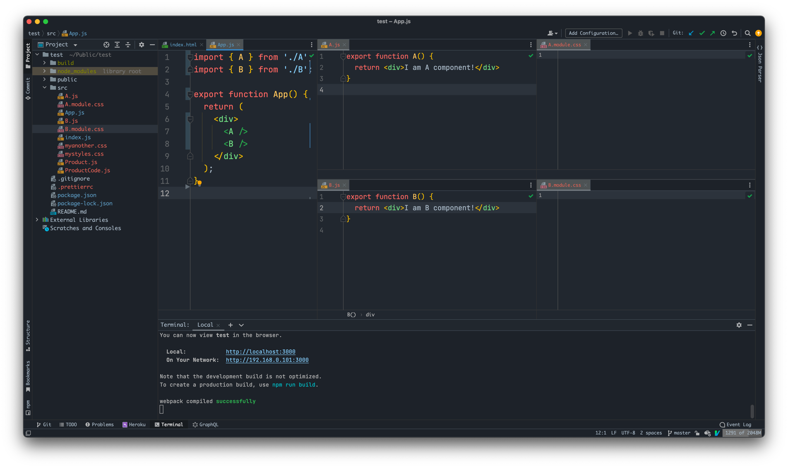

Тепер, в обох css файлах я створю клас `.hello`, і в одній компоненті він буде робити зелений фон, в іншій синій

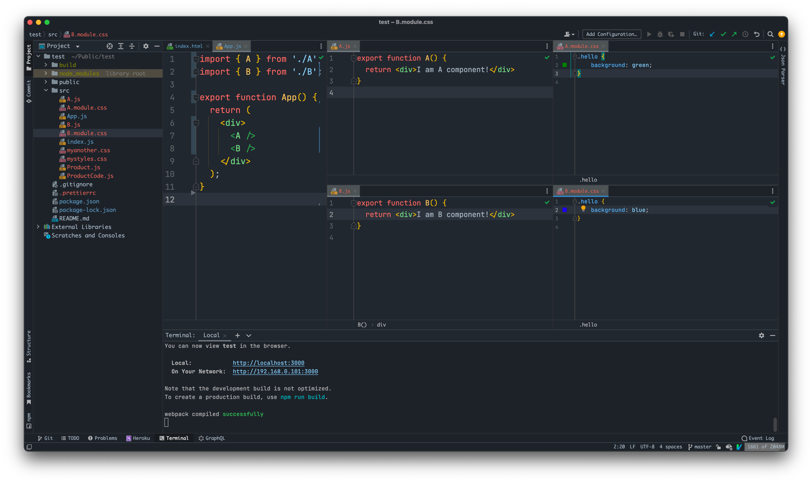

І тепер нам потрібно використати ці CSS класи. По перше потрібно розібрати наступне, якщо в `html` коли ти хтів надати для html елемента якийсь `css` клас ти писав слово `class`, тобто 
```html
<div class="world">Some random text</div>
```

В реакті такого робити не можна, змість слова `class` ти повинен використовувати `className`, для прикладу:

```jsx
function TestComponent() {
  return <div className="world">Some random text</div>
}
```

По друге, якщо твій клас `world` буде записаний в середині змінної чи константи, як його використати?

```jsx
function TestComponent() {
  const myClass = 'world'
  
  return <div className="myClass">Some random text</div>
}
```

Якщо ти зробиш так, то воно тобі згенерує таку `html`

```html
<div className="myClass">Some random text</div>
```

Тобто воно навіть не використовувало твою константу. Томущо йому потрібно дати зрозуміти, де виводити просто `html` а де виводити значення змінної. Дати зрозуміти для реакту, що ти хочеш виводити якесь значення зроблене javascript'ом можна наступним чином

```jsx
function TestComponent() {
  const myClass = 'world'
  
  return <div className={myClass}>Some random text</div>
}
```
Тобто в середині нашого `html` ми огортаємо нашу константу в фігурні дужки, але зверни увагу, наступний приклад працювати не буде

```jsx
function TestComponent() {
  const myClass = 'world'
  
  return <div className="{myClass}">Some random text</div>
}
```

Якщо ти огорнеш фігурні дужки в лапки, воно не буде сприймати це як javascript і `html` буде наступним

```html
<div className="{myClass}">Some random text</div>
```

Тепер повернемося до наших CSS Modules. Окрім цього, CSS Modules працюють тільки і тільки з CSS Класами, тобто ти не можеш їх використовувати для селекторів айдішок `#id` чи до будь чого іншого, тільки і тільки css класи.

Щоб використати наш CSS Modules, спочатку імпортуємо наш css файл в компоненту `A` та `B`, але для CSS Modules імпорт буде виглядати по іншому.

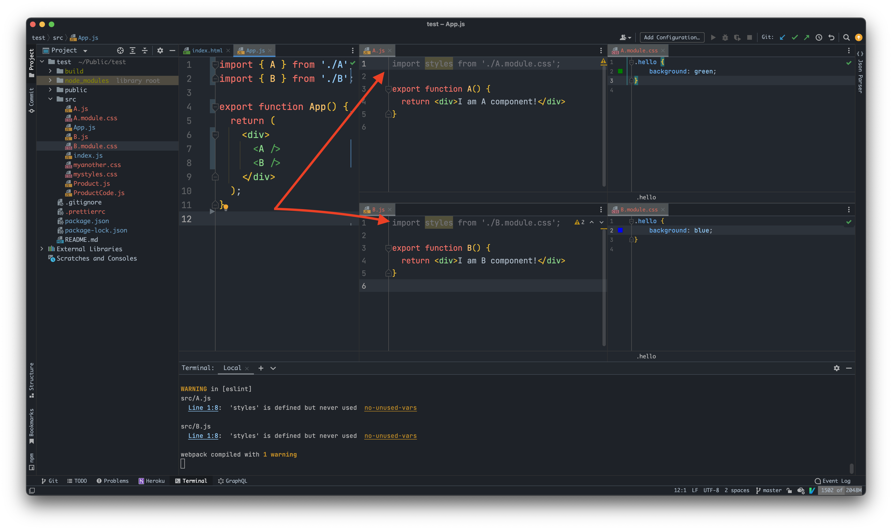

На разі думай про це як: "Ми імпортуємо CSS файл, і всі CSS класи записуємо в змінну styles".

І далі ми використовуємо ці CSS класи:

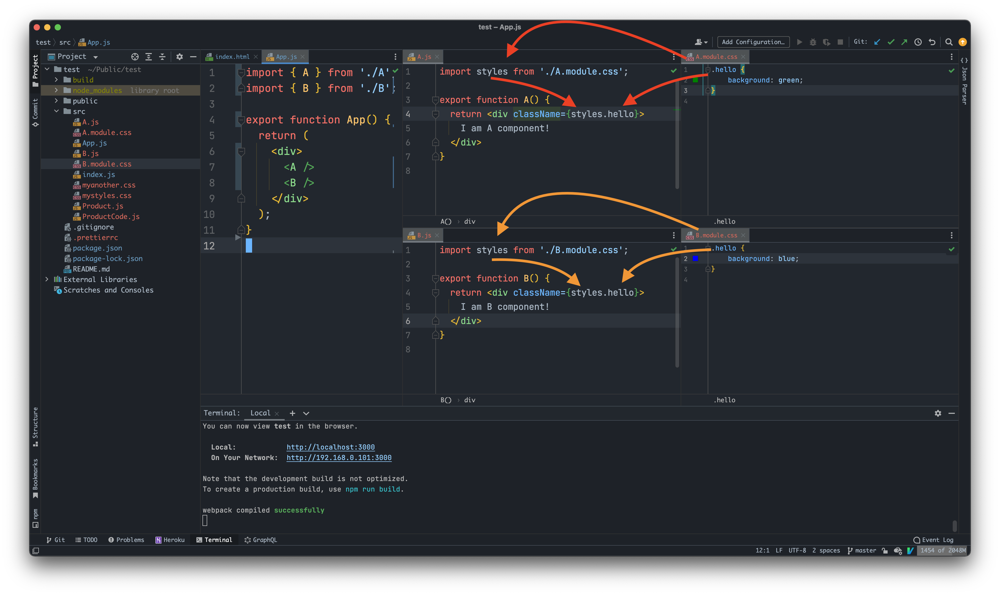

На разі читай це так:
1. Там де імпорт, записати всі css класи в об'єкт, який збергіається в змінні styles
2. Там де className, використати клас hello з об'єкта styles

Якщо відкрити браузер ти побачиш наступне:

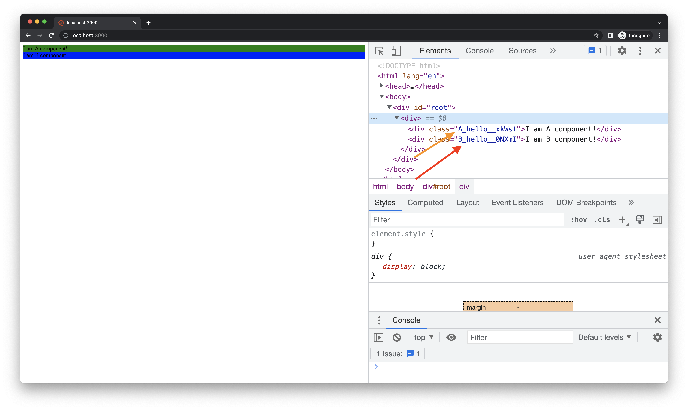

Компонента `A` має зелений колір, а компонента `B` має синій колір, хоч і в тому і в тому класі, ми використовували клас `.hello`, чому ж тоді вони мають різні кольори.

Зверни увагу на консоль розробника, і на стрілочки, як ти можеш помітити там якась абракадабра.

Суть CSS Modules в тому, щоб для кожного CSS модуля, генерувалася унікальна назва для CSS класу, тобто в тебе в проекті може бути хоч мілліон CSS файлів, які будуть мати клас `.hello`, але в кожного CSS файла, кла буде називатися по іншому. Але ще раз, це працює тільки з CSS Modules, тобто css файлами які закінчуються на `.module.css`

Тепер, якщо повернутися до проблематики. Якщо ти наприклад, працюєш на величезному проекті, і в середині CSS Module (наприклад A.module.css) змінив, або додав якийсь css клас, який вже існує в наприклад B.module.css, то CSS зміниться тільки в A.module.css 

### Розберемо цей import детальніше

По перше, хочу сказати про те, що як і випадку з `import 'щось.css'` так і у випадку з CSS Modules для цього білд використовує спеціальний пакет, бо як я і казав, javascript не має ніякого відношення до CSS.

В випадку з CSS Modules цей процес виглядає наступним чином:

- Ти пишеш `import` - `import styles from './name.module.css'`
- Коли білд доходить до цього імпорту, спрацьовує той плагін, який вміє працювати з такими імпортами
- Він бере, зчитує весь цей `css` міняє всі класи на такі, щоб мали унікальні імена, і далі на основі цього створює об'єкт
  - Для прикладу, якщо в тебе є `css` файл, який називається `Bydlo.module.css` і з таким кодом 
    ```css
        .hello {
            color: red
        }
    
        .world {
            background: green;
        }
     ```
    На основі такого `css` він згенерує об'єкт такого плану:
    ```js
      {
        hello: 'Bydlo_hello_k1kd8',
        world: 'Bydlo_world_asl29'
      }
     ```
    В свою чергу, в `build` попаде ось такий `css`
    ```css
    .Bydlo_hello_k1kd8 {color:red} .Bydlo_world_asl29 {background:green;}
    ```
    Тобто в білд потрапляє не оригінальний CSS, а вже унікальний
- І далі ми цей об'єкт, записуємо в змінну `styles` і далі видягуємо властивості цього об'єкта там де `className`

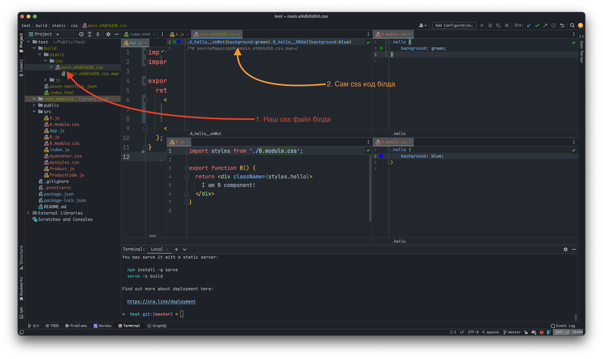

На цьому скріні ти можеш переконатися, що в білд попадає вже унікальний CSS, а не оригінальний.

### Висновки

Стосовно CSS Modules мені важко щось казати, вони насправді прості, типу, в них не має нічого важкого, але усвідомити як працює цей механізм доволі важко. В наступному туторіалі, ми ще трохи попрацюємо з CSS Modules, щоб просто закріпити їх на реальному wвипадку, в нашій ситуації це компонента продукт, та Код.

Плюс, я хочу щоб ти розумів, що хоч деякі моменти я затрогую поверхнево, але в основному, я намагаюся пояснити те, як воно працює на справді, щоб ти міг по перше розуміти, що нічого особливого в цьому не має, і це не реалізовване якимось магічним чином. 

Також навіть якщо щось ти не розумієш зараз, коли ти сам будеш пробувати з цим працювати, все стане на багато зрозумілішим.
