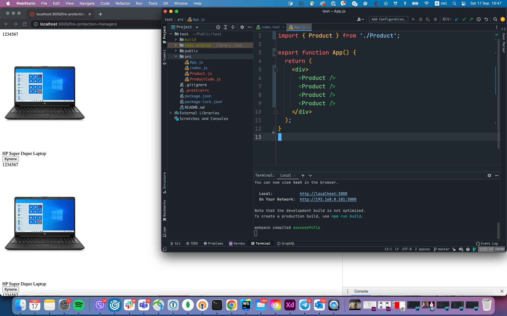
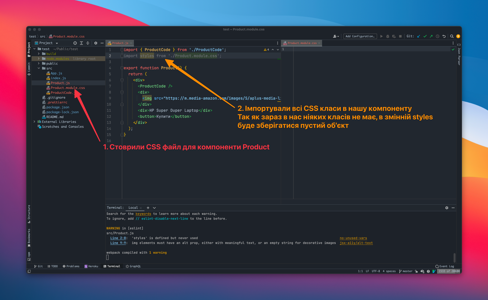
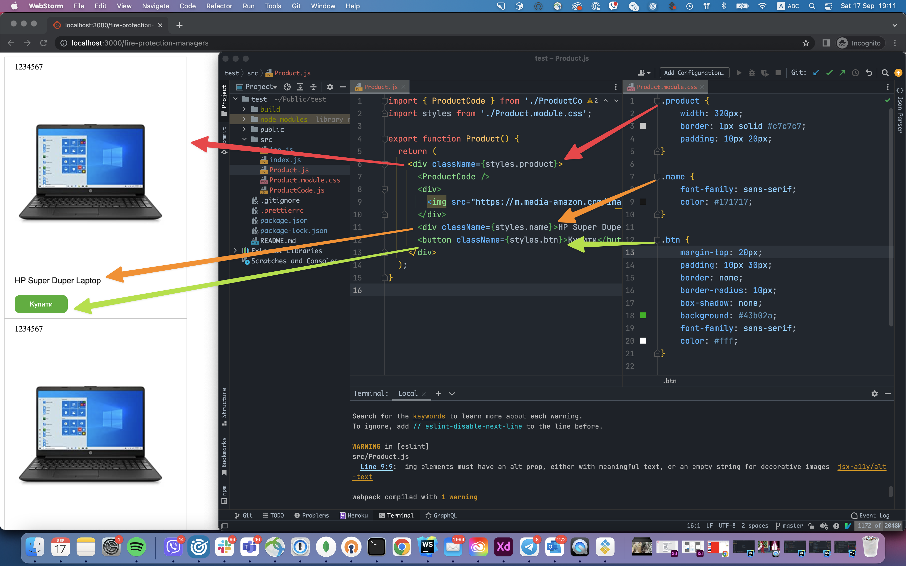
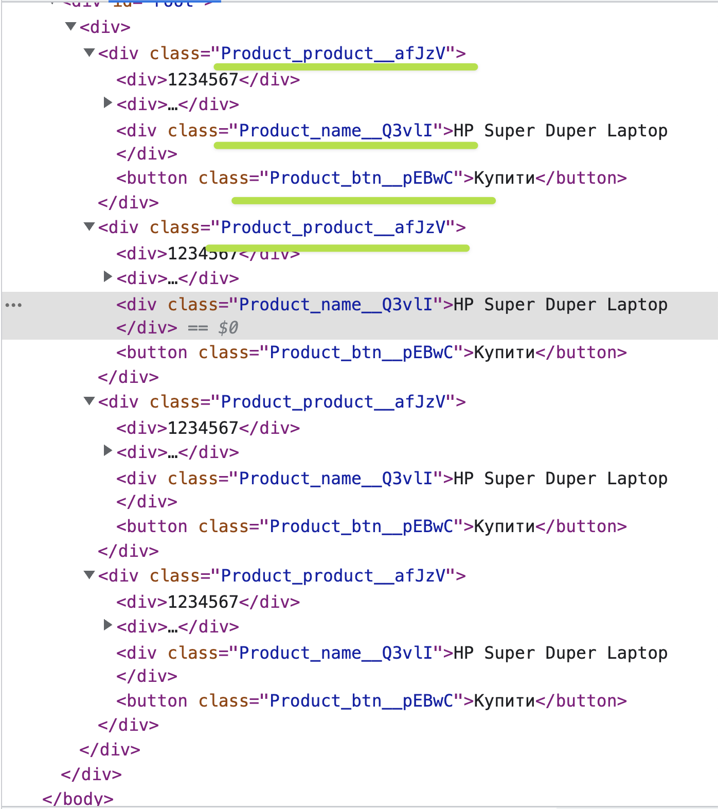

# Практикуємося зі стилями в React

Перше за все, повернемо наш проект до нормально вигляду



Тобто видалимо компоненти та стилі які ми створювали, щоб розібратися з CSS в React.

В даний темі, ми спробуємо частково відтворити стилі нашої компоненти `<Product />` як і в магазині Comfy


Перш за все, нам потрібно створити CSS файл для нашої компоненти `Product`. Нагадаємо:
- CSS файл ОБОВ'ЯЗКОВО повинен закінчуватися на `.module.css`
- Для того, щоб ми могли легко розпізнати для якої компоненти створений цей CSS файл, прийнято називати його іменем компоненти, наприклад `Product.module.css`
- Щоб використовувати CSS в компоненті потрібно створити наступний імпорт `import styles from 'шлях_до стилів'`

Тому спочатку створимо наш CSS файл для компоненти `Product` та імпортуємо його в нашу компоненту.



Ось ми створили наступні стилі



Тут я хочу ще раз звернути увагу на наступне:

1. в `React`, в html який ми пишемо не можна використовувати слово `class`, тому ми використовуємо `className`.
2. Так як наші класи, знаходяться в середині змінної `styles`, щоб використовувати `javascript` в `html` ми пишемо його в середині фігурних дужок `{}`, як приклад на 6 рядку ми пишемо `className={styles.product}`

Окрім цього, я хочу ще раз звернути увагу на те як виглядає фінальний `html`. 



Як ти можеш бачити, всі класи з файлу `Product.module.css` мають унікальні імена, і тут я хочу ще раз наголосити один момент. `CSS Modules` не створює унікальні класи для кожної компоненти, `CSS Modules` генерує унікальні класи для самого `CSS` файлу і тільки для нього.

Що я маю на увазі. Якщо в тебе є 10 компонент, які використовують один і той самий `.module.css` файл, тоді всі ці 10 компонент будуть використовувати однакові `CSS` класи.

Тобто, якщо в тебе є `hello.module.css` з таким кодом:

```css
.kuku {
    color: red
}
```

То всі ці 10 компонент будуть використовувати згенерований клас `hello_kuku_kd29`.


### Підсумки

Це насправді все що необхідно знати по `CSS Modules` в `React`, якщо ти повторював за мною, можеш спробувати написати стилі для компоненти `ProductCode`, якщо ні, то пінгани мене і я кину тобі код.
