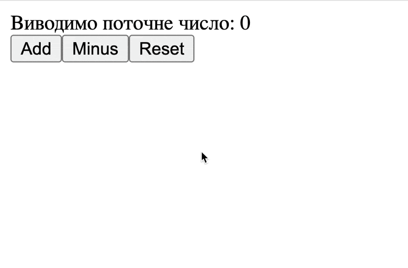
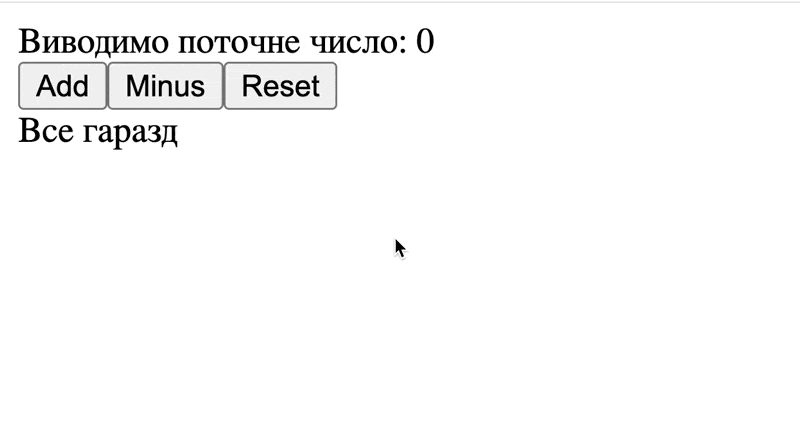
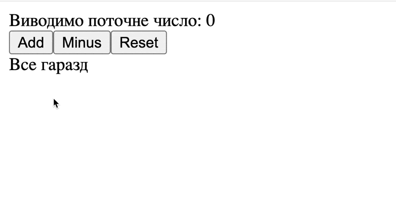

# Рендер по умові / Conditional render

Ми будемо використовувати задачку з попередньої статті, тому продублюю код:

```jsx
import { useState } from 'react';

export function App() {
  const countState = useState(0);

  const count = countState[0];
  const setCount = countState[1];

  const onAdd = function () {
    setCount(count + 1);
  };

  const onMinus = function () {
    setCount(count - 1);
  };

  const onReset = function () {
    setCount(0);
  }

  return (
    <div>
      <div>Виводимо поточне число: {count}</div>
      <div>
        <button onClick={onAdd}>Add</button>
        <button onClick={onMinus}>Minus</button>
        <button onClick={onReset}>Reset</button>
      </div>
    </div>
  );
}
```

Що взагалі таке рендер по умові? Якщо простими словами, ти в залежності від якоїсь умови, ми показуємо або ховаємо певний елемент.

Для прикладу, якщо число яке натисне користувач буде більше ніж 5, то ми будемо показувати якесь повідомлення.

```jsx
import { useState } from 'react';

export function App() {
  const countState = useState(0);

  const count = countState[0];
  const setCount = countState[1];

  const onAdd = function () {
    setCount(count + 1);
  };

  const onMinus = function () {
    setCount(count - 1);
  };

  const onReset = function () {
    setCount(0);
  }

  return (
    <div>
      <div>Виводимо поточне число: {count}</div>
      <div>
        <button onClick={onAdd}>Add</button>
        <button onClick={onMinus}>Minus</button>
        <button onClick={onReset}>Reset</button>
      </div>
      {count > 5 && <div>Ваше число вже дуже велике</div>}
    </div>
  );
}
```

Якщо відкриємо наш додаток, то ми побачимо наступне:



Як тільки наше число стає більше 5, одразу з'являється цей текст.

Для початку, пригадаємо як працює логічний оператор `і - &&`. Якщо всі значення в умові правдиві, тоді логічний оператор `i - &&` поверне остання правдиве значення, а якщо в умові є хоча б одне не правдиве значення, він поверне `false`

Для прикладу:

```jsx
console.log("Hello" && 10 && "World"); // "World"
```

Зверни увагу, що він повертає не `boolean`, а саме останнє правдиве значення, тобто якщо в тебе останнє правдиве значення об'єкт, тоді умова поверне об'єкт, якщо останнє правдиве значення строка, значить повернеться та строка. Це може трохи конф'юзити, томущо якщо щось буде не зрозумілим, пінгани мене в особисті.

Далі розберемо нашу умову:

```jsx
return (
  <div>
    <div>Виводимо поточне число: {count}</div>
    <div>
      <button onClick={onAdd}>Add</button>
      <button onClick={onMinus}>Minus</button>
      <button onClick={onReset}>Reset</button>
    </div>
    {count > 5 && <div>Ваше число вже дуже велике</div>}
  </div>
);
```

Зверни увагу на те, що так як я використовую тут Javascript, я огорнув цю частину коду в фігурні дужки. 

Далі, дивись наступне, тут ми використовуємо `&&`:
- зліва умова `count > 5`
- з права `html` - `<div>Ваше число вже дуже велике</div>`

> Запам'ятай, `html` - це завжди `true`. 

Якщо `count > 5` буде правдивою, і поверне `true`, тоді в тебе відобразиться `html`.

> Зауваж. в середині `html` ти не можеш використовувати `if else`, максимум тернарний оператор

Для прикладу, якщо наш `count > 5`, тоді ми виводимо попереднє повідомлення, в іншому випадку ми виводимо повідомлення про те, що все гаразд

```jsx
import { useState } from 'react';

export function App() {
  const countState = useState(0);

  const count = countState[0];
  const setCount = countState[1];

  const onAdd = function () {
    setCount(count + 1);
  };

  const onMinus = function () {
    setCount(count - 1);
  };

  const onReset = function () {
    setCount(0);
  };

  return (
    <div>
      <div>Виводимо поточне число: {count}</div>
      <div>
        <button onClick={onAdd}>Add</button>
        <button onClick={onMinus}>Minus</button>
        <button onClick={onReset}>Reset</button>
      </div>
      {count > 5 ? <div>Ваше число вже дуже велике</div> : <div>Все гаразд</div>}
    </div>
  );
}
```

В результаті ми отримаємо наступне:



Ми можемо ще більше розширити наш додаток, виводячи ще й повідомлення якщо число буде менше ніж -5.

```jsx
import { useState } from 'react';

export function App() {
  const countState = useState(0);

  const count = countState[0];
  const setCount = countState[1];

  const onAdd = function () {
    setCount(count + 1);
  };

  const onMinus = function () {
    setCount(count - 1);
  };

  const onReset = function () {
    setCount(0);
  };

  return (
    <div>
      <div>Виводимо поточне число: {count}</div>
      <div>
        <button onClick={onAdd}>Add</button>
        <button onClick={onMinus}>Minus</button>
        <button onClick={onReset}>Reset</button>
      </div>
      {count >= -5 && count <= 5 && <div>Все гаразд</div>}
      {count < -5  && <div>Ваше число занадто мале</div>}
      {count > 5 && <div>Ваше число вже дуже велике</div>}
    </div>
  );
}
```

І в результаті буде наступне



### Міні висновки

По більшій мірі - це взагалі суть таких штук як `React`, коли при зміні чогось, вигляд додатку автоматично змінюється.
