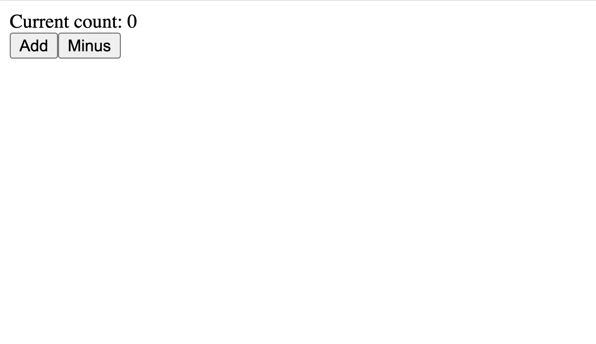
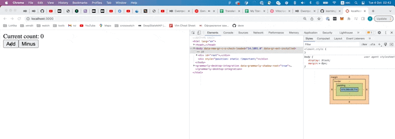
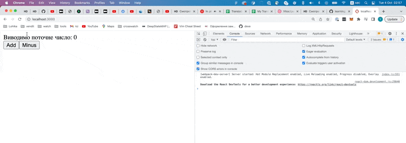
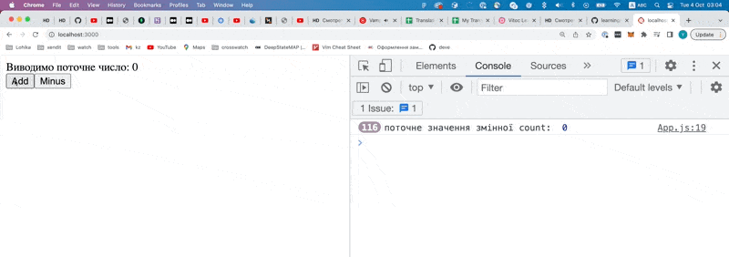
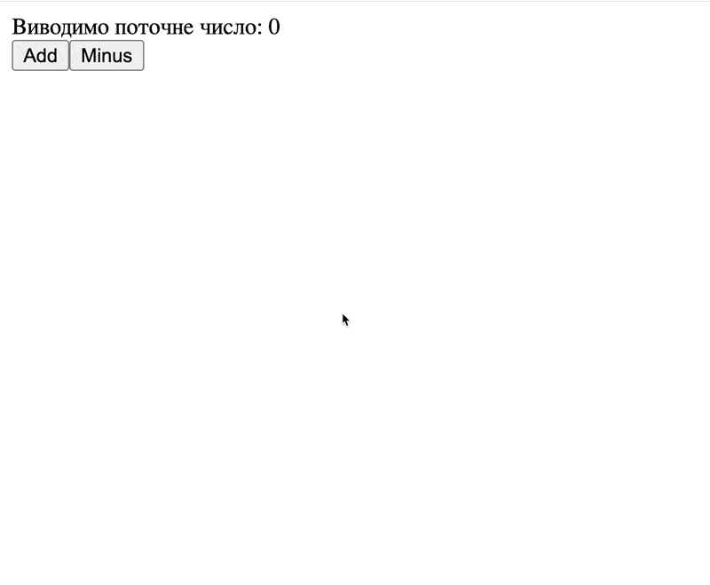
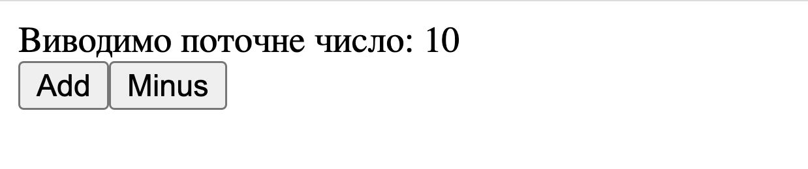
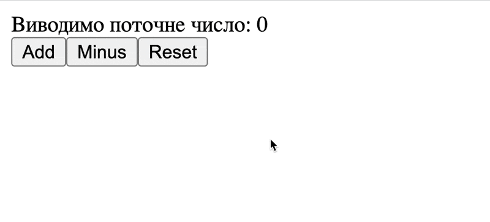

# Стан або State компоненти

Це основна тема цього етапу, навколо якої будуть будуватися наступні, і щоб розібрати її, ми напишемо невеличкий додаток, який буде мати дві кнопки, `Add` та `Minus`, які при натисканні будуть додавати, або віднімати одиницю від числа. Число ми також будемо виводити на екран.

Для початку напишемо `html` який повинен бачити користувач, для цього в компоненті `App` напишемо наступне:

```jsx
export function App() {
  return (
    <div>
      <div>Current count: 0</div>
      <div>
        <button>Add</button>
        <button>Minus</button>
      </div>
    </div>
  );
}
```

Якщо відкрити додаток в браузері, то ти повинен бачити наступне:



### Як зрозуміти що користувач натиснув на кнопку?

Тепер розберемося, яким чином ми можемо відстежувати події (events). В даній задачі, нам потрібно відстежувати натискання на елемент. Подія, яка відповідає за натискання називається - `click`.

Але для того, щоб ми могли реагувати на цю подію, на конкретному `html` елементі, на потрібний нам `html` елемент потрібно повісити так званий слухач подій. Слухач подій - це по своїй суті функція (або якщо правильніше - callback функція), яка буде викликатися щоразу, як певна подія станеться. Якщо ми вішаємо слухач на подію `click`, то щоразу як користувач буде натискати на елемент, буде створювати подія `click`, після чого буде викликана функція слухача.

Розберімося як це використовувати в `react`. Уяви що в тебе є компонента, яка повертає ось такий `html`.

```jsx
<button>Add</button>
```

На цій кнопці, ми хочемо відстежувати подію `click` і реагувати на неї. Для цього, для нашого елементу `button` ми повинні надати атрибут, який називається `onClick`.

```jsx
<button onClick={}>Add</button>
```

Далі, в якості значення нашого атрибуту, нам потрібно передати функцію, яка буде спрацьовувати щоразу, як подія `click` спрацює, тобто щоразу як користувач буде натискати на кнопку:

```jsx
<button onClick={function() {}}>Add</button>
```

На разі, наша функція пуста, тому давай на кожне натискання будемо просто виводити `alert`, який буде казати, що це, наприклад, додавання.

```jsx
<button onClick={function() { alert('Add'); }}>Add</button>
```

Тепер при натисканні на цю кнопку, в нас буде виводитися `alert` з надписом `"Add"`. Але тут є одна проблемка, зараз в нас все вмістилося в один рядок, але якщо ця функція буде мати більше коду, то тримати все в одному рядку погана ідея, томущо код стане не можливим до прочитання, окрім цього, потрібно притримуватися загально прийнятого стилю коду. Для цього відформатуємо трохи наш код:

```js
<button
  onClick={function () {
    alert('Add');
  }}
>
  Add
</button>
```

Все залишилося тим самим, просто трошки інший вигляд. Можливо на початку, тобі буде важко це сприймати, але з часом ти звикнеш.

> Зверни увагу, що ми використовуємо `{}` саме фігурні дужки, томущо нам потрібно буде передати функцію, тобто Javascript.

Повернемося до нашого додатку, і внесемо зміни в нашу компоненту `App`, а саме додамо слухачі на кнопку `Add` та `Minus`

```jsx
export function App() {
  return (
    <div>
      <div>Current count: 0</div>
      <div>
        <button
          onClick={function () {
            alert('Add');
          }}
        >
          Add
        </button>
        <button
          onClick={function () {
            alert('Minus');
          }}
        >
          Minus
        </button>
      </div>
    </div>
  );
}
```

Якщо відкрити сторінку в браузері, і спробувати понатискати на кнопки, ти повинен отримати наступний результат



Хотілося б додати, якщо `html` твоєї компоненти великий, і окрім цього там повинно бути багато слухачів, тоді ти можеш стикнутися з тим, що твій код буде дуже хаотичним, бо логіка компоненти, і `html`, який потрібно показувати, буде змішаним, це ніяк не вплине на роботу додатка, але чисто візуально буде виглядати жахливо.

Щоб вирішити цю "проблему", ми можемо винести наші функції з `html`, і створити їх перед `return`.

```jsx
export function App() {
  const onAdd = function () {
    alert('Add');
  };

  const onMinus = function () {
    alert('Minus');
  };

  return (
    <div>
      <div>Current count: 0</div>
      <div>
        <button onClick={onAdd}>Add</button>
        <button onClick={onMinus}>Minus</button>
      </div>
    </div>
  );
}
```

Одразу можна побачити, що наш `html` став виглядати чистіше.

> Зауваж, що в `onClick` ти передаєш саме функцію, а НЕ результат виклику
> ```jsx
> // ось так правильно, ти передасиш функцію
> <button onClick={onAdd}>Add</button>
> 
> // а ось так не правильно 
> // бо ти її викликав, і в onClick потрапить те, що функція поверне
> // тобто це НЕ буде працювати
> <button onClick={onAdd()}>Add</button>
> ```
> ⚠️ Якщо щось з цього не зрозуміло, то одразу пінгай мене в особисті повідомлення, я швиденько поясню на інших прикладах.

### Зміна та виведення поточного числа

Ми вже знаємо як відстежувати та реагувати на натискання користувача, тепер нам потрібно зберігати поточне число, виводити його, та при натисканні на кнопки, додавати чи віднімати одиницю від нього.

Найперше про що можна подумати - це створити змінну, виводити її значення, та коли користувач буде натискати на кнопку `Add` чи `Minus` додавати чи віднімати одиницю до цієї змінної.

```jsx
export function App() {
  // Змінна в які будемо зберігати поточне число
  let count = 0;

  const onAdd = function () {
    // Додаємо одиницю до нашого поточного числа
    count = count + 1;
  };

  const onMinus = function () {
    // Віднімаємо одиницю від нашого поточного числа
    count = count - 1;
  };

  return (
    <div>
      <div>Виводимо поточне число: {count}</div>
      <div>
        <button onClick={onAdd}>Add</button>
        <button onClick={onMinus}>Minus</button>
      </div>
    </div>
  );
}
```

Це варіант виглядає доволі логічно, але є одна маленька проблема, він не буде працювати 😅.



Я натискаю на кнопки, але нічого не відбувається, чому так? 

Я тут трохи схитрю, і тільки для пояснень зроблю одну, штуку. В консоль, я буду виводити кожні 100 мілісекунд значення змінної `count`. 

> Я не показую як я це зробив в коді, щоб не заплутати тебе ще більше, але це потрібно показати, щоб зрозуміти проблему



Зверни увагу, я натискаю на кнопки, і в консолі ти можеш бачити, що значення змінної `count` змінюється, але чому ж тоді на екрані не показується актуальне значення, а завжди показується `0`

Саме для того, щоб зрозуміти цей момент, ми й розбирали яким чином працює рендер в `react` в попередній темі [Як працює render в React](./react-render.md), але розберемо це ще раз.

Продублюю код компоненти, щоб тобі не доводилося постійно гортати:

```jsx
export function App() {
  // Змінна в які будемо зберігати поточне число
  let count = 0;

  const onAdd = function () {
    // Додаємо одиницю до нашого поточного числа
    count = count + 1;
  };

  const onMinus = function () {
    // Віднімаємо одиницю від нашого поточного числа
    count = count - 1;
  };

  return (
    <div>
      <div>Виводимо поточне число: {count}</div>
      <div>
        <button onClick={onAdd}>Add</button>
        <button onClick={onMinus}>Minus</button>
      </div>
    </div>
  );
}
```

Коли запуститься `react` додаток, він викличе функцію `App`, яка поверне таку `html`:

> Я навмисно видалив `onClick` з `button`, щоб розібрати саме процес рендеру, а не всього і одразу

```jsx
<div>
  <div>Виводимо поточне число: {count}</div>
  <div>
    <button>Add</button>
    <button>Minus</button>
  </div>
</div>
```
Замість ось цього `{count}` в нас буде значення змінної `count`, тобто `0`, томущо коли ми створювали нашу змінну `count` ми присвоювали їй значення `0` і тому кінцевий `html` буде виглядати наступним чином:

```jsx
<div>
  <div>Виводимо поточне число: 0</div>
  <div>
    <button>Add</button>
    <button>Minus</button>
  </div>
</div>
```

**А тепер відповідь на питання чому в нас нічого не мінялося, коли ми змінювали змінну**

В нас запустився наш додаток, згенерував `html`, після чого `react` показав цей `html` на екран і на цьому все закінчилося, як би ми не міняли нашу змінну, це вже нічого не змінить, `react` вже згенерував `html` і вивів його на екран.

Тобто в нас виникла проблема, нам потрібно мати якийсь механізм, який дозволив би вказувати для `react`, що потрібно заново пройтися по дереву компонентів, заново сформувати `html` і показати вже новий `html`.

Щоразу, як ми будемо змінювати нашу змінну `count`, потрібно буде генерувати новий `html`, але тут також є маленька проблемка (якщо буде не зрозумілим цей момент, одразу пінгуй в особисті, поясню детальніше), навіть якщо ми будемо силою змушувати `react` заново формувати `html`, ми все одно будемо бачити `0` на екрані.

Якщо повернутися до попередньої теми [Як працює render в React](./react-render.md), там говорилося, що кожного разу як `react` формує `html` нашого додатку, він проходиться по всьому дереву компоненті, і викликає кожну компоненту (тобто викликає кожну функцію, яка повертає `html`).

А тепер зверни увагу на нашу компоненту
```jsx
export function App() {
  // Змінна в які будемо зберігати поточне число
  let count = 0;
  
  ...

  return (
    <div>
      <div>Виводимо поточне число: {count}</div>
      ...
  )
}
```
Що разу, як `react` буде викликати цю функцію, буде створюватися змінна `count` зі значення `0`, і тоді виходить, що і `html`, який повертає компонента буде також мати `0`.

Щоб закріпити цей момент, я описав крок за кроком, що буде відбуватися:
1. Відбувся самий-самий перший рендер, `react` викликає функцію `App`, в ній створюється змінна `let count = 0`;
2. Твоя компонента повернула `html` де поточне число `0`;
3. Далі ти натиснув на кнопку додати, в тебе викликалася функція `onAdd` вона додала до змінної `count` одиницю, і тепер змінна `count` має значення `1`;
4. Далі ти якимось чином, сказав для `react`, що потрібно заново рендири додаток;
5. Відбувається другий рендер, `react` викликає функцію `App`, створює змінну `let count = 0`;
6. Твоя компонента повернула `html` де поточне число `0`;

Щоб розв'язувати цю проблему, нам якимось чином, потрібно зробити так, щоб між кожним рендером, тобто між кожним викликом компоненти, ця змінна `count` не створювалася заново, а зберігала своє попереднє значення. 

### Стейт компоненти

Щоб зберігати данні між викликами функційї, тобто між рендерами компоненти, в `react` є таке поняття як стан компонента, або component state. 

> Зараз ми не будемо розбирати, як воно працює під капотом, ми тільки розберемо як його використовувати.

```jsx
import { useState } from 'react';

export function App() {
  const countState = useState(0);

  const count = countState[0];
  const setCount = countState[1];

  const onAdd = function () {
    setCount(count + 1);
  };

  const onMinus = function () {
    setCount(count - 1);
  };

  return (
    <div>
      <div>Виводимо поточне число: {count}</div>
      <div>
        <button onClick={onAdd}>Add</button>
        <button onClick={onMinus}>Minus</button>
      </div>
    </div>
  );
}
```

Якщо запустити цей код в браузері, то тепер, при натисканні на кнопки, в нас буде змінюватися вигляд нашої сторінки



**Тепер розберемо цей код крок за кроком**

Перш за все, нам потрібно імпортувати з пакету `react` спеціальну функцію, яка називається `useState`

```jsx
import { useState } from 'react';
```

`useState` - це функція, яка дозволяє запхати в стейт компоненти значення, яке потрібно зберігати, між рендерами цієї компоненти. 

Далі, в середині компоненти, ми викликаємо цю функцію, та результат її виклику записуємо в константу `countState`.
```jsx
const countState = useState(0);
```

Функція `useState` приймає один аргумент, а саме значення за замовченням, якщо провести аналогію, то:
```jsx
useState(0);

це аналог до

let ... = 0;
```

Для прикладу, якщо в компоненті `App` ти замість `useState(0)`, ти напишеш `useState(10)`, то на екрані ти побачиш:



Розберемо наступний момент:
```jsx
export function App() {
  const countState = useState(0);

  const count = countState[0];
  const setCount = countState[1];
  
  // ...
}
```

Функція `useState` повертає масив, де `0` елемент, це поточне значення цього `useState`, а `1` елемент - це спеціальна функція, яку ти викликаєш, щоб змінити цей `state` і змусити `react` зробити ререндер твого додатку, щоб показати на екран вже змінений `state`.

Для зручності, ми для `0` та `1` елементу створили константи, щоб було легше читати код та орієнтуватися в ньому.

Наступне що ми розберемо, це як саме змінювати значення `state`.

```jsx
export function App() {
  const countState = useState(0);

  const count = countState[0];
  const setCount = countState[1];

  const onAdd = function () {
    setCount(count + 1);
  };

  const onMinus = function () {
    setCount(count - 1);
  };

  // ...
}
```

Зверни уваги на 2 наші функції `onAdd` та `onMinus`. Ми викликаємо функцію `setCount`, і передаємо в неї нове значення `state`, в випадку `onAdd` ми передаємо - `count + 1`, тобто поточне значення стейту плюс одиничка, а в випадку з `onMinus` ми передаємо - `count - 1`, тобто поточне значення стейту мінус одиничка.

> Тут я ще раз хочу звернути увагу. Змінити значення стейту, можна лише через так, лише викликавши функцію, яку ми отримуємо з `useState`.


Щоб закріпити цю тему, додамо ще одну кнопку - `reset`, при натисканні на яку, ми все повернемо до `0`.

```jsx
import { useState } from 'react';

export function App() {
  const countState = useState(0);

  const count = countState[0];
  const setCount = countState[1];

  const onAdd = function () {
    setCount(count + 1);
  };

  const onMinus = function () {
    setCount(count - 1);
  };

  const onReset = function () {
    // Вказуємо що значення стейту повинне бути 0
    setCount(0);
  }

  return (
    <div>
      <div>Виводимо поточне число: {count}</div>
      <div>
        <button onClick={onAdd}>Add</button>
        <button onClick={onMinus}>Minus</button>
        <button onClick={onReset}>Reset</button>
      </div>
    </div>
  );
}
```

Після чого твій додаток повинен мати наступний вигляд.




### Деструктуризація масиву з присвоєнням

Звучить страшно, але на справді все доволі просто. Зверни увагу на наш код:

```jsx
const countState = useState(0);

const count = countState[0];
const setCount = countState[1];
```

Як і говорилося вище, `useState` повертає масив, в якому є два елементи, поточне значення `useState` та функція, щоб його змінити.

Щоб цей код виглядав краще, ми для кожного елемента цього масиву створили константу, і весь код зайняв в нас 3 рядки, але на справді є простіший спосіб створити для кожного елементу константу, і щей написати це в один єдиний рядок.

```jsx
const [count, setCount] = useState(0);
```

Розберемо детальніше:

```jsx
// В нас є наступний масив
const arr = ['a', 'b'];

// Для зручності, для кожного елемента створимо свою константу
const firstLetter = arr[0]; // 'a'
const secondLetter = arr[1]; // 'b'

// Але ми можемо зробити простіше
// Це називається деструктиризація з присвоєнням
//     0 елемент   1 елеменет      ось цього масива
const [firstLetter, secondLetter] = arr;

console.log(firstLetter); // 'a'
console.log(secondLetter); // 'b'
```

Цей спосіб називається деструктуризація з присвоєнням, і допомагає зекономити нам час, та покращити вигляд нашого коду.

Якщо цей момент не дуже зрозумілий, пінгани мене в особисті, я розповім детальніше, і дам більше прикладів.


