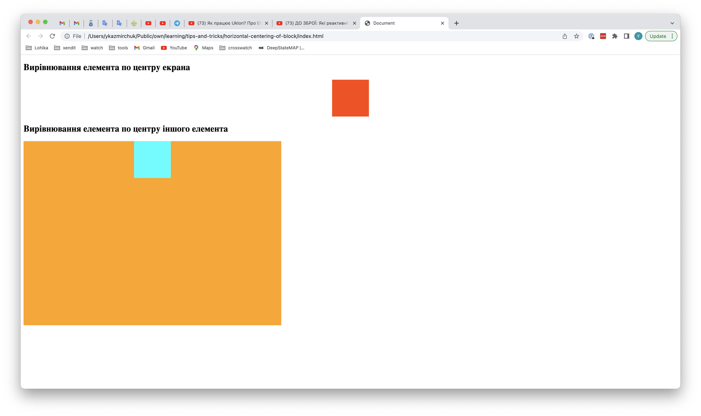

# Як відцентрувати по горизонталі блочний елемент

### Проблематика
Якщо в вас є елемент, в якого `display` - `block`, `flex` і тобі потрібно вирівняти його по центру та по горизонталі

### Рішення
Все дуже просто. Все що потрібно - це дати йому наступні властивості:
```css
margin-left: auto;
margin-right: auto;
```


