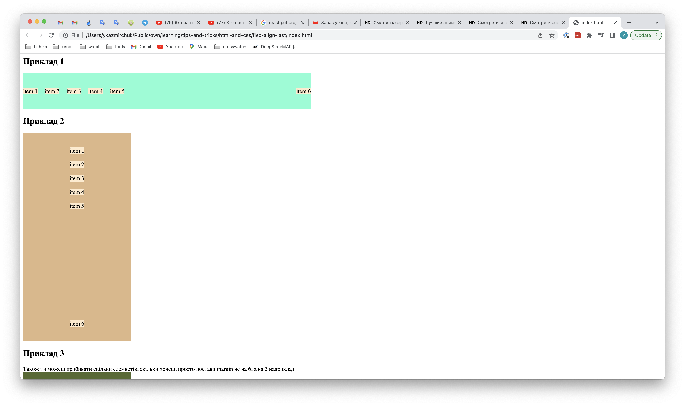
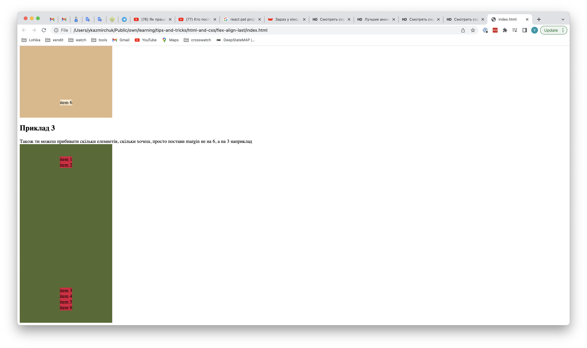

# Як прибити елемент списку до краю, з допомогою flexbox

Якщо в тебе є елементи, і останній з цих елементів треба прибити до нижнього краю наприклад, то тобі спочатку треба дати для батька display: flex, а цьому елементу margin-top: auto; А якщо вони в тебе йдуть в рядок, і його тобі потрібно прибити до правого краю, тоді дай йому margin-left: auto. 

Ось що я маю на увазі

Реальний приклад де такий підхід можна використати:

Особливо ця штука корисна на дизайні в другому прикладі
